### ClickHouse入门

#### 1. 什么是ClickHouse

ClickHouse是俄罗斯的Yonder于2016年开源的列式存储数据库，使用C++编写，主要用于联机分析处理（OLAP），能够使用SQL查询实时生成数据分析报告。

#### 2. ClickHouse的特点

##### 1. 列式存储

##### 2. DBMS的功能

##### 3. 多样化的引擎

##### 4. 高吞吐写入能力

##### 5. 数据分区与线程级并行

#### 3. ClickHouse的单机安装

##### 1. CentOS中安装ClickHouse

查看系统参数：`ulimit -a`

修改打开文件数限制：`vi /etc/security/limits.conf`，由于`/etc/security/limits.d/20-nproc.conf`可能会覆盖`limits.conf`的内容，所以同步修改其内容，如果不存在则创建。

```shell
# 用户@用户组 (软/硬)限制 nofile=打开文件数/nproc=最大打开进程数 数值
* soft nofile 65536
* hard nofile 65536
* soft nproc 131072
* hard nproc 131072
```

取消SELINUX：`/etc/selinux/config`，设置完之后需要重启，如果是生产机器无法重启，可以暂时使用`setenforce 0`临时关闭。

```shell
SELINUX=disabled
```

安装ClickHouse的依赖包：

```shell
$ sudo yum install -y libtoolw
$ sudo yum install -y *unixODBC*
```

下载对应的[rpm](https://packages.clickhouse.com/rpm/stable/)包进行安装，需要注意的是clickhouse在`20.6.3`才支持`explain`操作，所以建议安装版本`20.6.3`以上版本。

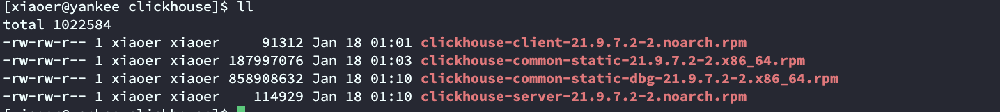

安装完成之后默认的安装目录需要注意：

```shell
bin		==> /usr/bin
conf	==> /etc/clickhouse-server
# 以下两个可以修改
lib		==> /var/lib/clickhouse
log		==> /var/log/clickhouse-server
```

使用`rpm`命令安装，安装过程可能要输入密码，直接回车密码即为空。

```shell
$ sudo rpm -ivh *.rpm
```

使用`rpm -qa | grep clickhouse`查看是否安装成功：

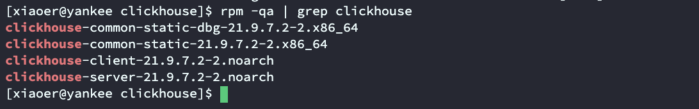

clickhouse的配置文件如下：

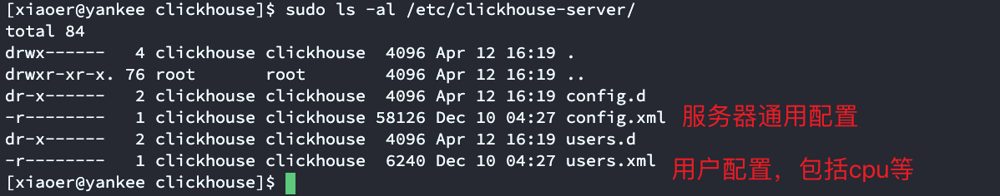

修改`/etc/clickhouse-server/config.xml`中关于`listen`的配置，如果启动报错`Listen [::]:8123 failed: Poco::Exception. Code: 1000, e.code() = 0, DNS error: EAI: Address family for hostname not supported (version 21.9.7.2 (official build))`，可以将`::`修改为`0.0.0.0`并重启即可。

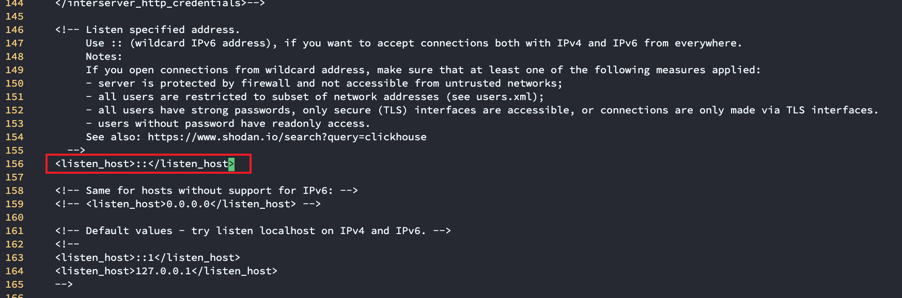

clickhouse命令：

```shell
# 启动clickhouse-server
$ sudo clickhouse start

# 查看clickhouse-server启动状态
$ sudo clickhouse status

# clickhouse-client客户端
$ clickhouse-client
```

##### 2. mac安装ClickHouse(M1)

直接按照官网命令，下载clickhouse，运行即可：

```shell
$ curl -O 'https://builds.clickhouse.com/master/macos-aarch64/clickhouse' && chmod a+x ./clickhouse
```

clickhouse服务启动：

```shell
# 后台以一个守护进程启动
$ ./clickhouse server --daemon

# 启动clickhouse的client
$ ./clickhouse client
```

##### 3. docker中安装ClickHouse

```shell
# 克隆docker镜像
$ docker pull yandex/clickhouse-server

# 在docker中创建容器启动clickhouse
docker run -d --name clickhouse-server --ulimit nofile=262144:262144 -p 8123:8123 -p 9000:9000 -p 9009:9009 yandex/clickhouse-server
```

#### 4. 数据类型

|  数据类型  |             表达形式              |                      范围                       |
| :--------: | :-------------------------------: | :---------------------------------------------: |
| 有符号整型 | Int8-TINYINT, BOOL, BOOLEAN, INT1 |                   [-128, 127]                   |
| 有符号整型 |        Int16-SMALLINT,INT2        |                 [-32768, 32767]                 |
| 有符号整型 |      Int32-INT,INT4,INTEGER       |                [-2^31^, 2^31^-1]                |
| 有符号整型 |           Int64-BIGINT            |                [-2^63^, 2^63^-1]                |
| 有符号整型 |              Int128               |              [-2^127^, 2^127^ -1]               |
| 有符号整型 |              Int256               |              [-2^255^, 2^255^ -1]               |
| 无符号整型 |               UInt8               |                   [0, 2^8^-1]                   |
| 无符号整型 |              UInt16               |                  [0, 2^16^-1]                   |
| 无符号整型 |              UInt32               |                  [0, 2^32^-1]                   |
| 无符号整型 |              UInt64               |                  [0, 2^64^-1]                   |
| 无符号整型 |              UInt128              |                  [0, 2^128^-1]                  |
| 无符号整型 |              UInt256              |                  [0, 2^256^-1]                  |
|   浮点型   |              Float32              |                                                 |
|   浮点型   |              Float64              |                                                 |
|   布尔型   |   无单独的布尔类型，用UInt8类型   |                      0或1                       |
| Decimal型  |           Decimal32(s)            |         Decimal(9-s, s)，s表示小数位数          |
| Decimal型  |           Decimal64(s)            |         Decimal(18-s, s)，s表示小数位数         |
| Decimal型  |           Decimal128(s)           |         Decimal(38-s, s)，s表示小数位数         |
|   字符串   |              String               |     字符串可以是任意长度的，可以包含空字节      |
|   字符串   |          FixedString(N)           | 固定长度N的字符串，大于N报错，小于N用空字节填充 |
|  枚举类型  |               Enum8               |          保存'String' = Int8的描述关系          |
|  枚举类型  |              Enum16               |         保存'String' = Int16的描述关系          |
|  时间类型  |               Date                |             接受“年-月-日”的字符串              |
|  时间类型  |             Datetime              |         接受“年-月-日 时:分:秒“的字符串         |
|  时间类型  |            Datetime64             |      接受“年-月-日 时:分:秒.亚秒”的字符串       |
|    数组    |             Array(T)              |         T是任意类型，不推荐使用多维数组         |

其他更多的数据类型，可以参考[官网](https://clickhouse.com/docs/en/sql-reference/data-types/)的文档，其中有更多的数据类型。

在ClickHouse类型中有`Nullable`类型表示NULL值，但是==在实际使用过程中需要注意，使用Nullable会对性能产生极大的影响。==

#### 5. 库引擎

默认情况下ClickHouse使用的是`Atomic`数据库引擎，提供了可以配置的表引擎和SQL方言。更多的库引擎及其用法可以参考[官网](https://clickhouse.com/docs/en/engines/database-engines/)文档。

除了默认的`Atomic`数据库引擎外，目前还支持`MySQL`、`Lazy`、`PostgreSQL`、`SQLite`等引擎。

##### 1. MySQL

MySQL引擎是将远程的MySQL服务器中的表映射到ClickHouse中，并允许对表进行`INSERT`和`SELETE`查询。MySQL数据库引擎会将对其的查询转换为MySQL语法并发送到MySQL服务器中，可以执行`SHOW TABLES`或`SHOW CREATE TABLE`等操作，但无法进行`RENAME`、`CREATE TABLE`以及`ALTER`等操作。

语法格式：

```sql
CREATE DATABASE [IF NOT EXISTS] db_name [ON CLUSTER cluster]
ENGINE = MySQL('host:port', ['database' | database], 'user', 'password')
```

支持的MySQL的数据类型：

|              MySQL               | ClickHouse  |
| :------------------------------: | :---------: |
|         UNSIGNED TINYINT         |    UInt8    |
|             TINYINT              |    Int8     |
|        UNSIGNED SMALLINT         |   UInt16    |
|             SMALLINT             |    Int16    |
| UNSIGNED INT, UNSIGNED MEDIUMINT |   UInt32    |
|          INT, MEDIUMINT          |    Int32    |
|         UNSIGNED BIGINT          |   UInt64    |
|              BIGINT              |    Int64    |
|              FLOAT               |   Float32   |
|              DOUBLE              |   Float64   |
|               DATE               |    Date     |
|       DATETIME, TIMESTAMP        |  DateTime   |
|              BINARY              | FixedString |

其他MySQL中的数据类型将全部转换成String类型，其中ClickHouse的Nullable在MySQL中也已经支持。

##### 2. Lazy

在最后一次访问后，在RAM中保存`expiration_time_in_second`秒。只能用于Log表引擎家族。它主要是为了存储许多小的Log表而优化的，对于这些表，访问之间有很长的时间间隔。

语法格式：

```sql
CREATE DATABASE testlazy ENGINE = Lazy(expiration_time_in_seconds);
```

##### 3. Atomic

`Atomic`是ClickHouse默认的数据库引擎，它支持非阻塞的`DROP TABLE`和`RENAME TABLE`查询和原子性的`EXCHANGE TABLES t1 AND t2 `查询。

语法结构：

```sql
CREATE DATABASE test[ ENGINE = Atomic];
```

- Table UUID

  数据库引擎`Atomic`中的所有表都有唯一的UUID，并将数据存储在目录`/clickhouse_path/store/xxx/xxxyyyyy-yyyy-yyyy-yyyy-yyyyyyyyyyyy/`，其中`xxxyyyyy-yyyy-yyyy-yyyy-yyyyyyyyyyyy`是该表的UUID。通过UUID是自动生成的，用户也可以在创建表时以相同的方式显式的指定UUID（不建议）。使用`show_table_uuid_in_table_create_query_if_not_nil`设置，显示UUID的可以使用`SHOW CREATE`查询：

  ```sql
  CREATE TABLE name UUID '28f1c61c-2970-457a-bffe-454156ddcfef' (n UInt64) ENGINE = ...;
  ```

- RENAME TABLES

  `RENAME`查询是在不更改表的UUID和移动表数据的情况下执行的，这些查询不会等待使用表的查询完成，而是会立即执行。

- DROP/DETACH TABLES

  在`DROP TABLE`上，不删除任何数据，数据库引擎`Atomic`只是通过将元数据移动到`/clickhouse_path/metadata_dropped/`将表标记为已删除，并通知后台线程。最终表数据删除前的延迟由参数`database_atomic_delay_before_drop_table_sec`设定。也可以使用`SYNC`修饰符指定同步模式，使用`database_atomic_wait_for_drop_and_detach_syncchronously`设置此操作。

- EXCHANGE TABLES

  `EXCHANGE`以原子的方式交换表。

  ```sql
  -- 非原子性
  RENAME TABLE new_table TO tmp, old_table TO new_table, tmp TO old_table;
  
  -- 原子性
  EXCHANGE TABLES new_table AND old_table;
  ```

#### 6. 表引擎

表引擎是ClickHouse的一大特色，表引擎决定了如何存储表的数据，包括以下几个方面：

- 数据的存储方式和位置，写到哪里以及从哪里读数据
- 支持那些查询以及如何支持
- 并发数据访问 
- 索引的使用（如果存在）
- 是否可以执行多线程请求
- 数据复制参数

需要注意的是ClickHouse的表引擎==大小写敏感==，而且建表是必须指定表引擎。更多的表引擎及其用法可以参考[官网](https://clickhouse.com/docs/en/engines/table-engines/)文档。

以下所有的简单数据测试均在数据库`demo`下：

```sql
-- 创建数据库
create database demo;
```

##### 1. TinyLog

`TinyLog`是最简单的表引擎，将数据以列的方式存储在磁盘上，不支持索引，没有并发控制，一般保存少量数据的小表，建议最多1000000行。

##### 2. Memory

`Memory`引擎以未压缩的形式将数据存储在RAM中，服务器重启数据就会丢失。该引擎下的表的读写操作不会相互阻塞，不支持索引，查询是并行化的。简单查询下最大速率超过10GB/s。可以用于测试，以及在相对较少的行（最多约100000000行）上需要最高性能的查询。

##### 3. MergeTree

`MergeTree`系列的引擎被设计用于插入极大量的数据到一张表中。数据以数据分段的形式一个接一个快速写入，数据片段在后台按照一定的规则进行合并。主要特点有以下几点：

- 存储的数据按主键排序：可以使用稀疏索引来加快数据检索。
- 指定了分区键，可以使用分区：相同数据集和相同结果集的情况下，查询中指定了分区键时ClickHouse会自动截取分区数据，增加查询性能。
- 支持数据副本：`ReplicateMergeTree`系列的表提供了数据副本功能。
- 支持数据采样：需要的话，可以给表设置一个采样方法。

建表格式：

```sql
CREATE TABLE [IF NOT EXISTS] [db.]table_name [ON CLUSTER cluster]
(
    name1 [type1] [DEFAULT|MATERIALIZED|ALIAS expr1] [TTL expr1],
    name2 [type2] [DEFAULT|MATERIALIZED|ALIAS expr2] [TTL expr2],
    ...
    INDEX index_name1 expr1 TYPE type1(...) GRANULARITY value1,
    INDEX index_name2 expr2 TYPE type2(...) GRANULARITY value2
) ENGINE = MergeTree()
ORDER BY expr
[PARTITION BY expr]
[PRIMARY KEY expr]
[SAMPLE BY expr]
[TTL expr [DELETE|TO DISK 'xxx'|TO VOLUME 'xxx'], ...]
[SETTINGS name=value, ...]
```

简单案例数据：

```sql
-- 建表语句
create table demo.t_order_mt(
  id UInt32,
  sku_id String,
  total_amount Decimal(16,2),
  create_time Datetime
) engine =MergeTree
partition by toYYYYMMDD(create_time)
primary key (id)
order by (id, sku_id);

-- 数据
insert into demo.t_order_mt values 
(101,'sku_001',1000.00,'2020-06-01 12:00:00'),
(102,'sku_002',2000.00,'2020-06-01 11:00:00'),
(102,'sku_004',2500.00,'2020-06-01 12:00:00'),
(102,'sku_002',2000.00,'2020-06-01 13:00:00'),
(102,'sku_002',12000.00,'2020-06-01 13:00:00'),
(102,'sku_002',600.00,'2020-06-02 12:00:00');
```

- Partition by分区（Optional）

  ```
  - 作用：分区的目的主要是为了降低扫描范围，优化查询速度，如果不填只会使用一个分区，分区名为all
  - 分区目录：分区目录下包含了“列文件+索引文件+表定义文件”组成，如果设定了分区这些文件将会保存到不同的分区中
  - 并行：分区后，面对涉及跨分区的查询操作，ClickHouse会以分区为单位并行处理
  - 数据写入与分区合并：任何一个批次的数据写入都会产生一个临时分区，这个分区不会纳入任何一个已有分区。写入后的某个时刻（大概10-15分钟后），ClickHouse会自动执行合并操作（也可以使用optimize命令手动执行），把临时分区的数据合并到已有分区中
  ```

  分区目录下的文件：

  ```
  - bin文件：数据文件
  - mrk文件：标记文件，笔记文件在idx索引文件和bin数据文件之间起到了桥梁作用
  - primary.idx文件：主键索引文件，用于加快查询效率
  - minmax_create_time.idx：分区键的最大最小值
  - checksums.txt：校验文件，用于校验各个分区文件的正确性，存放各个文件的size以及hash值
  ```

  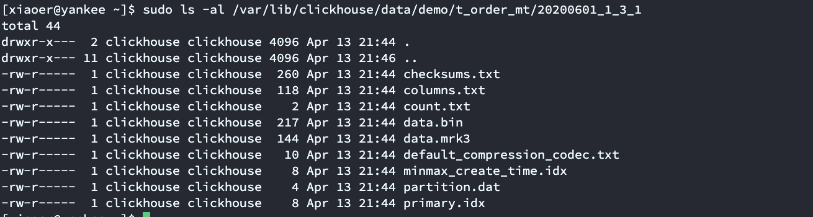

  分区目录命名`PartitionId_MinBlockNum_MaxBlockNum_Level`：

  ```
  - PartitionId：分区值
  	- 数据分区规则由分区ID决定，分区ID由PARTITION BY分区键决定。根据分区键字段类型，ID生成规则可分为：
  		- 未定义分区键：没有使用PARTITION BY，默认生成一个目录名为all的数据分区，所有数据均存放于all目录下
  		- 整型分区键：分区键为整型，直接使用该整型的字符串形式作为分区ID
  		- 日期类型分区键：分区键为日期类型，或者可以转换为日期类型
  		- 其他类型分区键：String、Float类型通过128位的Hash算法取其Hash值作为分区ID
  - MinBlockNum：最小分区块编号
  	- 最小分区块编号，自增类型，从1开始向上递增。每产生一个分区目录就向上递增一个数字
  - MaxBlockNum：最大分区块编号
  	- 最大分区块编号，新创建的分区MinBlockNum等于MaxBlockNum的编号
  - Level：合并层级
  	- 合并的层级，被合并的次数，合并的次数越多，层级值越大
  ```

  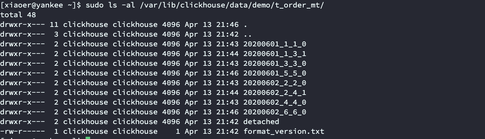

- Primary key主键（Optional）

  ClickHouse中的主键和其他数据库不太一样，它只提供了数据的一级索引，但是却不是唯一约束。主键的设定主要是依据查询语句中的`where`条件。根据条件通过对主键进行某种形式的二分查找，能够定位到对应的`index granularity`，避免了全表扫描。`index granularity`指的是稀疏索引中两个相邻索引对应的数据间隔。ClickHouse中的MergeTree默认是8192。官网不建议修改，除非该列存在大量重复值，比如一个分区中几万行才有一个不同数据。稀疏索引的好处就是用很少的索引数据，定位更多的数据，代价就是只能定位到索引粒度的第一行，然后进行扫描。

- Order by排序（Required）

  `order by`设定了==分区内==的数据按照那些字段顺序进行有序保存。`order by`是MergeTree中唯一一个必选项，比`primary key`还重要，因为不设置主键的情况下，很多处理会根据`order by`的字段进行处理。需要注意的是：==主键必须是order by的前缀字段==。

- 二级索引

  简单数据测试：

  ```sql
  -- 建表语句
  create table demo.t_order_mt2(
    id UInt32,
    sku_id String,
    total_amount Decimal(16,2),
    create_time Datetime,
    INDEX a total_amount TYPE minmax GRANULARITY 5
  ) engine =MergeTree
  partition by toYYYYMMDD(create_time)
  primary key (id)
  order by (id, sku_id);
  
  -- 数据
  insert into demo.t_order_mt2 values 
  (101,'sku_001',1000.00,'2020-06-01 12:00:00'),
  (102,'sku_002',2000.00,'2020-06-01 11:00:00'),
  (102,'sku_004',2500.00,'2020-06-01 12:00:00'),
  (102,'sku_002',2000.00,'2020-06-01 13:00:00'),
  (102,'sku_002',12000.00,'2020-06-01 13:00:00'),
  (102,'sku_002',600.00,'2020-06-02 12:00:00');
  ```

  老版本使用二级索引前需要增加设置：`set allow_experimental_data_skipping_indices=1;`，新版本默认开启，并且已经删除了该设置。

  在定义表语句中可以增加以下语法定义二级索引，具体支持的二级索引类型可以查看[官网](https://clickhouse.com/docs/en/engines/table-engines/mergetree-family/mergetree/#table_engine-mergetree-data_skipping-indexes)文档。其中`GRANULARITY n`表示二级索引对于一级索引的粒度。

  ```sql
  INDEX index_name expr TYPE type(...) GRANULARITY n
  ```

  插入数据后，可以使用以下命令查询数据：

  ```sql
  clickhouse-client --send_logs_level=trace <<< 'select * from demo.t_order_mt2 where total_amount > toDecimal32(900., 2)';
  ```

  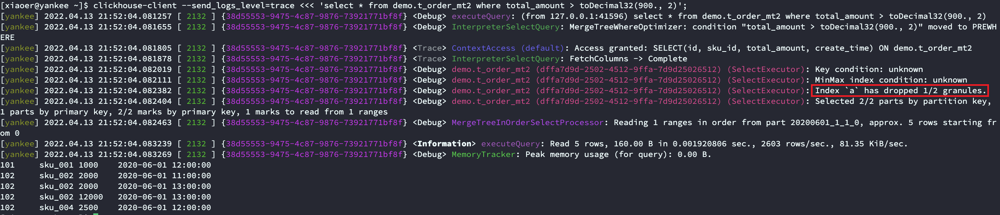

- 数据TTL

  简单数据测试：

  ```sql
  -- 建表语句
  -- 数据列级别TTL测试
  create table demo.t_order_mt3(
    id UInt32,
    sku_id String,
    total_amount Decimal(16,2) TTL create_time + interval 5 MINUTE,
    create_time Datetime
  ) engine =MergeTree
  partition by toYYYYMMDD(create_time)
  primary key (id)
  order by (id, sku_id);
  
  -- 数据需要根据时间进行修改
  insert into demo.t_order_mt3 values 
  (106,'sku_001',1000.00,'2022-04-13 21:53:30'),
  (107,'sku_002',2000.00,'2022-04-13 21:54:30'),
  (110,'sku_003',600.00,'2022-04-13 21:55:00');
  
  -- 数据表级别TTL测试
  alter table t_order_mt3 MODIFY TTL create_time + INTERVAL 1 MINUTE;
  ```

  TTL即`Time To Live`，MergeTree提供了可以管理数据==表==或者==列==的生命周期的功能。需要注意的是TTL对应的列必须是日期类型并且不能是主键字段，可以使用的时间周期关键字有`SECOND、MINUTE、HOUR、DAY、WEEK、MONTH、QUARTER和YEAR`。

  ```sql
  -- 列级TTL语法（alter）
  ALTER TABLE tableName MODIFY COLUMN columnName columnType TTL dateColumnName + INTERVAL 1 DAY;
  
  -- 表级TTL语法（alter）
  ALTER TABLE tableName MODIFY TTL dateColumnName + INTERVAL 1 DAY;
  ```

  列级别的TTL到期后就会删除该条数据：

  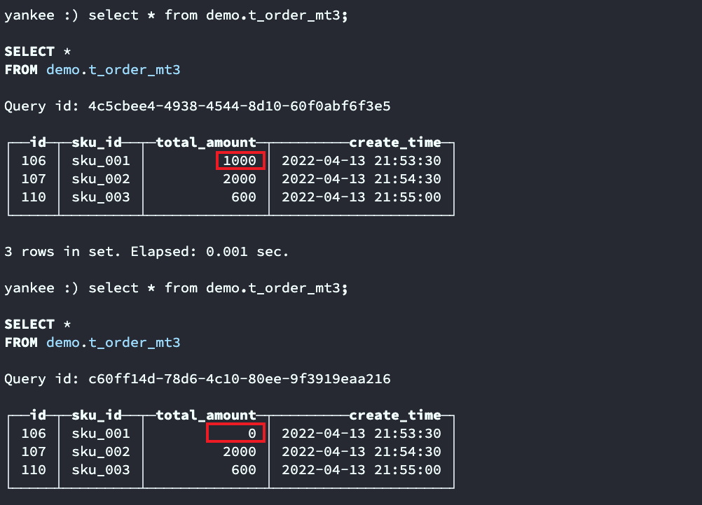

  表级别的TTL到期后默认删除该表中的到期数据：

  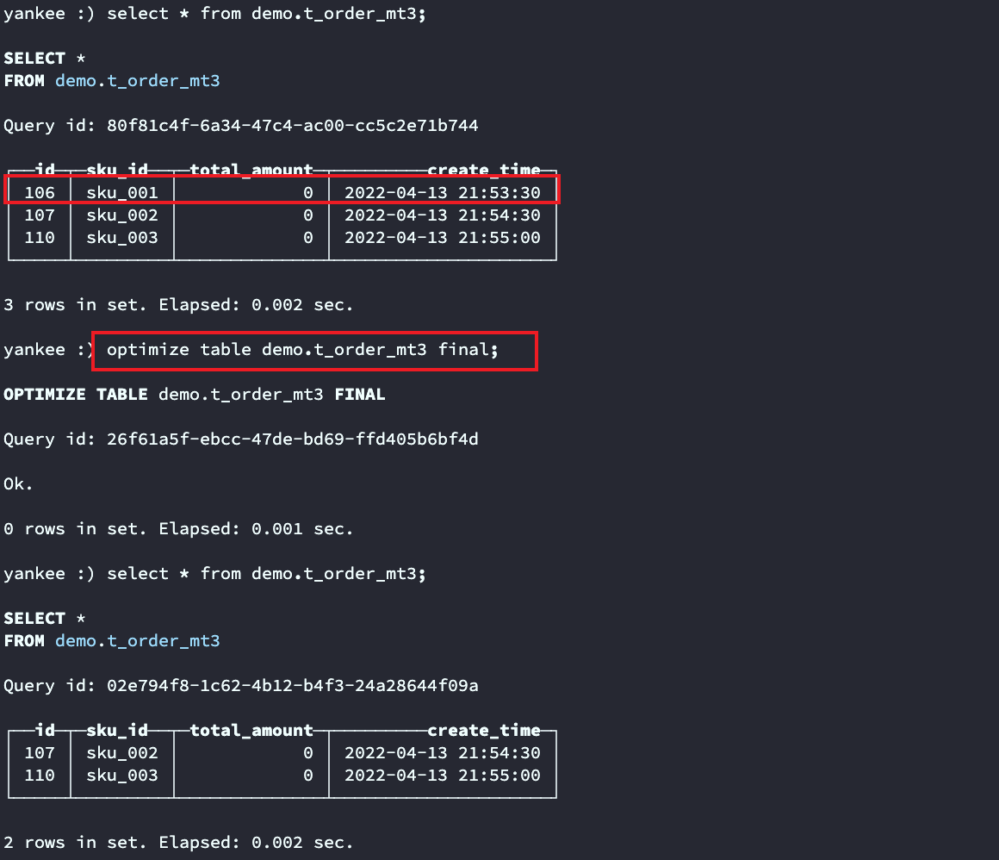

  表级的TTL如果不增加其他的描述，默认是删除`DELETE`操作，还有其他的`RECOMPRESS codec_name、TO DISK 'aaa'、TO VOLUME 'bbb'和GROUP BY`，分别表示用codec_name压缩过期的数据、将数据分段移动到磁盘aaa、将数据分段移动到卷bbb以及聚合过期的行，当然也可以使用`where`从句，可以指定那些过期的行会被删除或聚合（不适用于移动以及重新压缩）。其中`GROUP BY`表达式必须是主键的前缀，如果列不是GROUP BY表达式的一部分，并且未在`SET`子句中显式设置，则在结果行中，它包含来自分组行的临时值（就好像对其应用了聚合函数any一样）。

  ```sql
  TTL expr
      [DELETE|RECOMPRESS codec_name1|TO DISK 'xxx'|TO VOLUME 'xxx'][, DELETE|RECOMPRESS codec_name2|TO DISK 'aaa'|TO VOLUME 'bbb'] ...
      [WHERE conditions]
      [GROUP BY key_expr [SET v1 = aggr_func(v1) [, v2 = aggr_func(v2) ...]] ]
  ```

##### 4. ReplacingMergeTree

ReplacingMergeTree是MergeTree的一个变种，它存储特性完全继承MergeTree，只是多了一个==去重==的功能。需要注意的是去重时不会根据`primary key`进行去重，因为其没有唯一约束的功能。

- 去重时机：数据的去重只会在合并的过程中出现。合并会在未知的时间在后台进行，所以无法预先进行计划，有一些数据可能仍未被处理。
- 去重范围：如果表经过了分区，去重只会在分区内部进行去重，不能跨分区去重。

建表格式：

```sql
CREATE TABLE [IF NOT EXISTS] [db.]table_name [ON CLUSTER cluster]
(
    name1 [type1] [DEFAULT|MATERIALIZED|ALIAS expr1],
    name2 [type2] [DEFAULT|MATERIALIZED|ALIAS expr2],
    ...
) ENGINE = ReplacingMergeTree([ver])
[PARTITION BY expr]
[ORDER BY expr]
[PRIMARY KEY expr]
[SAMPLE BY expr]
[SETTINGS name=value, ...]
```

简单案例数据：

```sql
-- 建表语句
create table demo.t_order_rmt(
  id UInt32,
  sku_id String,
  total_amount Decimal(16,2),
  create_time Datetime
) engine =ReplacingMergeTree(create_time)
partition by toYYYYMMDD(create_time)
primary key (id)
order by (id, sku_id);

-- 数据
insert into demo.t_order_rmt values
(101,'sku_001',1000.00,'2020-06-01 12:00:00'),
(102,'sku_002',2000.00,'2020-06-01 11:00:00'),
(102,'sku_004',2500.00,'2020-06-01 12:00:00'),
(102,'sku_002',2000.00,'2020-06-01 13:00:00'),
(102,'sku_002',12000.00,'2020-06-01 13:00:00'),
(102,'sku_002',600.00,'2020-06-02 12:00:00');
```

需要注意的是表引擎`ReplacingMergeTree()`填入的参数为版本字段，重复数据保留版本字段值最大的，如果不填写版本字段，默认按照插入顺序保留最后一条。

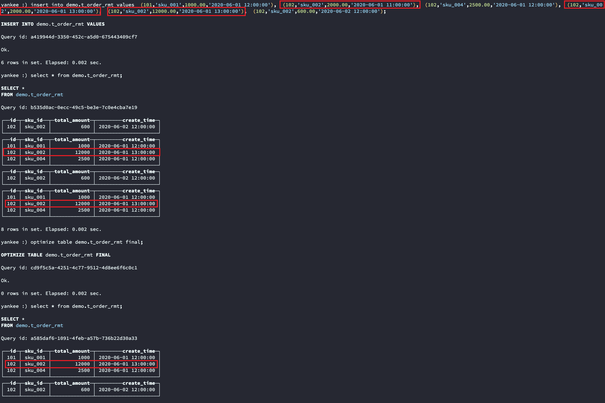

`ReplacingMergeTree`引擎的合并规则：

- 使用`order by`字段作为唯一键
- 去重不能跨分区
- 只有同一批插入或合并分区时才会进行去重
- 认定重复的数据保留版本字段值最大的
- 如果版本字段相同则按插入的顺序保留最后一条

##### 5. SummingMergeTree

对于不查询明细，只关心以维度进行汇总聚合结果的场景。如果只使用普通的MergeTree的话，无论是存储空间还是查询时临时聚合的开销都比较大。所以使用了一种能够”预聚合“的表引擎`SummingMergeTree`。

建表格式：

```sql
CREATE TABLE [IF NOT EXISTS] [db.]table_name [ON CLUSTER cluster]
(
    name1 [type1] [DEFAULT|MATERIALIZED|ALIAS expr1],
    name2 [type2] [DEFAULT|MATERIALIZED|ALIAS expr2],
    ...
) ENGINE = SummingMergeTree([columns])
[PARTITION BY expr]
[ORDER BY expr]
[SAMPLE BY expr]
[SETTINGS name=value, ...]
```

简单案例数据：

```sql
-- 建表语句
create table t_order_smt(
  id UInt32,
  sku_id String,
  total_amount Decimal(16,2) ,
  create_time Datetime
) engine =SummingMergeTree(total_amount)
partition by toYYYYMMDD(create_time)
primary key (id)
order by (id, sku_id);

-- 数据
insert into t_order_smt values
(101,'sku_001',1000.00,'2020-06-01 12:00:00'),
(102,'sku_002',2000.00,'2020-06-01 11:00:00'),
(102,'sku_004',2500.00,'2020-06-01 12:00:00'),
(102,'sku_002',2000.00,'2020-06-01 13:00:00'),
(102,'sku_002',12000.00,'2020-06-01 13:00:00'),
(102,'sku_002',600.00,'2020-06-02 12:00:00');
```

需要注意的是表引擎`SummingMergeTree()`填入的列即为汇总数据列，并且在查询时也要使用`sum`等聚合函数进行聚合，因为表中可能存在一些还没来得及聚合的临时明细，使用`sum`聚合时效率会有一定的提升，但是因为ClickHouse本身就是列式存储的，所以效率提升有限。

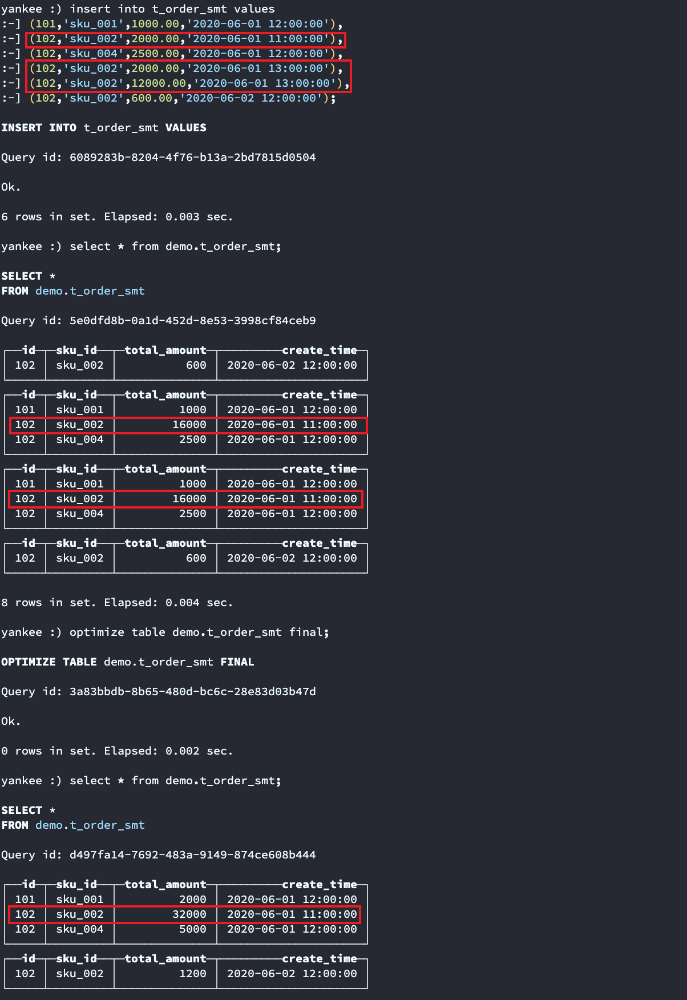

`SummingMergeTree`引擎的聚合规则：

- 以`SummingMergeTree()`中指定的列作为汇总数据列
- 可以填写多列必须是数字列，如果不填，以所有非维度且数字列的字段为数据汇总列
- 以`order by`的列为准，作为维度列
- 其他的列按插入顺序保留第一行，也就是最早的一条
- 不在一个分区的数据不会被聚合
- 只有在同一个批次插入或分片合并时才会进行聚合

#### 7. SQL语法

##### 1. INSERT

```sql
-- 正常insert
INSERT INTO [db.]table [(c1, c2, c3)] VALUES (v11, v12, v13), (v21, v22, v23), ...

-- 使用select子句
INSERT INTO [db.]table [(c1, c2, c3)] SELECT ...
```

在ClickHouse的`INSERT`中，除了使用正常的表达式`[(c1, c2, c3)]`外，还可以使用[匹配器](https://clickhouse.com/docs/en/sql-reference/statements/select/#asterisk)表达式，例如`*`或`/`或者[修饰符](https://clickhouse.com/docs/en/sql-reference/statements/select/#select-modifiers)，常见的有`APPLY`、`EXCEPT`、`REPLACE`等。

对于不填充的某列的值，如果存在`DEFAULT`表达式，则根据`DEFAULT`计算被填充的值，如果没有则填充零或空字符串。如果参数`strict_insert_defaults=1`，则必须在查询中列出所有没有定义`DEFAULT`表达式的列。

需要注意的是在进行`INSERT`时会对写入的数据进行一些处理，包括按照主键排序，按照月份对数据进行分区等。如果在写入的数据中包含多个月份的混合数据时，会显著的降低`INSERT`的性能，为了避免这种情况：

- 数据总是以尽量大的batch写入
- 数据在写入ClickHouse之前预先对数据进行分组

在以下的情况下，性能不会下降：

- 数据总是被实时的写入
- 写入的数据已经按照时间排序

##### 2. UPDATE&DELETE

在ClickHouse中`UPDATE`和`DELETE`都属于`ALTER`的一种，这类查询被称之为`Mumation`查询。需要注意的是，修改和删除可以实现，但需要注意的是在ClickHouse中，`Mutation`语句是一种很“重”的操作，而且不支持事务。

```sql
-- UPDATE
ALTER TABLE [db.]table UPDATE column1 = expr1 [, ...] WHERE filter_expr

-- DELETE
ALTER TABLE [db.]table [ON CLUSTER cluster] DELETE WHERE filter_expr
```

由于这种操作比较“重“，所以`Mutation`语句分两步执行，同步执行的部分其实只是进行新增数据新增分区和并把旧分区打上逻辑的失效标记，直到触发分区合并的时候才会删除旧数据释放磁盘空间，这种功能一般不会开放给用户，由管理员完成。

##### 3. ALTER

ClickHouse中的`ALTER`操作仅支持`MergeTree家族`、`Merge`以及`Distributed`等引擎表。关于更多`ALTER`的操作可以查看[官网](https://clickhouse.com/docs/en/sql-reference/statements/alter/)文档。

```sql
ALTER TABLE [db].name [ON CLUSTER cluster] ADD|DROP|CLEAR|COMMENT|MODIFY COLUMN ...
```

- 增加列

  ```sql
  ADD COLUMN [IF NOT EXISTS] name [type] [default_expr] [codec] [AFTER name_after]
  ```

- 删除列

  ```sql
  DROP COLUMN [IF EXISTS] name
  ```

- 清空列

  ```sql
  CLEAR COLUMN [IF EXISTS] name IN PARTITION partition_name
  ```

- 增加注释

  ```sql
  COMMENT COLUMN [IF EXISTS] name 'comment'
  ```

- 修改列

  ```sql
  MODIFY COLUMN [IF EXISTS] name [type] [default_expr] [TTL]
  ```

##### 4. SELECT

ClickHouse中的`SELECT`和标准的SQL差别不是很大，更多详细的介绍查看[官网](https://clickhouse.com/docs/en/sql-reference/statements/select/)文档。

- 支持子查询
- 支持CTE（Command Table Expression公用表表达式with子句）
- 支持各种JOIN，但是JOIN操作无法使用缓存，所以即使是两次相同的JOIN语句，ClickHouse也会视为两条新的SQL
- 窗口函数
- 不支持自定义函数
- GROUP BY操作增加了`with rollup、with cube、with total`用来计算小计和总计

```sql
[WITH expr_list|(subquery)]
SELECT [DISTINCT] expr_list
[FROM [db.]table | (subquery) | table_function] [FINAL]
[SAMPLE sample_coeff]
[ARRAY JOIN ...]
[GLOBAL] [ANY|ALL|ASOF] [INNER|LEFT|RIGHT|FULL|CROSS] [OUTER|SEMI|ANTI] JOIN (subquery)|table (ON <expr_list>)|(USING <column_list>)
[PREWHERE expr]
[WHERE expr]
[GROUP BY expr_list] [WITH TOTALS]
[HAVING expr]
[ORDER BY expr_list] [WITH FILL] [FROM expr] [TO expr] [STEP expr]
[LIMIT [offset_value, ]n BY columns]
[LIMIT [n, ]m] [WITH TIES]
[UNION ALL ...]
[INTO OUTFILE filename]
[FORMAT format]
```

这些子句的执行顺序分别是：`WITH -> SELECT -> DISTINCT -> FROM -> SAMPLE -> JOIN -> PREWHERE -> WHERE -> GROUP BY -> LIMIT BY -> HAVING -> LIMIT -> OFFSET -> UNION -> INTERSECT -> EXCEPT -> INTO OUTFILE -> FORMAT`。

简单测试数据：

```sql
-- 删除所有数据
alter table demo.t_order_mt delete where 1=1;

-- 插入数据
insert into demo.t_order_mt values 
(101,'sku_001',1000.00,'2020-06-01 12:00:00'),
(101,'sku_002',2000.00,'2020-06-01 12:00:00'),
(103,'sku_004',2500.00,'2020-06-01 12:00:00'),
(104,'sku_002',2000.00,'2020-06-01 12:00:00'),
(105,'sku_003',600.00,'2020-06-02 12:00:00'),
(106,'sku_001',1000.00,'2020-06-04 12:00:00'),
(107,'sku_002',2000.00,'2020-06-04 12:00:00'),
(108,'sku_004',2500.00,'2020-06-04 12:00:00'),
(109,'sku_002',2000.00,'2020-06-04 12:00:00'),
(110,'sku_003',600.00,'2020-06-01 12:00:00');
```

- with rollup：从右至左去掉维度进行小计

  ```sql
  select id, sku_id, sum(total_amount) from demo.t_order_mt group by id, sku_id with rollup;
  ```

  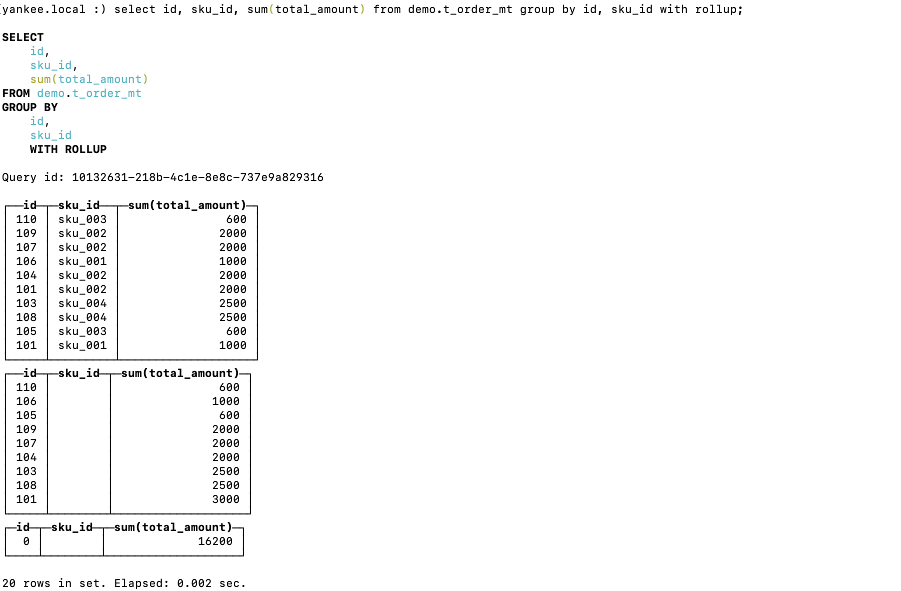

- with cube：从右到左去掉维度进行小计，再从左到右去掉维度进行小计

  ```sql
  select id, sku_id, sum(total_amount) from demo.t_order_mt group by id, sku_id with cube;
  ```

  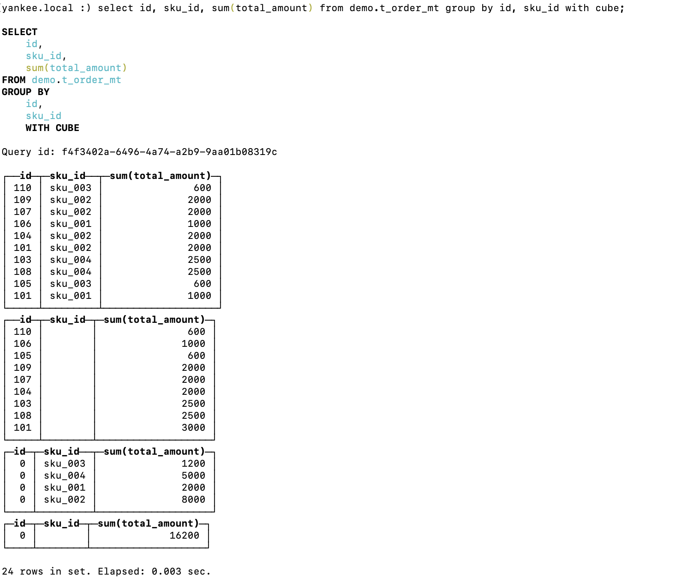

- with total ：只计算合计

  ```sql
  select id, sku_id, sum(total_amount) from demo.t_order_mt group by id, sku_id with totals;
  ```

  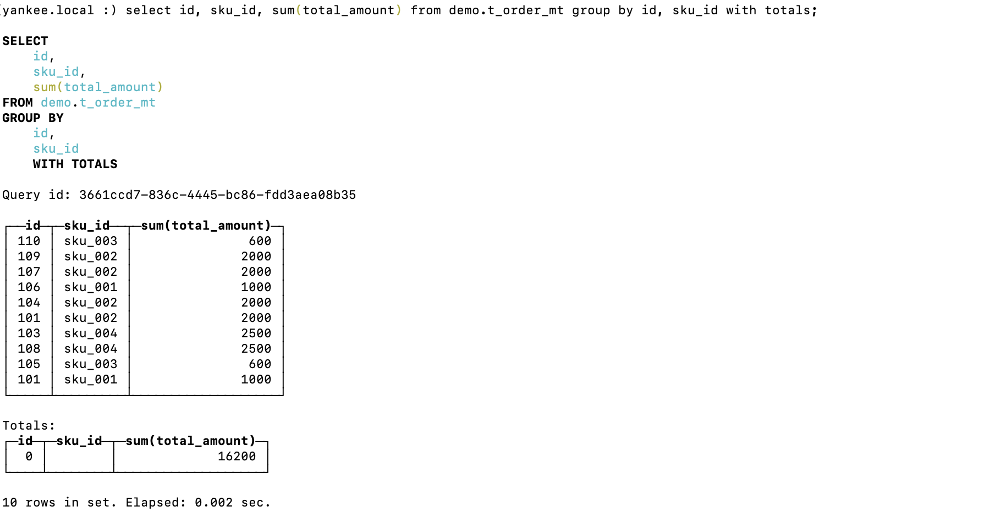

##### 5. 导出数据

ClickHouse提供了使用客户端导出数据的方式，而且支持导出成非常多的数据格式，具体可以参考[官网](https://clickhouse.com/docs/en/interfaces/formats/)文档。

```sql
clickhouse-client --query "select * from t_order_mt where create_time='2020-06-01 12:00:00'" --format CSVWithNames > /Users/yankee/modules/clickhouse/data/rs1.csv
```

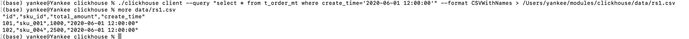

#### 8. 副本

##### 1. 副本写入流程

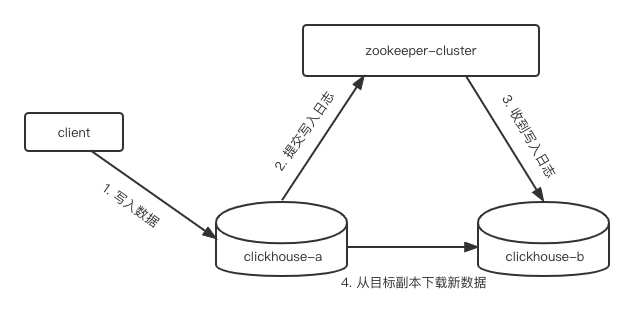

##### 2. 副本配置

配置方式大概分为两种，一种是在原有的配置文件`config.xml`中打开`zookeeper`标签，另外一种是使用外部配置文件指定`zookeeper`标签。

建议使用第一种直接修改`config.xml`的方式，相对来说操作简单，不需要新增其他文件。

启动Zookeeper集群之后，在`config.d`目录下创建文件`metrika.xml`（文件名随意，一般情况下使用metrika），并写入以下内容：

```xml
<?xml version="1.0"?>
<yandex>
  <zookeeper-servers>
    <node index="1">
      <host>cdh2</host>
      <port>2181</port>
    </node>
    <node index="2">
      <host>hadoop02</host>
      <port>cdh3</port>
    </node>
    <node index="3">
      <host>cdh4</host>
      <port>2181</port>
    </node>
  </zookeeper-servers>
</yandex>
```

新增完`metrika.xml`文件后注意看该文件的用户及用户组是不是`clickhouse:clickhouse`，如果不是尽可能的修改一下，以防止出现权限等问题。

之后需要在`config.xml`中增加`include`标签引入外部的配置文件。

```xml
 <zookeeper incl="zookeeper-servers" optional="true" />
<include_from>/etc/clickhouse-server/config.d/metrika.xml</include_from>
```

在互为副本的clickhouse服务节点，同步`config.xml`和`metrika.xml`配置文件，同步完成后需要重启clickhouse服务。

建表语句：

```sql
-- cdh2建表
create table demo.t_order_rep (
  id UInt32,
  sku_id String,
  total_amount Decimal(16,2), create_time Datetime
) engine =ReplicatedMergeTree('/clickhouse/table/01/t_order_rep','rep_cdh2')
partition by toYYYYMMDD(create_time)
primary key (id)
order by (id, sku_id);

-- cdh3建表
create table demo.t_order_rep (
  id UInt32,
  sku_id String,
  total_amount Decimal(16,2), create_time Datetime
) engine =ReplicatedMergeTree('/clickhouse/table/01/t_order_rep','rep_cdh3')
partition by toYYYYMMDD(create_time)
primary key (id)
order by (id, sku_id);
```

简单数据测试：

```sql
-- 在其中任何一台中插入数据，在另外一个副本节点查看是否有数据
insert into demo.t_order_rep values
(101,'sku_001',1000.00,'2020-06-01 12:00:00'),
(102,'sku_002',2000.00,'2020-06-01 12:00:00'),
(103,'sku_004',2500.00,'2020-06-01 12:00:00'),
(104,'sku_002',2000.00,'2020-06-01 12:00:00'),
(105,'sku_003',600.00,'2020-06-02 12:00:00');
```

需要注意的是==副本只能同步表数据，不能同步表结构，所以我们必须手动建表。==在使用`ReplicatedMergeTree`表引擎建表时，有两个参数：

- 第一个参数：分片的`zk_path`，一般按照：`/clickhouse/table/{shard}/{table_name}`的格式编写，如果只有一个副本就写01即可
- 第二个参数：副本名称，相同的分片副本的名称不能相同

#### 9. 分片集群

副本可以提高数据的高可用性，降低数据丢失的风险，但是每台服务器实际上保存的还是所有的数据，对数据的==横向扩容==问题并没有解决。要解决数据水平切片的问题，就需要使用`Distributed`表引擎将不同的数据分片保存在不同的节点上，需要的时候通过`Distributed`表引擎把数据拼接起来一同使用。

`Distributed`表引擎本身并不存储数据，只是一种中间件，通过分布式逻辑表来写入、分发、路由来操作多台节点不同分片的分布式数据。

需要注意的是ClickHouse的集群是表级别的，实际应用中，大部分做了高可用，但是没有使用用分片，避免降低查询性能以及操作集群的复杂性。

##### 1. 集群写入流程（3分片2副本）


##### 2. 集群读取流程（3分片2副本）

##### 3. 集群配置（3分片2副本）