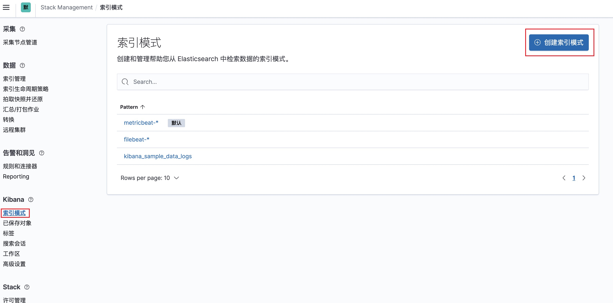
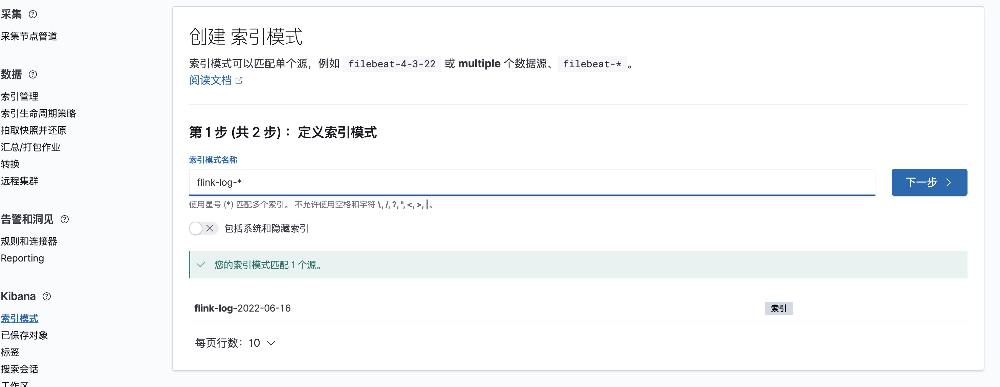
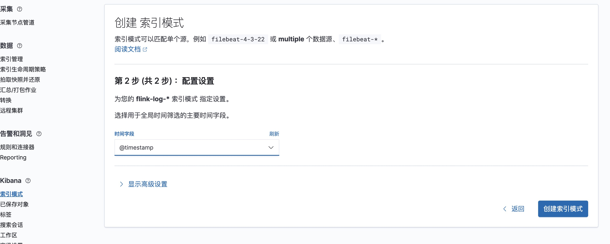
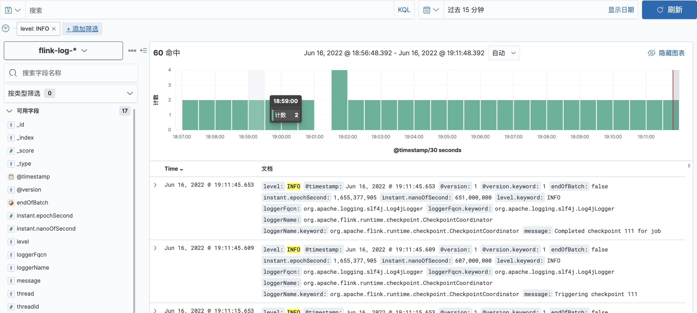

### 1. 各组件版本

|     组件     |  版本  |
| :----------: | :----: |
| elasticseach | 7.13.0 |
|    kibana    | 7.13.0 |
|   logstash   | 7.13.0 |
|    flink     | 1.13.6 |

### 2. Flink日志文件配置

#### 2.1 设置日志按大小滚动生成文件

因为在正常的情况下，Flink的流数据是非常大的，有时候会使用print()打印数据自己查看，有时候为了查找问题会开启debug日志，就会导致日志文件非常大，通过Web UI查看对应的日志文件是会非常卡，所以首先将日志文件按照大小滚动生成文件，我们在查看时不会因为某个文件非常大导致Web UI界面卡，没法查看。

```properties
# Allows this configuration to be modified at runtime. The file will be checked every 30 seconds.
monitorInterval=30

# This affects logging for both user code and Flink
rootLogger.level = INFO
rootLogger.appenderRef.file.ref = RollingFileAppender

# Uncomment this if you want to _only_ change Flink's logging
#logger.flink.name = org.apache.flink
#logger.flink.level = INFO

# The following lines keep the log level of common libraries/connectors on
# log level INFO. The root logger does not override this. You have to manually
# change the log levels here.
logger.akka.name = akka
logger.akka.level = INFO
logger.kafka.name= org.apache.kafka
logger.kafka.level = INFO
logger.hadoop.name = org.apache.hadoop
logger.hadoop.level = INFO
logger.zookeeper.name = org.apache.zookeeper
logger.zookeeper.level = INFO
logger.shaded_zookeeper.name = org.apache.flink.shaded.zookeeper3
logger.shaded_zookeeper.level = INFO

# Log all infos in the given file
appender.rolling.name = RollingFileAppender
appender.rolling.type = RollingFile
appender.rolling.append = false
appender.rolling.fileName = ${sys:log.file}
appender.rolling.filePattern = ${sys:log.file}.%i
appender.rolling.layout.type = PatternLayout
appender.rolling.layout.pattern = %d{yyyy-MM-dd HH:mm:ss,SSS} %-5p %-60c %x - %m%n
appender.rolling.policies.type = Policies
appender.rolling.policies.size.type = SizeBasedTriggeringPolicy
appender.rolling.policies.size.size = 500MB
appender.rolling.strategy.type = DefaultRolloverStrategy
appender.rolling.strategy.max = 10

# Suppress the irrelevant (wrong) warnings from the Netty channel handler
logger.netty.name = org.apache.flink.shaded.akka.org.jboss.netty.channel.DefaultChannelPipeline
logger.netty.level = OFF
```

#### 2.2 设置日志写入Kafka集群

针对按照日志文件大小滚动生成文件的方式，可能因为某个错误的问题，需要看好多个日志文件，所以可以把日志文件通过KafkaAppender写入到kafka中，然后通过ELK等进行日志搜索甚至是分析告警。

```properties
# Allows this configuration to be modified at runtime. The file will be checked every 30 seconds.
monitorInterval=30

# This affects logging for both user code and Flink
rootLogger.level = INFO
rootLogger.appenderRef.kafka.ref = Kafka
rootLogger.appenderRef.file.ref = RollingFileAppender

# Uncomment this if you want to _only_ change Flink's logging
#logger.flink.name = org.apache.flink
#logger.flink.level = INFO

# The following lines keep the log level of common libraries/connectors on
# log level INFO. The root logger does not override this. You have to manually
# change the log levels here.
logger.akka.name = akka
logger.akka.level = INFO
logger.kafka.name= org.apache.kafka
logger.kafka.level = INFO
logger.hadoop.name = org.apache.hadoop
logger.hadoop.level = INFO
logger.zookeeper.name = org.apache.zookeeper
logger.zookeeper.level = INFO
logger.shaded_zookeeper.name = org.apache.flink.shaded.zookeeper3
logger.shaded_zookeeper.level = INFO

# Log all infos in the given file
appender.rolling.name = RollingFileAppender
appender.rolling.type = RollingFile
appender.rolling.append = false
appender.rolling.fileName = ${sys:log.file}
appender.rolling.filePattern = ${sys:log.file}.%i
appender.rolling.layout.type = PatternLayout
appender.rolling.layout.pattern = %d{yyyy-MM-dd HH:mm:ss,SSS} %-5p %-60c %x - %m%n
appender.rolling.policies.type = Policies
appender.rolling.policies.size.type = SizeBasedTriggeringPolicy
appender.rolling.policies.size.size = 500MB
appender.rolling.strategy.type = DefaultRolloverStrategy
appender.rolling.strategy.max = 10

# kafka
appender.kafka.type = Kafka
appender.kafka.name = Kafka
appender.kafka.syncSend = true
appender.kafka.ignoreExceptions = false
appender.kafka.topic = flink_logs
appender.kafka.property.type = Property
appender.kafka.property.name = bootstrap.servers
appender.kafka.property.value = localhost:9092
appender.kafka.layout.type = JSONLayout
apender.kafka.layout.value = net.logstash.log4j.JSONEventLayoutV1
appender.kafka.layout.compact = true
appender.kafka.layout.complete = false

# Suppress the irrelevant (wrong) warnings from the Netty channel handler
logger.netty.name = org.apache.flink.shaded.akka.org.jboss.netty.channel.DefaultChannelPipeline
logger.netty.level = OFF
```

上面的`appender.kafka.layout.type`可以使用`JSONLayout`，也可以自定义。自定义需要将上面的`appender.kafka.layout.type`和`appender.kafka.layout.value`修改成如下：

````properties
appender.kafka.layout.type = PatternLayout
appender.kafka.layout.pattern = {"log_level":"%p","log_timestamp":"%d{ISO8601}","log_thread":"%t","log_file":"%F","log_line":"%L","log_message":"'%m'","log_path":"%X{log_path}","job_name":"${sys:flink_job_name}"}%n
````

针对于不同的Flink模式，需要在`flink/lib`目录下放入的jar包也有所不同：

##### 2.2.1 Flink on Yarn

```shell
# 根据kafka的版本放入kafka-clients
kafka-clients-3.1.0.jar
```

如果是通过`flink on yarn`模式还可以添加自定义字段：

```properties
# 日志路径
appender.kafka.layout.additionalField1.type = KeyValuePair
appender.kafka.layout.additionalField1.key = logdir
appender.kafka.layout.additionalField1.value = ${sys:log.file}
# flink-job-name
appender.kafka.layout.additionalField2.type = KeyValuePair
appender.kafka.layout.additionalField2.key = flinkJobName
appender.kafka.layout.additionalField2.value = ${sys:flinkJobName}
# 提交到yarn的containerId
appender.kafka.layout.additionalField3.type = KeyValuePair
appender.kafka.layout.additionalField3.key = yarnContainerId
appender.kafka.layout.additionalField3.value = ${sys:yarnContainerId}
```

添加以上的自定义字段，需要在`flink-conf.yaml`中配置如下：

```yaml
env.java.opts.taskmanager: -DyarnContainerId=$CONTAINER_ID
env.java.opts.jobmanager: -DyarnContainerId=$CONTAINER_ID
```

之后进入flink目录提交任务到yarn：

```shell
./bin/flink run-application \
-d \
-t yarn-application \
-Dyarn.application.name=TopSpeed \
-Dmetrics.reporter.promgateway.groupingKey="TopSpeed" \
-Dmetrics.reporter.promgateway.jobName=TopSpeed \
-Denv.java.opts="-DflinkJobName=TopSpeed" \
./examples/streaming/TopSpeedWindowing.jar
```

消费kafka的消息可以看到如下：

```json
{
    "instant":{
        "epochSecond":1655379271,
        "nanoOfSecond":642000000
    },
    "thread":"main",
    "level":"INFO",
    "loggerName":"org.apache.flink.runtime.io.network.netty.NettyServer",
    "message":"Transport type 'auto': using EPOLL.",
    "endOfBatch":false,
    "loggerFqcn":"org.apache.logging.slf4j.Log4jLogger",
    "threadId":1,
    "threadPriority":5,
    "logdir":"/yarn/container-logs/application_1655373794581_0005/container_e46_1655373794581_0005_01_000002/taskmanager.log",
    "flinkJobName":"TopSpeed",
    "yarnContainerId":"container_e46_1655373794581_0005_01_000002"
}
```

##### 2.2.2 Flink Standalone集群

```shell
# 根据kafka的版本放入kafka-clients
kafka-clients-3.1.0.jar
# jackson对应的jar包
jackson-annotations-2.13.3.jar
jackson-core-2.13.3.jar
jackson-databind-2.13.3.jar
```

### 3. Flink日志接入Elasticsearch

日志写入Kafka之后可以通过Logstash接入elasticsearch，然后通过kibana进行查询或搜索，安装logstash的步骤可以参考官网。

#### 3.1 配置Logstash

将以下内容写入`config/logstash-sample.conf`文件中

```
input {
  kafka {
    bootstrap_servers => ["cdh2:9092,cdh3:9092,cdh4:9092"]
    group_id => "logstash-group"
    topics => ["flink_logs"]
    consumer_threads => 3
    type => "flink-logs"
    codec => "json"
    auto_offset_reset => "latest"
  }
}

output {
  elasticsearch {
    hosts => ["cdh2:9200","cdh3:9200","cdh4:9200"]
    index => "flink-log-%{+YYYY-MM-dd}"
  }
}
```

上述配置按天生成新的flink日志索引，之后运行logstash，运行的日志没有报错即可在elasticsearch查看对应的索引日志。

```shell
bin/logstash -f ./config/logstash-sample.conf 2>&1 >./logs/logstash.log &
```

#### 3.2 利用kibana搜索日志

##### 3.2.1 创建索引模式



新建索引模式，因为我们上面的flink日志的索引名称为`flin-log-%{+YYYY-MM-dd}`，所以我们创建一个匹配flink-log的索引模式即可。



之后点击下一步，选择时间字段为`@timestamp`即可。



##### 3.2.2 通过Discover搜索日志

打开Discover选择刚刚创建的索引模式，在左上角可以添加筛选条件。



---

<div align=center>
    <font color='red' size=5>关注微信公众号《零基础学大数据》回复【Flink】领取全部PDF</font>
</div>