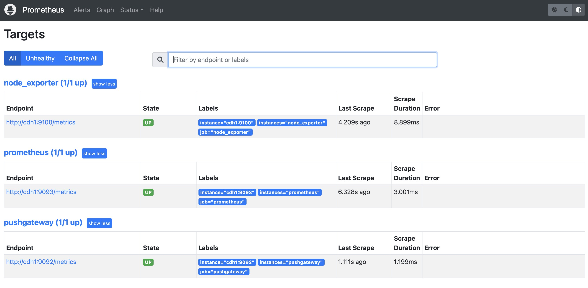
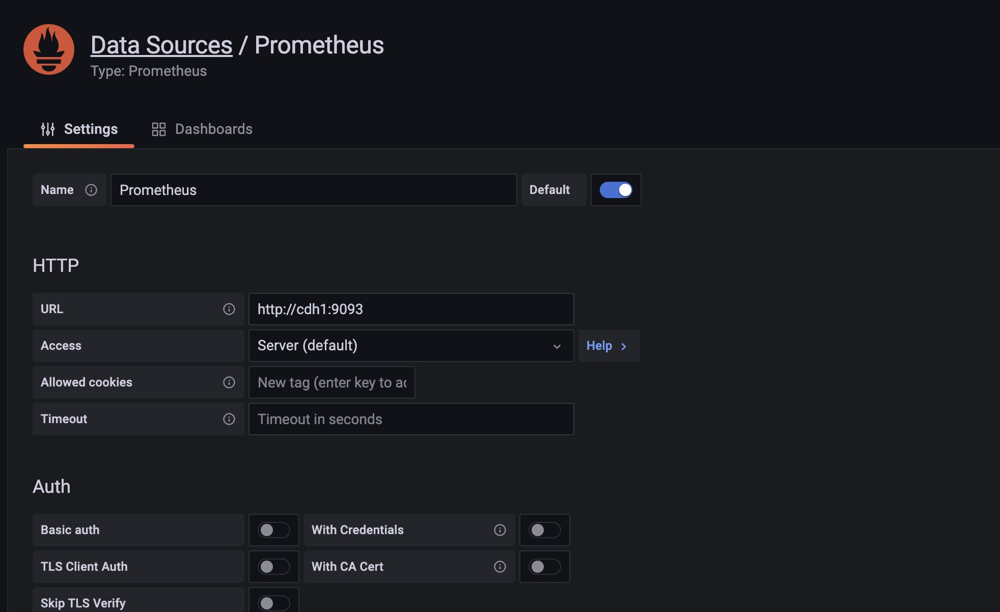
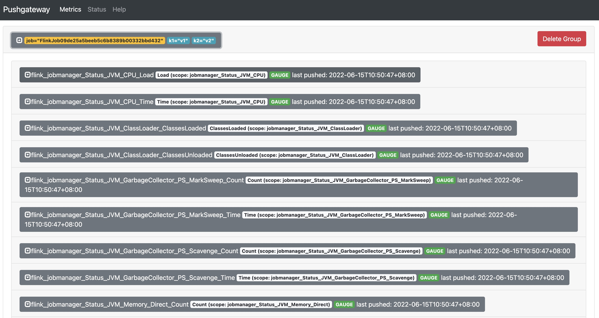
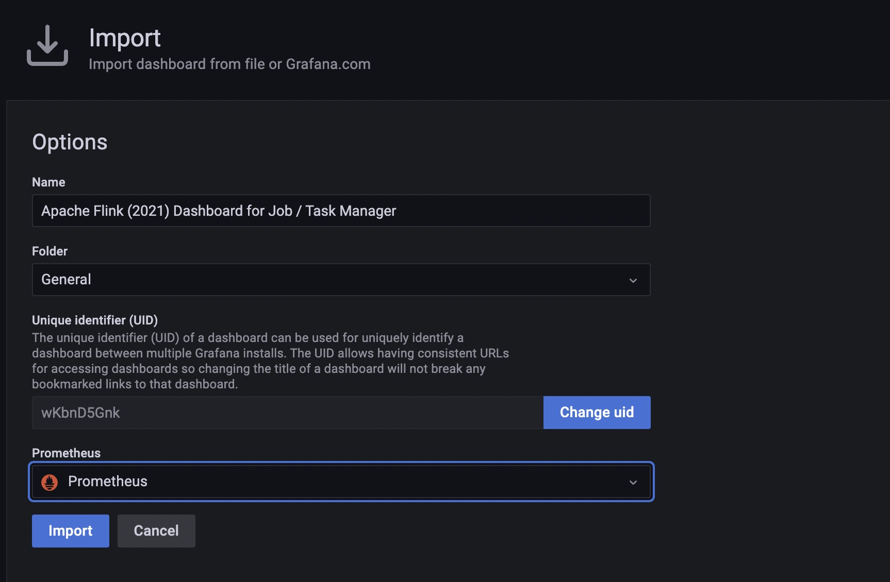
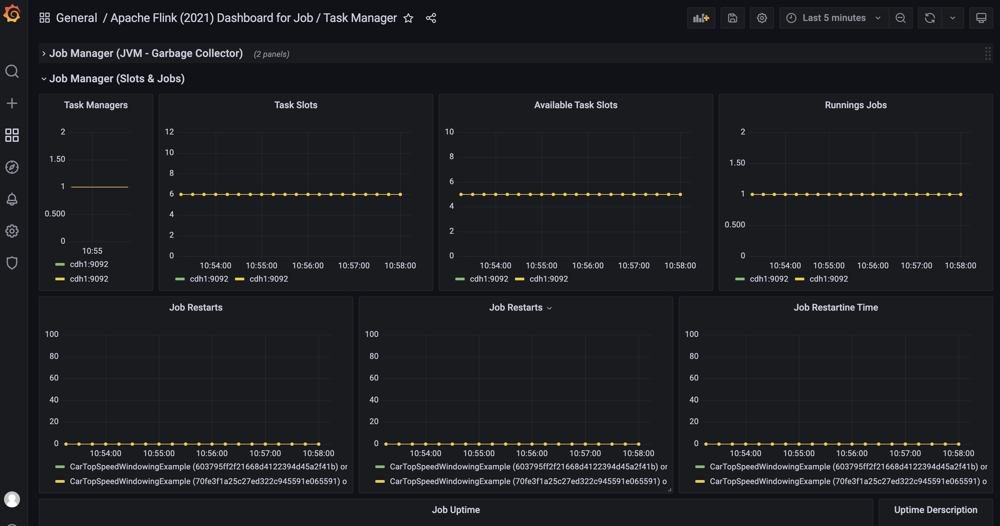

#### 1. 下载对应的安装包

|     组件      |  版本  |                           下载地址                           |
| :-----------: | :----: | :----------------------------------------------------------: |
|  Prometheus   | 2.36.1 | [官网](https://github.com/prometheus/prometheus/releases/download/v2.36.1/prometheus-2.36.1.linux-amd64.tar.gz) |
|  Pusgateway   | 1.4.3  | [官网](https://github.com/prometheus/pushgateway/releases/download/v1.4.3/pushgateway-1.4.3.linux-amd64.tar.gz) |
| node_exporter | 1.3.1  | [官网](https://github.com/prometheus/node_exporter/releases/download/v1.3.1/node_exporter-1.3.1.linux-amd64.tar.gz) |
|    Grafana    | 8.5.6  | [官网](https://dl.grafana.com/enterprise/release/grafana-enterprise-8.5.6-1.x86_64.rpm) |

#### 2. 安装并运行

##### 2.1 安装pushgateway

将pushgateway解压到指定目录后，直接运行pushgateway即可

启动pushgateway

```shell
nohup ./pushgateway --web.listen-address=":9092" > ./pushgateway-start.log 2>&1 &
```

将push gateway安装为系统服务，让`systemctl`来管理，直接修改`/usr/lib/systemd/system/pushgateway.service`，写入以下内容：

```
[Unit]
Description=pushgateway
After=local-fs.target network-online.target network.target
Wants=local-fs.target network-online.target network.target

[Service]
ExecStart=/opt/modules/pushgateway/pushgateway --web.listen-address=:9092
Restart=on-failure

[Install]
WantedBy=multi-user.target
```

设置开机自启

```shell
systemctl enable pushgateway
systemctl start pushgateway
systemctl status pushgateway
```

##### 2.2 安装node_exporter

将node_exporter解压到指定目录后，直接运行node_exporter即可

启动node_exporter

```shell
nohup ./node_exporter --web.listen-address=":9100" > ./node_exporter-start.log 2>&1 &
```

将node_exporter安装为系统服务，让`systemctl`来管理，直接修改`/usr/lib/systemd/system/node_exporter.service`，写入以下内容：

```
[Unit]
Description=node_exporter
After=local-fs.target network-online.target network.target
Wants=local-fs.target network-online.target network.target

[Service]
ExecStart=/opt/modules/node_exporter/node_exporter --web.listen-address=:9100
Restart=on-failure

[Install]
WantedBy=multi-user.target
```

设置开机自启

```shell
systemctl enable node_exporter
systemctl start node_exporter
systemctl status node_exporter
```

##### 2.3 安装Prometheus

解压Prometheus到安装目录，并修改目录下的`prometheus.yml`配置文件：

```yml
# my global config
global:
  scrape_interval: 15s # Set the scrape interval to every 15 seconds. Default is every 1 minute.
  evaluation_interval: 15s # Evaluate rules every 15 seconds. The default is every 1 minute.
  # scrape_timeout is set to the global default (10s).

# Alertmanager configuration
alerting:
  alertmanagers:
    - static_configs:
        - targets:
          # - alertmanager:9093

# Load rules once and periodically evaluate them according to the global 'evaluation_interval'.
rule_files:
  # - "first_rules.yml"
  # - "second_rules.yml"

scrape_configs:
  # The job name is added as a label `job=<job_name>` to any timeseries scraped from this config.
  - job_name: "prometheus"
    static_configs:
    # 默认端口是9090
      - targets: ["cdh1:9093"]
        labels:
          instances: prometheus

  - job_name: "pushgateway"
    # 默认为1分钟
    scrape_interval: 5s
    static_configs:
    # 默认端口是9091
      - targets: ["cdh1:9092"]
        labels:
          instances: pushgateway

  - job_name: "node_exporter"
    scrape_interval: 5s
    static_configs:
      - targets: ["cdh1:9100"]
        labels:
          instances: node_exporter
```

启动Prometheus服务

```shell
nohup ./prometheus --config.file=./prometheus.yml --web.listen-address=":9093" > ./prometheus-start.log 2>&1 &
```

启动之后在web页面上可以看到pushgateway、node_exporter以及prometheus的运行情况，地址`ip:port/targets`



将prometheus安装为系统服务，让`systemctl`来管理，直接修改`/usr/lib/systemd/system/prometheus.service`，写入以下内容：

```
[Unit]
Description=prometheus
After=local-fs.target network-online.target network.target
Wants=local-fs.target network-online.target network.target

[Service]
ExecStart=/opt/modules/prometheus/prometheus --config.file=/opt/modules/prometheus/prometheus.yml --web.listen-address=:9093
Restart=on-failure

[Install]
WantedBy=multi-user.target
```

设置开机自启

```shell
systemctl enable prometheus
systemctl start prometheus
systemctl status prometheus
```

##### 2.4 安装Grafana

```shell
wget https://dl.grafana.com/enterprise/release/grafana-enterprise-9.0.2-1.x86_64.rpm
sudo yum install grafana-enterprise-9.0.2-1.x86_64.rpm
```

启动Grafana服务

```shell
sudo systemctl start grafana-server
```

启动Grafana后，可以访问web页面，地址是`ip:3000`，默认用户名和密码是`admin/admin`。


#### 3. 配置Grafana数据源

进入`Setting`中选择`Add Data source`即可添加数据源，选择prometheus即可，添加完成后保存测试。



#### 4. 配置Flink上报Metrics

修改`flink-conf.yaml`配置文件，新增如下配置：

```yaml
metrics.reporter.promgateway.class: org.apache.flink.metrics.prometheus.PrometheusPushGatewayReporter
# pushgateway的地址和端口号
metrics.reporter.promgateway.host: cdh1
metrics.reporter.promgateway.port: 9092
metrics.reporter.promgateway.jobName: FlinkJob
# 是否自动生成JobName
metrics.reporter.promgateway.randomJobNameSuffix: true
# 作业结束后删除其对应的Metrics
metrics.reporter.promgateway.deleteOnShutdown: false
metrics.reporter.promgateway.groupingKey: k1=v1;k2=v2
# 上报Metrics的频率
metrics.reporter.promgateway.interval: 10 SECONDS
```

配置好之后运行flink的测试案例：

```shell
bin/flink run -d -t yarn-per-job ./examples/streaming/TopSpeedWindowing.jar
```

再次访问pushgateway的页面可以看到如下的metrics上报信息



####  5. 登陆Grafana配置Flink监控面板

访问Grafana的dashboards页面，下载Flink的dashboards模板，官网下载地址`https://grafana.com/grafana/dashboards/`

下载好之后打开Grafana Web UI通过import导入刚刚所下载的Flink Metrics监控模板



之后打开该dashboards即可看到flink的metrics信息



