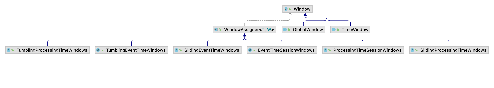
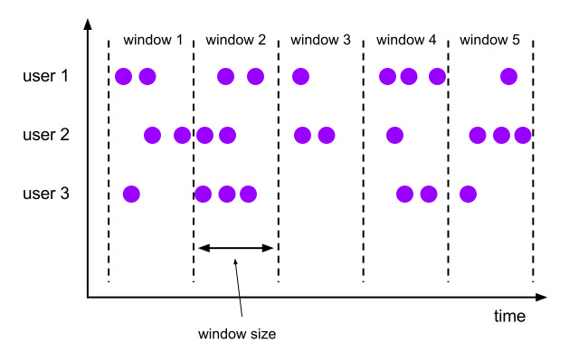
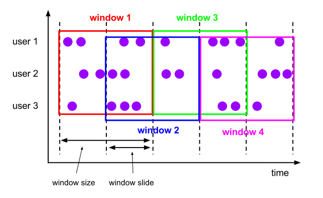
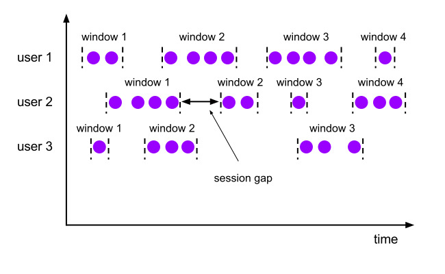
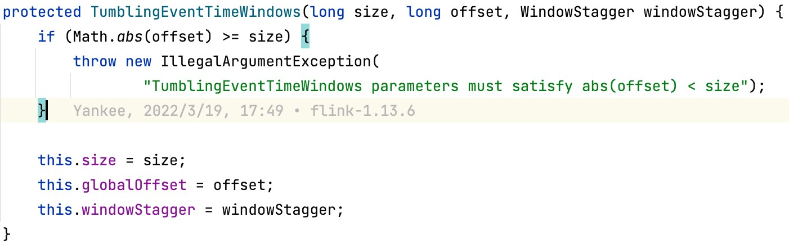
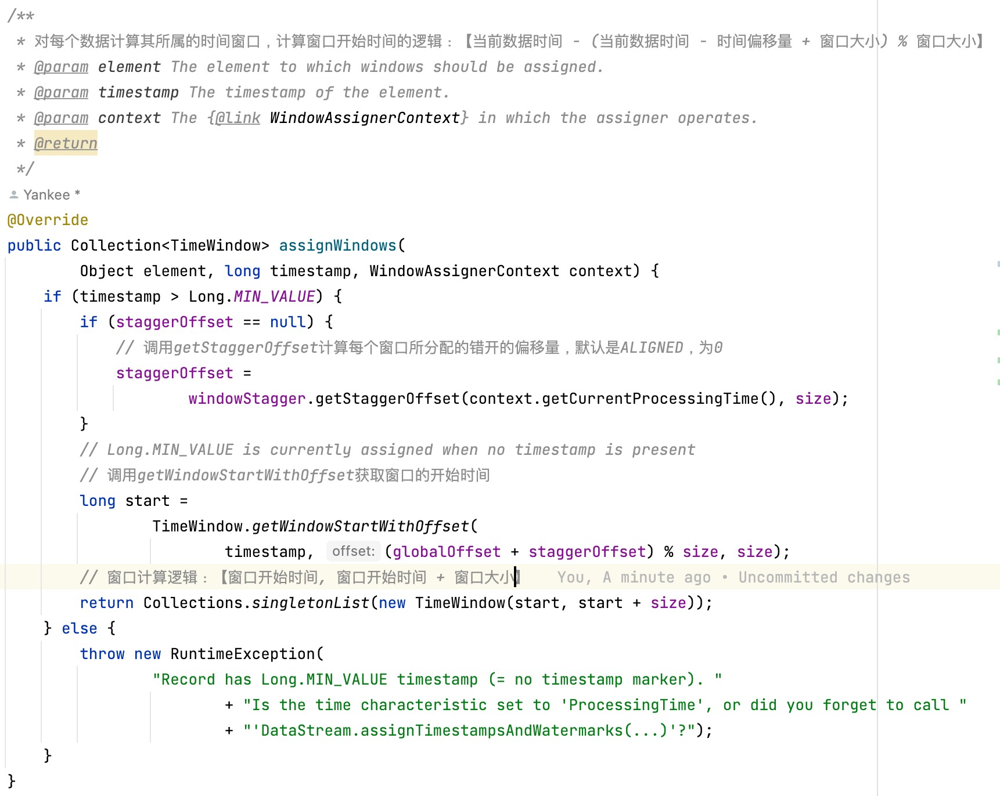
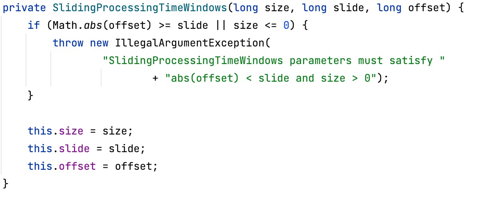
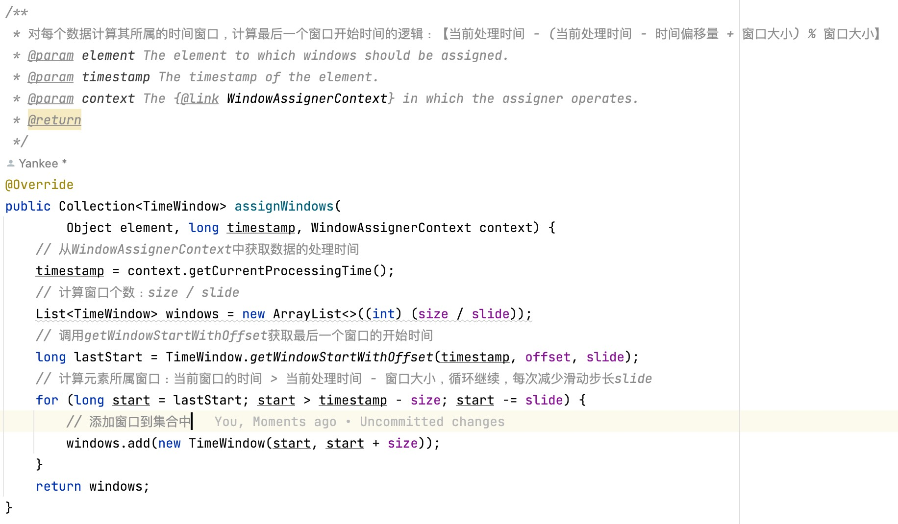
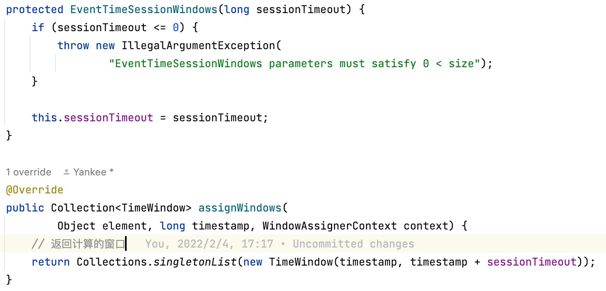

### Flink中Window的介绍和使用

Flink中的窗口大致分为两类，分别是`Keyed Windows`和`Non-Keyed Windows`，接下来我们从其简单应用方面看看Window都包含哪些内容，基本的用法等。

#### 1. 窗口分类

##### 1. 按照使用场景分类

- `Keyed Windows`：跟在`KeyedStream`后使用

  ```
  stream
         .keyBy(...)               <-  keyed versus non-keyed windows
         .window(...)              <-  required: "assigner"
        [.trigger(...)]            <-  optional: "trigger" (else default trigger)
        [.evictor(...)]            <-  optional: "evictor" (else no evictor)
        [.allowedLateness(...)]    <-  optional: "lateness" (else zero)
        [.sideOutputLateData(...)] <-  optional: "output tag" (else no side output for late data)
         .reduce/aggregate/apply()      <-  required: "function"
        [.getSideOutput(...)]      <-  optional: "output tag"
  ```

- `Non-Keyed Windows`：直接使用`WindowAll`

  ```
  stream
         .windowAll(...)           <-  required: "assigner"
        [.trigger(...)]            <-  optional: "trigger" (else default trigger)
        [.evictor(...)]            <-  optional: "evictor" (else no evictor)
        [.allowedLateness(...)]    <-  optional: "lateness" (else zero)
        [.sideOutputLateData(...)] <-  optional: "output tag" (else no side output for late data)
         .reduce/aggregate/apply()      <-  required: "function"
        [.getSideOutput(...)]      <-  optional: "output tag"
  ```

其实在这两种中，`Non-Keyed Windows`是`Keyed Windows`的一种特殊实现。在看Flink中的Window都包含哪些之前，我们需要先看看其基本用法：在`window`中需要一个`WindowAssigner`将`KeyedStream`转换成`WindowedStream`，然后就可以指定窗口的计算逻辑，这块分为全量窗口计算(`apply`和`process`)和增量窗口计算(`reduce`和`aggregate`)，之后就是触发窗口计算的`Trigger`以及能够修改窗口内元素的`Evictor`，此时便会通过`WindowOperatorBuilder`生成一个`WindowOperator`，窗口的处理逻辑主要就在`WindowOperator`中。

##### 2. 按照时间语义分类

`Window`大致分为`GlobalWindow`和`TimeWindow`，进一步从时间语义方面看看Flink已经内置的几种`WindowAssigner`。



- `EventTime`：事件时间语义

  ```
  滚动窗口（Tumbling）：TumblingEventTimeWindows
  滑动窗口（Sliding）：SlidingEventTimeWindows
  会话窗口（Session）：EventTimeSessionWindows
  ```

- `ProcessTime`：处理时间语义

  ```
  滚动窗口（Tumbling）：TumblingProcessTimeWindows
  滑动窗口（Sliding）：SlidingProcessTimeWindows
  会话窗口（Session）：ProcessTimeSessionWindows
  ```

##### 3. 按照窗口类型分类

- 滚动窗口（Tumbling）：`EventTime`和`ProcessTime`

  

- 滑动窗口（Sliding）：`EventTime`和`ProcessTime`

  

- 会话窗口（Session）：`EventTime`和`ProcessTime`

  

- 计数窗口（Count）：分为滚动计数和滑动计数，都是使用`countWindow`

- 全局窗口（Global）：计数窗口`CountWindow`是`GlobalWindow`的一种特殊实现

  

#### 2. 窗口计算逻辑

下面我们深入的看看不同的窗口它是如何知道某一条数据是属于那个窗口的，这块我们根据窗口是魂动还是滑动的来分析其窗口分配器`WindowAssigner`的实现。

##### 1. 滚动窗口计算逻辑（TumblingEventTimeWindows）

首先会在构造方法中对时间偏移量`offset`和时间窗口大小`size`进行判断，如果`abs(offset) >= size`就会抛出异常。



之后会调用`assignWindows`方法计算元素所属的窗口集合，最终的计算窗口开始的逻辑是：`timestamp - (timestamp - offset + size) % size`，对于滚动窗口来说，每个元素只会属于一个窗口，窗口的计算逻辑是：`start, start + size`，所以最终形成的元素所属的窗口集合也就只有一个。



在`TumblingProcessTimeWindows`中，也是调用`getWindowStartWithOffset`方法获取窗口的开始时间，不一样的是，在第一参数位置，`EventTime`使用的是数据的`timestamp`，而`ProcessTime`直接使用`now`作为参数进行计算。

##### 2. 滑动窗口计算逻辑（SlidingProcessTimeWindows）

和滚动窗口类似，也会在其构造方法中对时间偏移量`offset`和时间窗口的滑动步长`slide`进行判断，同时也会对窗口的的大小进行检验，如果`abs(offset) >= slide`或者`size <= 0`就会向外抛出异常。



之后和滚动窗口一样，也会调用`assignWindows`计算元素所属的窗口集合，由于滑动窗口中，一个元素可能属于多个窗口，所以首先计算元素所属最后一个窗口的开始时间，计算逻辑是：`timestamp - (timestamp - offset + size) % size`，窗口的计算逻辑是：判断结束的条件是当前窗口开始时间`start`小于当前数据的第一个窗口的开始时间`timestamp - size`，循环每次窗口时间减去滑动步长`start - slide`，最终形成的窗口会保存在`List`集合中。



在`SlidingEventTimeWindows`中，也是调用`getWindowStartWithOffset`方法获取最后一个窗口的开始时间，不一样的是，在第一位参数位置，`EventTime`使用的是数据的`timestamp`，而`ProcessTime`使用的`now`，也就是从`WindowAssignerContext`中获取的`currentProcessTime`。

从以上两个窗口的计算规则中可以看出，对于`EventTime`时间语义的处理，当`timestamp`第一次进入是都是和`Long.MIN_VALUE`进行对比，也就是说对于`EventTime`时间语义，时间的最小值不能小于`Long.MIN_VALUE`，否则就会抛出异常。

##### 3. 会话窗口计算逻辑（EventTimeSessionWindows）

会话窗口的计算逻辑相对来说比较简单，在其构造方法中也会对`sessionTimeout`进行校验，如果`sessionTimeout <= 0`则会向外抛出异常。同时其窗口处理逻辑也非常简单，因为对于会话窗口来说某个元素也只能属于一个窗口，所以最终生成的窗口列表也就只有一个值，其窗口的计算逻辑：`timestamp, timestamp + sessionTimeout`。



#### 3. 窗口计算函数

窗口计算函数分为增量和全量函数计算，增量窗口计算函数根据数据来一条计算一条，不会缓存数据，而全量窗口计算函数则会缓存窗口中的函数，相比于增量窗口函数，全量窗口函数包含了窗口的元数据信息等附加信息。所以在平时的使用中，我们可以采用`ProcessWindowFunction`与`ReduceFunction`或`AggregateFunction`结合使用的情况。

##### 1. 增量窗口计算

- `ReduceFunction`

  我们可以按照如下方式使用`ReduceFunction`进行增量聚合计算。

  ```java
  DataStream<Tuple2<String, Long>> input = ...;
  
  input
      .keyBy(<key selector>)
      .window(<window assigner>)
      .reduce(new ReduceFunction<Tuple2<String, Long>>() {
        public Tuple2<String, Long> reduce(Tuple2<String, Long> v1, Tuple2<String, Long> v2) {
          return new Tuple2<>(v1.f0, v1.f1 + v2.f1);
        }
      });
  ```

- `AggregateFunction`

  `ReduceFunction`是`AggregateFunction`的一种特殊实现，`AggregateFunction`包含三个范型，分别是：输入类型`IN`，累加器类型`ACC`和输出类型`OUT`。

  ```java
  /**
   * The accumulator is used to keep a running sum and a count. The {@code getResult} method
   * computes the average.
   */
  private static class AverageAggregate
      implements AggregateFunction<Tuple2<String, Long>, Tuple2<Long, Long>, Double> {
    @Override
    public Tuple2<Long, Long> createAccumulator() {
      return new Tuple2<>(0L, 0L);
    }
  
    @Override
    public Tuple2<Long, Long> add(Tuple2<String, Long> value, Tuple2<Long, Long> accumulator) {
      return new Tuple2<>(accumulator.f0 + value.f1, accumulator.f1 + 1L);
    }
  
    @Override
    public Double getResult(Tuple2<Long, Long> accumulator) {
      return ((double) accumulator.f0) / accumulator.f1;
    }
  
    @Override
    public Tuple2<Long, Long> merge(Tuple2<Long, Long> a, Tuple2<Long, Long> b) {
      return new Tuple2<>(a.f0 + b.f0, a.f1 + b.f1);
    }
  }
  
  DataStream<Tuple2<String, Long>> input = ...;
  
  input
      .keyBy(<key selector>)
      .window(<window assigner>)
      .aggregate(new AverageAggregate());
  ```

##### 2. 全量窗口计算

全量窗口包含`ProcessWindowFunction`，相比于增量窗口提供了一个可以访问窗口时间和状态的上下文对象，也能提供比其他窗口更加灵活的操作，但这些都是以牺牲性能为代价的。

```java
DataStream<Tuple2<String, Long>> input = ...;

input
  .keyBy(t -> t.f0)
  .window(TumblingEventTimeWindows.of(Time.minutes(5)))
  .process(new MyProcessWindowFunction());

/* ... */

public class MyProcessWindowFunction 
    extends ProcessWindowFunction<Tuple2<String, Long>, String, String, TimeWindow> {

  @Override
  public void process(String key, Context context, Iterable<Tuple2<String, Long>> input, Collector<String> out) {
    long count = 0;
    for (Tuple2<String, Long> in: input) {
      count++;
    }
    out.collect("Window: " + context.window() + "count: " + count);
  }
}
```

##### 3. 带增量聚合的ProcessWindowFunction

通过将`ProcessWindowFunction`于`ReduceFunction`或`AggregateFunction`相结合的方式，实现增量窗口计算并可以获取到窗口的元数据信息，更加方便灵活的进行窗口计算。

```java
DataStream<SensorReading> input = ...;

input
  .keyBy(<key selector>)
  .window(<window assigner>)
  .reduce(new MyReduceFunction(), new MyProcessWindowFunction());

// Function definitions

private static class MyReduceFunction implements ReduceFunction<SensorReading> {

  public SensorReading reduce(SensorReading r1, SensorReading r2) {
      return r1.value() > r2.value() ? r2 : r1;
  }
}

private static class MyProcessWindowFunction
    extends ProcessWindowFunction<SensorReading, Tuple2<Long, SensorReading>, String, TimeWindow> {

  public void process(String key,
                    Context context,
                    Iterable<SensorReading> minReadings,
                    Collector<Tuple2<Long, SensorReading>> out) {
      SensorReading min = minReadings.iterator().next();
      out.collect(new Tuple2<Long, SensorReading>(context.window().getStart(), min));
  }
}
```

#### 4. 简单案例

```java
public class WindowDemo {
    private static final Logger LOG = LoggerFactory.getLogger(WindowDemo.class);

    public static void main(String[] args) throws Exception {
        // 1.获取执行环境
        StreamExecutionEnvironment env = StreamExecutionEnvironment.getExecutionEnvironment();
        // 设置并行度为1
        env.setParallelism(1);

        // 2.读取端口数据
        DataStreamSource<String> socketTextStream = env.socketTextStream("hadoop04", 9999);

        // 3.压平并转换为元组
        SingleOutputStreamOperator<Tuple2<String, Integer>> wordToOneDS = socketTextStream.flatMap(new FlatMapFunction<String, Tuple2<String, Integer>>() {
            @Override
            public void flatMap(String value, Collector<Tuple2<String, Integer>> out) throws Exception {
                String[] words = value.split(" ");
                for (String word : words) {
                    out.collect(new Tuple2<>(word, 1));
                }
            }
        });

        // 4.按照单词分组
        KeyedStream<Tuple2<String, Integer>, String> keyedStream = wordToOneDS.keyBy(data -> data.f0);

        // 5.开窗，最后一个参数offset是窗口的偏移量，向后偏移1秒
        // 时间窗口：5的倍数窗口开和关
        WindowedStream<Tuple2<String, Integer>, String, TimeWindow> windowedStream = keyedStream.window(TumblingProcessingTimeWindows.of(Time.seconds(5), Time.seconds(1)));

        // 6.增量聚合计算
        // SingleOutputStreamOperator<Tuple2<String, Integer>> result = windowedStream.sum(1);
        // SingleOutputStreamOperator<Tuple2<String, Integer>> result = windowedStream.aggregate(new AggregateFunction<Tuple2<String, Integer>, Integer, Integer>() {
        //     @Override
        //     public Integer createAccumulator() {
        //         return 0;
        //     }
        //
        //     @Override
        //     public Integer add(Tuple2<String, Integer> value, Integer accumulator) {
        //         return accumulator + 1;
        //     }
        //
        //     @Override
        //     public Integer getResult(Integer accumulator) {
        //         return accumulator;
        //     }
        //
        //     @Override
        //     public Integer merge(Integer a, Integer b) {
        //         return a + b;
        //     }
        // }, (WindowFunction<Integer, Tuple2<String, Integer>, String, TimeWindow>) (key, window, input, out) -> {
        //     // 取出迭代器的数据
        //     Integer next = input.iterator().next();
        //     // 输出
        //     out.collect(new Tuple2<>(new Timestamp(window.getStart()) + ":" + key, next));
        // });
        // SingleOutputStreamOperator<Tuple2<String, Integer>> result = windowedStream.reduce(new ReduceFunction<Tuple2<String, Integer>>() {
        //     @Override
        //     public Tuple2<String, Integer> reduce(Tuple2<String, Integer> value1, Tuple2<String, Integer> value2) throws Exception {
        //         return new Tuple2<>(value1.f0, value1.f1 + value2.f1);
        //     }
        // });

        // 6.全窗口聚合
        // 经常用在计算平均值或者计算前百分之多少的需求之中，也就是说必须要窗口内的全部数据
        // 全窗口可以获取窗口的信息
        // SingleOutputStreamOperator<Tuple2<String, Integer>> result = windowedStream.apply(new WindowFunction<Tuple2<String, Integer>, Tuple2<String, Integer>, String, TimeWindow>() {
        //     @Override
        //     public void apply(String key, TimeWindow window, Iterable<Tuple2<String, Integer>> input, Collector<Tuple2<String, Integer>> out) throws Exception {
        //         // 窗口开始时间
        //         LOG.info("窗口开始时间：{}", window.getStart());
        //
        //         // 取出迭代器的长度
        //         ArrayList<Tuple2<String, Integer>> arrayList = Lists.newArrayList(input.iterator());
        //         // 输出数据
        //         out.collect(new Tuple2<>(key, arrayList.size()));
        //
        //         // 窗口结束时间
        //         LOG.info("窗口结束时间：{}", window.getEnd());
        //     }
        // });
        SingleOutputStreamOperator<Tuple2<String, Integer>> result = windowedStream.process(new ProcessWindowFunction<Tuple2<String, Integer>, Tuple2<String, Integer>, String, TimeWindow>() {
            @Override
            public void process(String key, ProcessWindowFunction<Tuple2<String, Integer>, Tuple2<String, Integer>, String, TimeWindow>.Context context, Iterable<Tuple2<String, Integer>> elements, Collector<Tuple2<String, Integer>> out) throws Exception {
                // 窗口的开始时间
                LOG.info("窗口开始时间：{}", new Timestamp(context.window().getStart()));

                // 取出迭代器的东西
                ArrayList<Tuple2<String, Integer>> arrayList = Lists.newArrayList(elements.iterator());
                // 输出数据
                out.collect(new Tuple2<>(key, arrayList.size()));

                // 窗口的结束时间
                LOG.info("窗口结束时间：{}", new Timestamp(context.window().getEnd()));
            }
        });

        // 7.打印
        result.print();

        // 8.执行任务
        env.execute("Flink Job: " + Flink09_Window_TimeTumbling.class.getSimpleName());
    }
}
```

