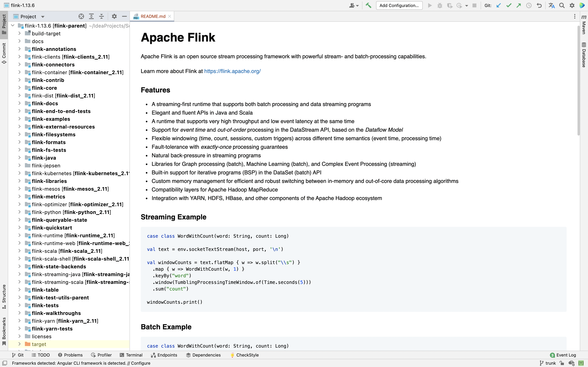
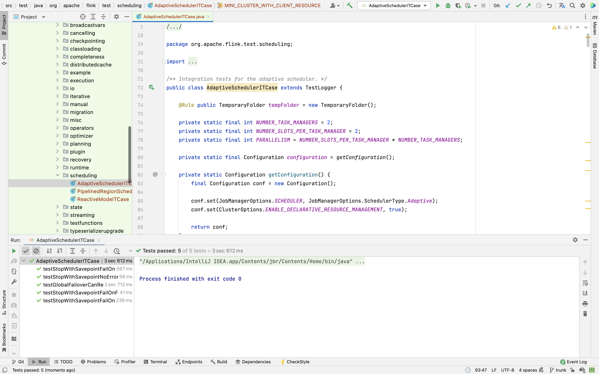

### 《从0学习Flink源码》——构建源码测试环境

#### 1. 前言

上篇文章讲到了下载flink的源码并编译，结局了在编译中存在的问题，以后在本地提交运行WordCount的案例，这篇文章我们将Flink源码导入IDEA，构建源码测试环境。

#### 2. 导入IDEA



导入IDEA之后，我们就可以看到flink的包结构，包含了很多的包，我们接下来大概分析一下对应的包都有什么作用。

```
├── build-target -> /Users/yankee/IdeaProjects/SourceCodeLearning/flink-1.13.6/flink-dist/target/flink-1.13.6-bin/flink-1.13.6（编译源码后的target目录，是一个软连接，链接到flink-dist/target/flink-1.13.6-bin/flink-1.13.6目录）
├── docs（存放了Flink的markdown文档，可以编译生成网页）
├── flink-annotations（Flink里面的一些注解）
├── flink-clients（Flink的客户端）
├── flink-connectors（Flink的connector，常见的有kafka、elasticsearch、hbase、hive、jdbc、cassandra、filesystem、rabbitmq，经常在source/sink中出现）
│   ├── flink-connector-base
│   ├── flink-connector-cassandra
│   ├── flink-connector-elasticsearch-base
│   ├── flink-connector-elasticsearch5
│   ├── flink-connector-elasticsearch6
│   ├── flink-connector-elasticsearch7
│   ├── flink-connector-files
│   ├── flink-connector-gcp-pubsub
│   ├── flink-connector-hbase-1.4
│   ├── flink-connector-hbase-2.2
│   ├── flink-connector-hbase-base
│   ├── flink-connector-hive
│   ├── flink-connector-jdbc
│   ├── flink-connector-kafka
│   ├── flink-connector-kinesis
│   ├── flink-connector-nifi
│   ├── flink-connector-rabbitmq
│   ├── flink-connector-twitter
│   ├── flink-file-sink-common
│   ├── flink-hadoop-compatibility
│   ├── flink-hcatalog
│   ├── flink-sql-connector-elasticsearch6
│   ├── flink-sql-connector-elasticsearch7
│   ├── flink-sql-connector-hbase-1.4
│   ├── flink-sql-connector-hbase-2.2
│   ├── flink-sql-connector-hive-1.2.2
│   ├── flink-sql-connector-hive-2.2.0
│   ├── flink-sql-connector-hive-2.3.6
│   ├── flink-sql-connector-hive-3.1.2
│   ├── flink-sql-connector-kafka
│   ├── flink-sql-connector-kinesis
│   ├── pom.xml
│   └── target
├── flink-container（Flink任务部署在Docke和kubernetes容器上）
├── flink-contrib（是新模块的暂存/孵化区）
│   ├── README.md
│   ├── flink-connector-wikiedits
│   ├── pom.xml
│   └── target
├── flink-core（API、资源分配、内存管理、配置等核心代码）
├── flink-dist（编译完成后的flink就是在这里）
├── flink-docs（从Flink的源代码创建HTML文件的生成器）
├── flink-end-to-end-tests（测试类）
│   ├── README.md
│   ├── flink-batch-sql-test
│   ├── flink-cli-test
│   ├── flink-confluent-schema-registry
│   ├── flink-connector-gcp-pubsub-emulator-tests
│   ├── flink-dataset-allround-test
│   ├── flink-dataset-fine-grained-recovery-test
│   ├── flink-datastream-allround-test
│   ├── flink-distributed-cache-via-blob-test
│   ├── flink-elasticsearch5-test
│   ├── flink-elasticsearch6-test
│   ├── flink-elasticsearch7-test
│   ├── flink-end-to-end-tests-common
│   ├── flink-end-to-end-tests-common-kafka
│   ├── flink-end-to-end-tests-hbase
│   ├── flink-file-sink-test
│   ├── flink-glue-schema-registry-test
│   ├── flink-heavy-deployment-stress-test
│   ├── flink-high-parallelism-iterations-test
│   ├── flink-local-recovery-and-allocation-test
│   ├── flink-metrics-availability-test
│   ├── flink-metrics-reporter-prometheus-test
│   ├── flink-netty-shuffle-memory-control-test
│   ├── flink-parent-child-classloading-test-lib-package
│   ├── flink-parent-child-classloading-test-program
│   ├── flink-plugins-test
│   ├── flink-python-test
│   ├── flink-queryable-state-test
│   ├── flink-quickstart-test
│   ├── flink-rocksdb-state-memory-control-test
│   ├── flink-sql-client-test
│   ├── flink-state-evolution-test
│   ├── flink-stream-sql-test
│   ├── flink-stream-state-ttl-test
│   ├── flink-stream-stateful-job-upgrade-test
│   ├── flink-streaming-kafka-test
│   ├── flink-streaming-kafka-test-base
│   ├── flink-streaming-kinesis-test
│   ├── flink-tpcds-test
│   ├── flink-tpch-test
│   ├── pom.xml
│   ├── run-nightly-tests.sh
│   ├── run-single-test.sh
│   ├── target
│   └── test-scripts
├── flink-examples（Flink官网的案例）
│   ├── flink-examples-batch
│   ├── flink-examples-build-helper
│   ├── flink-examples-streaming
│   ├── flink-examples-table
│   ├── pom.xml
│   └── target
├── flink-external-resources（Flink的外部资源模块）
│   ├── flink-external-resource-gpu
│   ├── pom.xml
│   └── target
├── flink-filesystems（Flink支持的文件系统，例如hadoop、mapr、s3）
│   ├── flink-azure-fs-hadoop
│   ├── flink-fs-hadoop-shaded
│   ├── flink-hadoop-fs
│   ├── flink-mapr-fs
│   ├── flink-oss-fs-hadoop
│   ├── flink-s3-fs-base
│   ├── flink-s3-fs-hadoop
│   ├── flink-s3-fs-presto
│   ├── pom.xml
│   └── target
├── flink-formats（Flink格式化，例如avro、csv、json、parquet、orc）
│   ├── flink-avro
│   ├── flink-avro-confluent-registry
│   ├── flink-avro-glue-schema-registry
│   ├── flink-compress
│   ├── flink-csv
│   ├── flink-format-common
│   ├── flink-hadoop-bulk
│   ├── flink-json
│   ├── flink-orc
│   ├── flink-orc-nohive
│   ├── flink-parquet
│   ├── flink-sequence-file
│   ├── flink-sql-avro
│   ├── flink-sql-avro-confluent-registry
│   ├── flink-sql-orc
│   ├── flink-sql-parquet
│   ├── pom.xml
│   └── target
├── flink-fs-tests（Flink文件系统的测试类）
├── flink-java（Flink里面的各种聚合计算方法，算子操作）
├── flink-jepsen（基于Jepsen框架的Clojure项目，用于在Flink的分布式协调中发现漏洞）
├── flink-kubernetes（支持Flink可以运行在k8s上）
├── flink-libraries（包含Flink的cep、gelly、state）
│   ├── flink-cep
│   ├── flink-cep-scala
│   ├── flink-gelly
│   ├── flink-gelly-examples
│   ├── flink-gelly-scala
│   ├── flink-state-processing-api
│   ├── pom.xml
│   └── target
├── flink-mesos（支持Flink可以运行在mesos上）
├── flink-metrics（Flink的metrics信息）
│   ├── flink-metrics-core
│   ├── flink-metrics-datadog
│   ├── flink-metrics-dropwizard
│   ├── flink-metrics-graphite
│   ├── flink-metrics-influxdb
│   ├── flink-metrics-jmx
│   ├── flink-metrics-prometheus
│   ├── flink-metrics-slf4j
│   ├── flink-metrics-statsd
│   ├── pom.xml
│   └── target
├── flink-optimizer（Flink的优化器，怎么合理的计算让一些任务能够串成任务链执行）
├── flink-python（Flink的python）
│   ├── MANIFEST.in
│   ├── README.md
│   ├── apache-flink-libraries
│   ├── bin
│   ├── dev
│   ├── docs
│   ├── lib
│   ├── pom.xml
│   ├── pyflink
│   ├── setup.cfg
│   ├── setup.py
│   ├── src
│   ├── target
│   └── tox.ini
├── flink-queryable-state（Flink的状态管理机制）
│   ├── flink-queryable-state-client-java
│   ├── flink-queryable-state-runtime
│   ├── pom.xml
│   └── target
├── flink-quickstart（在IDEA快速生成项目）
│   ├── flink-quickstart-java
│   ├── flink-quickstart-scala
│   ├── pom.xml
│   └── target
├── flink-runtime（Flink的运行时环境，相当重要）
├── flink-runtime-web（Flink的WebUI）
│   ├── README.md
│   ├── pom.xml
│   ├── src
│   ├── target
│   └── web-dashboard
├── flink-scala（Flink的scala）
├── flink-scala-shell
│   ├── pom.xml
│   ├── src
│   ├── start-script
│   └── target
├── flink-state-backends（Flink的状态后端）
│   ├── flink-statebackend-changelog
│   ├── flink-statebackend-heap-spillable
│   ├── flink-statebackend-rocksdb
│   ├── pom.xml
│   └── target
├── flink-streaming-java（Flink的StreamAPI，包含datastream、watermark、checkpoint、function、算子、转换操作、window等）
├── flink-streaming-scala
├── flink-table（Flink的Table和SQL封装）
│   ├── flink-sql-client
│   ├── flink-sql-parser
│   ├── flink-sql-parser-hive
│   ├── flink-table-api-java
│   ├── flink-table-api-java-bridge
│   ├── flink-table-api-scala
│   ├── flink-table-api-scala-bridge
│   ├── flink-table-common
│   ├── flink-table-planner
│   ├── flink-table-planner-blink
│   ├── flink-table-runtime-blink
│   ├── flink-table-uber
│   ├── flink-table-uber-blink
│   ├── pom.xml
│   └── target
├── flink-test-utils-parent
│   ├── flink-connector-test-utils
│   ├── flink-test-utils
│   ├── flink-test-utils-junit
│   ├── pom.xml
│   └── target
├── flink-tests
├── flink-walkthroughs
│   ├── flink-walkthrough-common
│   ├── flink-walkthrough-datastream-java
│   ├── flink-walkthrough-datastream-scala
│   ├── pom.xml
│   └── target
├── flink-yarn（支持Flink可以运行在yarn上）
├── flink-yarn-tests（Flink的yarn测试）
├── licenses
├── pom.xml
├── target
│   ├── checkstyle-checker.xml
│   ├── checkstyle-result.xml
│   ├── checkstyle-suppressions.xml
│   ├── flink-parent-1.13.6-shaded-tests.pom
│   ├── flink-parent-1.13.6-shaded.pom
│   └── maven-shared-archive-resources
└── tools（工具）
    ├── azure-pipelines
    ├── change-version.sh
    ├── ci
    ├── force-shading
    ├── list_deps.py
    ├── maven
    ├── releasing
    └── update_notice_year.sh
```

#### 3. 运行测试代码

运行flink-tests模块下scheduling包下的AdaptiveSchedulerITCase案例，运行成功，没有任何问题。

