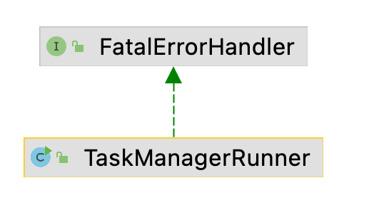

### 《从0学习Flink源码》——TaskManager启动流程

#### 1. 前言

上一篇文章我们看了JobManager的启动过程，查看了源码的具体实现，这篇文章我们一起来看看TaskManager是如何启动，看看内部的源码是如何实现的。

#### 2. 入口类TaskManagerRunner

该类位于`flink-runtime`模块下，位于包`taskexecutor`中，我们还是一样，先看看这个类的继承结构：



从上图我们可以看到`TaskManagerRunner`仅仅实现了`FatalErrorHandler`接口，那我们接下来看看这个类的main方法，看看main方法中具体做了哪些事情？

```java
public static void main(String[] args) throws Exception {
    // startup checks and logging
    // 前几行和JobManager的启动类StandaloneSessionClusterEntrypoint如出一辙
    // 记录有关环境的信息，如代码修订、当前用户、Java版本和JVM参数
    EnvironmentInformation.logEnvironmentInfo(LOG, "TaskManager", args);
    // 注册一些处理信号处理器
    SignalHandler.register(LOG);
    // 安装安全关机挂钩。JVM在被终止前被允许关闭的最长时间是5秒
    JvmShutdownSafeguard.installAsShutdownHook(LOG);

    long maxOpenFileHandles = EnvironmentInformation.getOpenFileHandlesLimit();

    if (maxOpenFileHandles != -1L) {
        LOG.info("Maximum number of open file descriptors is {}.", maxOpenFileHandles);
    } else {
        LOG.info("Cannot determine the maximum number of open file descriptors");
    }

    // 启动taskmanager进程 🔥
    runTaskManagerProcessSecurely(args);
}
```

可以看到其他的和`JobManager`的入口类差不多，重点在`runTaskManagerProcessSecurely`方法，接下来我们继续深入看看其具体实现。

#### 3. runTaskManagerProcessSecurely

```java
public static void runTaskManagerProcessSecurely(String[] args) {
    Configuration configuration = null;

    try {
        // loadConfiguration加载args，最后和JobManager解析生成Configuration基本一致
        configuration = loadConfiguration(args);
    } catch (FlinkParseException fpe) {
        LOG.error("Could not load the configuration.", fpe);
        System.exit(FAILURE_EXIT_CODE);
    }

    // 将configuration传入调用runTaskManagerProcessSecurely启动taskmanager 🔥
    runTaskManagerProcessSecurely(checkNotNull(configuration));
}
```

关于`loadConfiguration`的具体实现就不继续深入看了，我们接下来看看`runTaskManagerProcessSecurely`的具体实现：

```java
public static void runTaskManagerProcessSecurely(Configuration configuration) {
    FlinkSecurityManager.setFromConfiguration(configuration);
    final PluginManager pluginManager =
            PluginUtils.createPluginManagerFromRootFolder(configuration);
    // 初始化配置文件和PluginManager共享文件设置
    FileSystem.initialize(configuration, pluginManager);

    int exitCode;
    Throwable throwable = null;

    try {
        // 安装相关的安全配置
        SecurityUtils.install(new SecurityConfiguration(configuration));

        // 主要实现runTaskManager 🔥
        exitCode =
                SecurityUtils.getInstalledContext()
                        .runSecured(() -> runTaskManager(configuration, pluginManager));
    } catch (Throwable t) {
        throwable = ExceptionUtils.stripException(t, UndeclaredThrowableException.class);
        exitCode = FAILURE_EXIT_CODE;
    }

    if (throwable != null) {
        LOG.error("Terminating TaskManagerRunner with exit code {}.", exitCode, throwable);
    } else {
        LOG.info("Terminating TaskManagerRunner with exit code {}.", exitCode);
    }

    System.exit(exitCode);
}
```

可以看到这块和`JobManager`中`startCluster`的实现有很多的相似之处，对于`TaskManager`最重要的还是`runTaskManager`方法，我们继续深入看看。

#### 4. runTaskManager

```java
public static int runTaskManager(Configuration configuration, PluginManager pluginManager)
        throws Exception {
    final TaskManagerRunner taskManagerRunner;

    try {
        // 创建TaskManager 1️⃣
        taskManagerRunner =
                new TaskManagerRunner(
                        configuration,
                        pluginManager,
                        TaskManagerRunner::createTaskExecutorService);
        // 启动TaskManager 2️⃣
        taskManagerRunner.start();
    } catch (Exception exception) {
        throw new FlinkException("Failed to start the TaskManagerRunner.", exception);
    }

    try {
        return taskManagerRunner.getTerminationFuture().get().getExitCode();
    } catch (Throwable t) {
        throw new FlinkException(
                "Unexpected failure during runtime of TaskManagerRunner.",
                ExceptionUtils.stripExecutionException(t));
    }
}
```

##### 1. TaskManagerRunner构造方法

```java
public TaskManagerRunner(
        Configuration configuration,
        PluginManager pluginManager,
        TaskExecutorServiceFactory taskExecutorServiceFactory)
        throws Exception {
    this.configuration = checkNotNull(configuration);

    timeout = AkkaUtils.getTimeoutAsTime(configuration);

    this.executor =
            java.util.concurrent.Executors.newScheduledThreadPool(
                    Hardware.getNumberCPUCores(),
                    new ExecutorThreadFactory("taskmanager-future"));

    // 创建HA服务
    highAvailabilityServices =
            HighAvailabilityServicesUtils.createHighAvailabilityServices(
                    configuration,
                    executor,
                    HighAvailabilityServicesUtils.AddressResolution.NO_ADDRESS_RESOLUTION);

    JMXService.startInstance(configuration.getString(JMXServerOptions.JMX_SERVER_PORT));

    // 创建RPC服务
    rpcService = createRpcService(configuration, highAvailabilityServices);

    // 资源ID
    this.resourceId =
            getTaskManagerResourceID(
                    configuration, rpcService.getAddress(), rpcService.getPort());

    // 创建心跳检查服务
    HeartbeatServices heartbeatServices = HeartbeatServices.fromConfiguration(configuration);

    // 创建metric服务
    metricRegistry =
            new MetricRegistryImpl(
                    MetricRegistryConfiguration.fromConfiguration(configuration),
                    ReporterSetup.fromConfiguration(configuration, pluginManager));

    final RpcService metricQueryServiceRpcService =
            MetricUtils.startRemoteMetricsRpcService(configuration, rpcService.getAddress());
    metricRegistry.startQueryService(metricQueryServiceRpcService, resourceId);

    // 创建blob服务
    blobCacheService =
            new BlobCacheService(
                    configuration, highAvailabilityServices.createBlobStore(), null);

    final ExternalResourceInfoProvider externalResourceInfoProvider =
            ExternalResourceUtils.createStaticExternalResourceInfoProviderFromConfig(
                    configuration, pluginManager);

    // 根据传入的参数调用工厂类创建taskExecutor服务对象 🔥
    taskExecutorService =
            taskExecutorServiceFactory.createTaskExecutor(
                    this.configuration,
                    this.resourceId,
                    rpcService,
                    highAvailabilityServices,
                    heartbeatServices,
                    metricRegistry,
                    blobCacheService,
                    false,
                    externalResourceInfoProvider,
                    this);

    this.terminationFuture = new CompletableFuture<>();
    this.shutdown = false;
    handleUnexpectedTaskExecutorServiceTermination();

    MemoryLogger.startIfConfigured(
            LOG, configuration, terminationFuture.thenAccept(ignored -> {}));
}
```

这块的代码和`JobManager`中`initializeService`代码部分也有些许类似，都是去创建一些服务，做好准备工作。我们可以继续深入看看是怎么通过工厂类创建`taskExecutorService`的。

```java
// TaskManagerRunner中的一个接口
public interface TaskExecutorServiceFactory {
    TaskExecutorService createTaskExecutor(
            Configuration configuration,
            ResourceID resourceID,
            RpcService rpcService,
            HighAvailabilityServices highAvailabilityServices,
            HeartbeatServices heartbeatServices,
            MetricRegistry metricRegistry,
            BlobCacheService blobCacheService,
            boolean localCommunicationOnly,
            ExternalResourceInfoProvider externalResourceInfoProvider,
            FatalErrorHandler fatalErrorHandler)
            throws Exception;
}

// 看看接口的具体实现子类的方法——TaskManagerRunner::createTaskExecutorService
public static TaskExecutorService createTaskExecutorService(
        Configuration configuration,
        ResourceID resourceID,
        RpcService rpcService,
        HighAvailabilityServices highAvailabilityServices,
        HeartbeatServices heartbeatServices,
        MetricRegistry metricRegistry,
        BlobCacheService blobCacheService,
        boolean localCommunicationOnly,
        ExternalResourceInfoProvider externalResourceInfoProvider,
        FatalErrorHandler fatalErrorHandler)
        throws Exception {

    // 调用startTaskManager创建TaskExecutor对象
    final TaskExecutor taskExecutor =
            startTaskManager(
                    configuration,
                    resourceID,
                    rpcService,
                    highAvailabilityServices,
                    heartbeatServices,
                    metricRegistry,
                    blobCacheService,
                    localCommunicationOnly,
                    externalResourceInfoProvider,
                    fatalErrorHandler);

    // 将taskExecutor传入构造一个TaskExecutorToServiceAdapter对象
    return TaskExecutorToServiceAdapter.createFor(taskExecutor);
}
```

`TaskManagerRunner#startTaskManager`的方法：

```java
// TaskManagerRunner_startTaskManager
public static TaskExecutor startTaskManager(
        Configuration configuration,
        ResourceID resourceID,
        RpcService rpcService,
        HighAvailabilityServices highAvailabilityServices,
        HeartbeatServices heartbeatServices,
        MetricRegistry metricRegistry,
        BlobCacheService blobCacheService,
        boolean localCommunicationOnly,
        ExternalResourceInfoProvider externalResourceInfoProvider,
        FatalErrorHandler fatalErrorHandler)
        throws Exception {

    checkNotNull(configuration);
    checkNotNull(resourceID);
    checkNotNull(rpcService);
    checkNotNull(highAvailabilityServices);

    LOG.info("Starting TaskManager with ResourceID: {}", resourceID.getStringWithMetadata());

    String externalAddress = rpcService.getAddress();

    final TaskExecutorResourceSpec taskExecutorResourceSpec =
            TaskExecutorResourceUtils.resourceSpecFromConfig(configuration);

    // TaskManger服务的相关配置，包括内存管理器、IO管理器等
    TaskManagerServicesConfiguration taskManagerServicesConfiguration =
            TaskManagerServicesConfiguration.fromConfiguration(
                    configuration,
                    resourceID,
                    externalAddress,
                    localCommunicationOnly,
                    taskExecutorResourceSpec);

    Tuple2<TaskManagerMetricGroup, MetricGroup> taskManagerMetricGroup =
            MetricUtils.instantiateTaskManagerMetricGroup(
                    metricRegistry,
                    externalAddress,
                    resourceID,
                    taskManagerServicesConfiguration.getSystemResourceMetricsProbingInterval());

    final ExecutorService ioExecutor =
            Executors.newFixedThreadPool(
                    taskManagerServicesConfiguration.getNumIoThreads(),
                    new ExecutorThreadFactory("flink-taskexecutor-io"));

    // TaskExecutor服务的容器，例如MemoryManager、IOManager以及ShuffleEnvironment。所有服务都专属于单个TaskExecutor。
    // 因此，相应的TaskManager也负责关闭它们。
    TaskManagerServices taskManagerServices =
            TaskManagerServices.fromConfiguration(
                    taskManagerServicesConfiguration,
                    blobCacheService.getPermanentBlobService(),
                    taskManagerMetricGroup.f1,
                    ioExecutor,
                    fatalErrorHandler);

    MetricUtils.instantiateFlinkMemoryMetricGroup(
            taskManagerMetricGroup.f1,
            taskManagerServices.getTaskSlotTable(),
            taskManagerServices::getManagedMemorySize);

    TaskManagerConfiguration taskManagerConfiguration =
            TaskManagerConfiguration.fromConfiguration(
                    configuration, taskExecutorResourceSpec, externalAddress);

    String metricQueryServiceAddress = metricRegistry.getMetricQueryServiceGatewayRpcAddress();

    return new TaskExecutor(
            rpcService,
            taskManagerConfiguration,
            highAvailabilityServices,
            taskManagerServices,
            externalResourceInfoProvider,
            heartbeatServices,
            taskManagerMetricGroup.f0,
            metricQueryServiceAddress,
            blobCacheService,
            fatalErrorHandler,
            new TaskExecutorPartitionTrackerImpl(taskManagerServices.getShuffleEnvironment()));
}
```

```java
// TaskExecutor
public TaskExecutor(
        RpcService rpcService,
        TaskManagerConfiguration taskManagerConfiguration,
        HighAvailabilityServices haServices,
        TaskManagerServices taskExecutorServices,
        ExternalResourceInfoProvider externalResourceInfoProvider,
        HeartbeatServices heartbeatServices,
        TaskManagerMetricGroup taskManagerMetricGroup,
        @Nullable String metricQueryServiceAddress,
        BlobCacheService blobCacheService,
        FatalErrorHandler fatalErrorHandler,
        TaskExecutorPartitionTracker partitionTracker) {

    super(rpcService, AkkaRpcServiceUtils.createRandomName(TASK_MANAGER_NAME));

    checkArgument(
            taskManagerConfiguration.getNumberSlots() > 0,
            "The number of slots has to be larger than 0.");

    this.taskManagerConfiguration = checkNotNull(taskManagerConfiguration);
    this.taskExecutorServices = checkNotNull(taskExecutorServices);
    this.haServices = checkNotNull(haServices);
    this.fatalErrorHandler = checkNotNull(fatalErrorHandler);
    this.partitionTracker = partitionTracker;
    this.taskManagerMetricGroup = checkNotNull(taskManagerMetricGroup);
    this.blobCacheService = checkNotNull(blobCacheService);
    this.metricQueryServiceAddress = metricQueryServiceAddress;
    this.externalResourceInfoProvider = checkNotNull(externalResourceInfoProvider);

    this.libraryCacheManager = taskExecutorServices.getLibraryCacheManager();
    // 获取slot 🔥
    this.taskSlotTable = taskExecutorServices.getTaskSlotTable();
    this.jobTable = taskExecutorServices.getJobTable();
    // 获取JobLeader服务 🔥
    this.jobLeaderService = taskExecutorServices.getJobLeaderService();
    this.unresolvedTaskManagerLocation =
            taskExecutorServices.getUnresolvedTaskManagerLocation();
    // 获取TaskManager中的状态存储 🔥
    this.localStateStoresManager = taskExecutorServices.getTaskManagerStateStore();
    // 获取TaskManager中的shuffle环境 🔥
    this.shuffleEnvironment = taskExecutorServices.getShuffleEnvironment();
    // 获取TaskManager中的KV状态存储 🔥
    this.kvStateService = taskExecutorServices.getKvStateService();
    this.ioExecutor = taskExecutorServices.getIOExecutor();
    // 获取ResourceManagerLeader检索器 🔥
    this.resourceManagerLeaderRetriever = haServices.getResourceManagerLeaderRetriever();

    this.hardwareDescription =
            HardwareDescription.extractFromSystem(taskExecutorServices.getManagedMemorySize());
    this.memoryConfiguration =
            TaskExecutorMemoryConfiguration.create(taskManagerConfiguration.getConfiguration());

    this.resourceManagerAddress = null;
    this.resourceManagerConnection = null;
    this.currentRegistrationTimeoutId = null;

    final ResourceID resourceId =
            taskExecutorServices.getUnresolvedTaskManagerLocation().getResourceID();
    this.jobManagerHeartbeatManager =
            createJobManagerHeartbeatManager(heartbeatServices, resourceId);
    this.resourceManagerHeartbeatManager =
            createResourceManagerHeartbeatManager(heartbeatServices, resourceId);

    ExecutorThreadFactory sampleThreadFactory =
            new ExecutorThreadFactory.Builder()
                    .setPoolName("flink-thread-info-sampler")
                    .build();
    ScheduledExecutorService sampleExecutor =
            Executors.newSingleThreadScheduledExecutor(sampleThreadFactory);
    this.threadInfoSampleService = new ThreadInfoSampleService(sampleExecutor);
}
```

之后调用`TaskExecutor`的构造方法创建一个`TaskExecutor`对象，`TaskExecutor`是负责执行多个任务的，那么是不是非常好奇启动`TaskManager`时是存在slot的，那么slot相关的代码是在哪里呢？我们可以通过`TaskExecutor`类中仔细看到有一个`getSlotTable`的方法，但它是通过`taskManagerServices`进行调用的，所以我们需要继续向上看，可以看到`TaskManagerServices`在`startTaskManager`方法中已经被创建了，通过传入的参数创建了`TaskManagerServices`，`TaskManagerServices`是`TaskExecutor`服务的容器，包括`MemoryManager`、`IOManager`和`ShuffleEnvironment`。其中的这些所有的服务都是属于`TaskExecutor`，因此，相应的`TaskManager`也负责关闭它们。在这个`TaskManagerServices`类中我们可以看到slot对应的一些实现，具体我们就不深入了，有兴趣的可以自己看看。

上图中我标🔥 的大家私下有兴趣都可以深入看看，这些都是`TaskManagerServices`中管理的一些和`TaskExecutor`有关的服务。

##### 2. TaskManagerRunner的start方法

```java
// TaskManagerRunner
public void start() throws Exception {
    taskExecutorService.start();
}

public interface TaskExecutorService extends AutoCloseableAsync {
    void start();

    CompletableFuture<Void> getTerminationFuture();
}
```

`TaskManagerRunner的start`方法调用了`taskExecutorService`的start方法，我们可以看到`taskExecutorService`的start方法应该是调用了子类（`TaskExecutorToServiceAdapter`）的具体实现，我们深入继续看看。

```java
// TaskExecutorToServiceAdapter
public class TaskExecutorToServiceAdapter implements TaskManagerRunner.TaskExecutorService {

    private final TaskExecutor taskExecutor;

    private TaskExecutorToServiceAdapter(TaskExecutor taskExecutor) {
        this.taskExecutor = taskExecutor;
    }

    @Override
    public void start() {
        taskExecutor.start();
    }

    @Override
    public CompletableFuture<Void> getTerminationFuture() {
        return taskExecutor.getTerminationFuture();
    }

    @Override
    public CompletableFuture<Void> closeAsync() {
        return taskExecutor.closeAsync();
    }

    public static TaskExecutorToServiceAdapter createFor(TaskExecutor taskExecutor) {
        return new TaskExecutorToServiceAdapter(taskExecutor);
    }
}

// RpcEndpoint
/**
 * Triggers start of the rpc endpoint. This tells the underlying rpc server that the rpc
 * endpoint is ready to process remote procedure calls.
 */
public final void start() {
    rpcServer.start();
}
```

可以看到最后调用了父类`RpcEndpoint`的`start`方法，大概意思就是启动`RPC`的`EndPoint`，告诉底层的RPC服务，`RPC EndPoint`已经准备好处理远程过程的调用了。

#### 5. 总结

该篇文章大概分析了`TaskManager`的入口类`TaskManagerRunner`的源码，分析了整个main方法的执行流程。其中有很多部分和`JobManager`的实现有些类似，当然也有很多`TaskManagerServices`中管理的服务我们没有深入分析，感兴趣的小伙伴可以自己下去针对这部分的源码分析一波。👻

---

<div align=center>
    <font color='red' size=5>关注微信公众号《零基础学大数据》回复【Flink】领取全部PDF</font>
</div>