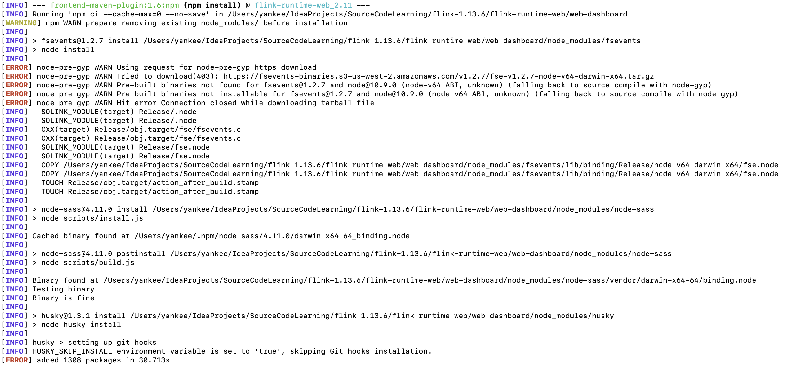
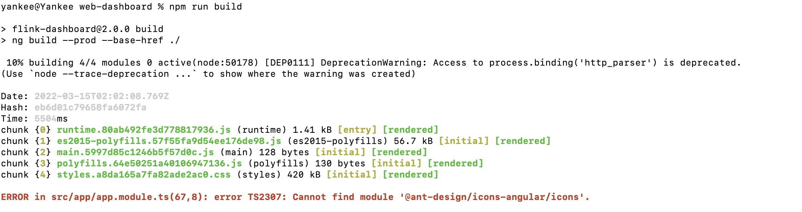
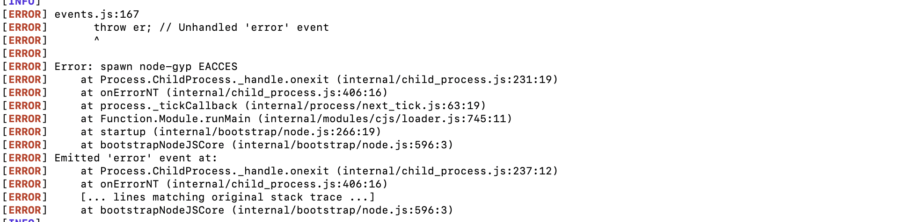
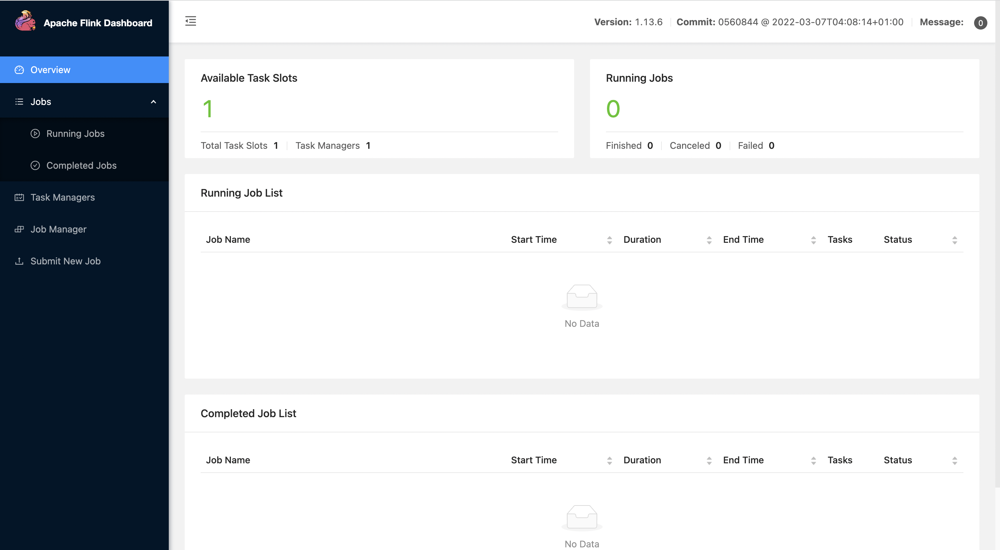

### 《从0学习Flink源码》——Flink源码编译及部署

#### 1. 前言

针对Flink的源码进行一个初步了解，学习Flink框架中优秀的设计同时也可以针对平时所出现的问题有一个系统的认识。今天开始从0学习Flink源码，本系列用来记录在Flink源码学习过程中遇见的一些问题。

#### 2. 下载源码并编译

确保安装了java环境和maven环境

```shell
$ java -version
$ mvn -version
$ wget https://dlcdn.apache.org/flink/flink-1.13.6/flink-1.13.6-src.tgz
$ tar -zvxf flink-1.13.6-src.tgz
$ cd flink-1.13.6
$ mvn clean install -DskipTests
```

编译过程中可能因为网络等原因导致编译不成功，可以设置maven的配置文件`setting.xml`中的mirrors：

```xml
<mirror>
    <id>nexus aliyun</id>
    <name>Nexus-Aliyun</name>
    <url>https://maven.aliyun.com/repository/public</url>
    <mirrorOf>*,!jeecg,!jeecg-snapshots,!mapr-releases,!confluent,!spring</mirrorOf>
</mirror>
<mirror>
    <id>mapr-public</id>
    <name>mapr-releases</name>
    <url>https://maven.aliyun.com/repository/mapr-public</url>
    <mirrorOf>mapr-releases</mirrorOf>
</mirror>
<mirror>
    <id>confluent-repo</id>
    <name>confluent-repo</name>
    <url>http://packages.confluent.io/maven</url>
    <mirrorOf>confluent</mirrorOf>
</mirror>
<mirror>
    <id>aliyun maven</id>
    <name>spring-plugin</name>
    <url>https://maven.aliyun.com/repository/spring-plugin</url>
    <mirrorOf>spring</mirrorOf>
</mirror>
```

在编译过程中可能出现`flink-runtime-web`模块编译报错，如下：



进入`flink-runtime-web/web-dashboard`目录下，删除`node_modules`目录，执行以下操作：

```shell
$ cd flink-runtime-web/web-dashboard
$ rm -rf ./node_modules

# 记得设置自己本地的npm源为淘宝镜像，会比较快
$ npm config set registry npm config set registry http://registry.npm.taobao.org/
$ npm update

# 更新完成之后执行npm install
$ npm install

# 执行npm run build测试
$ npm run build
```

继续报错：



报错显示找不到包`@ant-design/icons-angular/icons`，手动安装：

```shell
$ npm install -g @ant-design/icons-angular

# 安装报错先安装@angular/cli
$ npm install -g @angular/cli

# 换个方式安装@ant-design/icons-angular/icons
$ ng add @ant-design/icons-angular

# 先在本地进行build尝试，如下所示就可以继续进行打包了
$ npm run build
```

如果打包还报错如下：



可以手动安装node-gyp包：

```shell
$ npm i node-gyp -g
```

执行maven打包命令：

```shell
$ mvn clean install -DskipTests
```

也可以使用以下命令跳过测试、代码风格以及License检查：

```shell
mvn clean install -Dmaven.test.skip=true -Dmaven.javadoc.skip=true -Dcheckstyle.skip=true -Drat.skip=true
```

出现如下图所示的全篇绿色就说明编译成功了😎


#### 3. 在本地启动测试

```shell
$ cd flink-dist/target/flink-1.13.6-bin/flink-1.13.6
$ ./bin/start-cluster.sh

# 修改taskManager的slot数量
$ vi ./conf/flink-conf.yaml
```



#### 4. 简单程序WordCount测试

```java
@Data
@NoArgsConstructor
@AllArgsConstructor
class WordCount {
    private String word;
    private Integer count;
}

public class SocketWindowWordCount {
    private static final Logger LOG = LoggerFactory.getLogger(SocketWindowWordCount.class);

    public static void main(String[] args) {
        try {
            // 输出参数host和port
            final String host;
            final int port;

            ParameterTool params = ParameterTool.fromArgs(args);
            host = params.get("host");
            port = params.getInt("port");
            // 创建env并配置
            StreamExecutionEnvironment env = StreamExecutionEnvironment.getExecutionEnvironment();
            // 从socket中获取数据
            DataStreamSource<String> socketDS = env.socketTextStream(host, port, "\n");
            // 处理数据
            SingleOutputStreamOperator<WordCount> reduceDS =
                    socketDS.flatMap(
                                    new FlatMapFunction<String, WordCount>() {
                                        @Override
                                        public void flatMap(String value, Collector<WordCount> out)
                                                throws Exception {
                                            String[] words = value.split(",");
                                            for (String word : words) {
                                                out.collect(new WordCount(word, 1));
                                            }
                                        }
                                    })
                            .keyBy(WordCount::getWord)
                            .window(
                                    SlidingProcessingTimeWindows.of(
                                            Time.seconds(5), Time.seconds(2)))
                            .reduce(
                                    new ReduceFunction<WordCount>() {
                                        @Override
                                        public WordCount reduce(WordCount value1, WordCount value2)
                                                throws Exception {
                                            return new WordCount(
                                                    value1.getWord(),
                                                    value1.getCount() + value1.getCount());
                                        }
                                    })
                            .disableChaining();

            // 打印输出
            reduceDS.print().setParallelism(1);

            // 提交执行
            env.execute("Socket Window WordCount");
        } catch (Exception e) {
            System.out.println("Encounter Error：");
            LOG.error("Encounter Error：", e);
            System.exit(1);
        }
    }
}
```

打包，构建jar包：

```shell
$ mvn clean package
$ ls target/flink-learning-demo-1.0-SNAPSHOT.jar
```

开启9999端口，用于输入数据：

```shell
$ nc -lk 9999
```

提交flink任务：

```shell
$ bin/flink run --detached -c com.yankee.wordcount.SocketWindowWordCount /Users/yankee/demojar/flink-learning-demo-1.0-SNAPSHOT.jar --host localhost --port 9999
```

提交后可以在WebUI查看运行情况以及log日志，同时flink1.13版本开启了CPU的火焰图，默认关闭。可以设置以下参数开启，具体可参考[官网](https://nightlies.apache.org/flink/flink-docs-release-1.13/docs/deployment/config/#rest-flamegraph-enabled)。

```yaml
rest.flamegraph.enabled: true
```