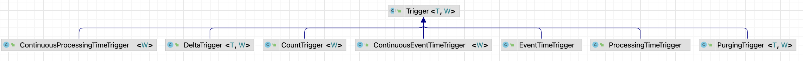
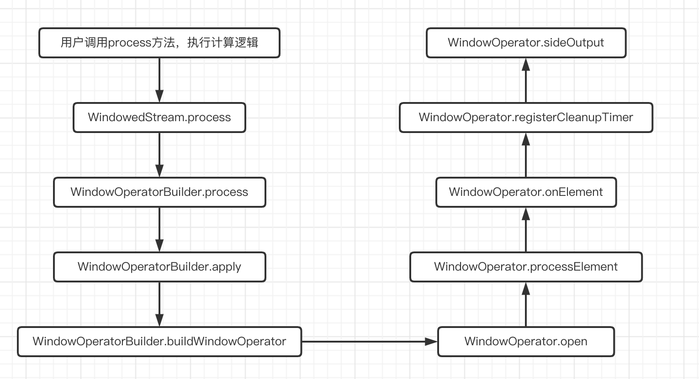
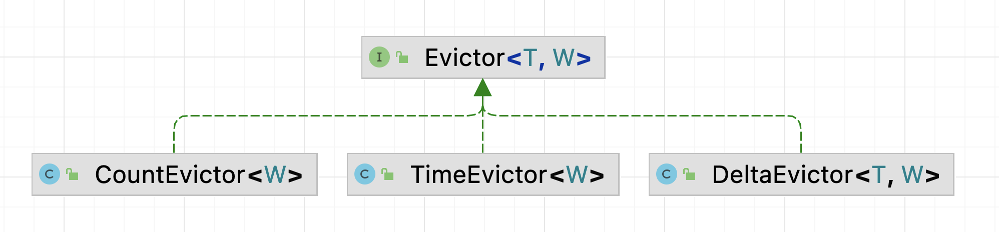

### 《从0学习Flink源码》——Window

#### 1. 前言

Flink四大基石之一的Window，同时也是Flink中处理无限流的核心，我们可以针对不同的时间语义等采用不同的Window窗口进行计算。接下来我们看看在Flink中Window具体是怎么实现的？在Window中的数据又是何时触发计算的？

#### 2. Window的使用方法

##### 1. Keyed Windows

```
stream
       .keyBy(...)               <-  keyed versus non-keyed windows
       .window(...)              <-  required: "assigner"
      [.trigger(...)]            <-  optional: "trigger" (else default trigger)
      [.evictor(...)]            <-  optional: "evictor" (else no evictor)
      [.allowedLateness(...)]    <-  optional: "lateness" (else zero)
      [.sideOutputLateData(...)] <-  optional: "output tag" (else no side output for late data)
       .reduce/aggregate/apply()      <-  required: "function"
      [.getSideOutput(...)]      <-  optional: "output tag"
```

##### 2. Non-Keyed Windows

```
stream
       .windowAll(...)           <-  required: "assigner"
      [.trigger(...)]            <-  optional: "trigger" (else default trigger)
      [.evictor(...)]            <-  optional: "evictor" (else no evictor)
      [.allowedLateness(...)]    <-  optional: "lateness" (else zero)
      [.sideOutputLateData(...)] <-  optional: "output tag" (else no side output for late data)
       .reduce/aggregate/apply()      <-  required: "function"
      [.getSideOutput(...)]      <-  optional: "output tag"
```

我们重点关注Keyed Windows的具体实现，Non-Keyed Windows是基于Keyed Windows的一种特殊实现。

Window的基本用法：在window中需要一个WindowAssigner将KeyedStream转换成WindowedStream，然后就可以指定窗口的计算逻辑，这块分为全量窗口计算(apply和process)和增量窗口计算(reduce和aggregate)，之后就是触发窗口计算的Trigger以及能够修改窗口内元素的Evictor，此时便会通过WindowOperatorBuilder生成一个WindowOperator，窗口的处理逻辑主要就在WindowOperator中。

#### 3. Trigger和Timer

在看Window相关的代码实现之前，我们先看看触发器Trigger和定时器Timer，触发器Trigger在Window中有着不可替代的作用，因为Window其实就是进行划分元素属于那个窗口或那几个窗口，当元素进入窗口后何时进行计算，就是触发器Trigger和定时器Timer所负责的事情了。

##### 1. Trigger



Trigger是用来确定一个窗口是否应该触发结果的计算，Trigger提供了一系列的回调函数，根据回调函数返回的结果来决定是否应该触发窗口的计算。Trigger在Flink内置的几种实现包括：

- EventTimeTrigger：所有事件时间窗口的默认触发器
- ProcessingTimeTrigger：所有处理时间窗口的默认触发器
- ContinuousEventTimeTrigger：按照事件时间定期进行触发
- ContinuousProcessingTimeTrigger：按照处理时间定期进行触发
- CountTrigger：按照窗口内元素个数进行触发
- DeltaTrigger：按照DeltaFunction进行触发
- NeverTrigger：永远不会触发
- PurgingTrigger：接受另一个Trigger，并将其转换成一个会清理数据的Trigger

```java
public abstract class Trigger<T, W extends Window> implements Serializable {

    private static final long serialVersionUID = -4104633972991191369L;

    /**
     * Called for every element that gets added to a pane. The result of this will determine whether
     * the pane is evaluated to emit results.
     * 添加到窗口的每个元素都会调用该方法
     *
     * @param element The element that arrived.
     * @param timestamp The timestamp of the element that arrived.
     * @param window The window to which the element is being added.
     * @param ctx A context object that can be used to register timer callbacks.
     */
    public abstract TriggerResult onElement(T element, long timestamp, W window, TriggerContext ctx)
            throws Exception;

    /**
     * Called when a processing-time timer that was set using the trigger context fires.
     * 当注册的ProcessTime的定时器触发时调用该方法
     *
     * @param time The timestamp at which the timer fired.
     * @param window The window for which the timer fired.
     * @param ctx A context object that can be used to register timer callbacks.
     */
    public abstract TriggerResult onProcessingTime(long time, W window, TriggerContext ctx)
            throws Exception;

    /**
     * Called when an event-time timer that was set using the trigger context fires.
     * 当注册的EventTime的定时器触发时调用该方法
     *
     * @param time The timestamp at which the timer fired.
     * @param window The window for which the timer fired.
     * @param ctx A context object that can be used to register timer callbacks.
     */
    public abstract TriggerResult onEventTime(long time, W window, TriggerContext ctx)
            throws Exception;

    /**
     * Returns true if this trigger supports merging of trigger state and can therefore be used with
     * a {@link org.apache.flink.streaming.api.windowing.assigners.MergingWindowAssigner}.
     * 判断该Trigger是否支持合并触发器状态，如果支持则返回true，否则返回false
     *
     * <p>If this returns {@code true} you must properly implement {@link #onMerge(Window,
     * OnMergeContext)}
     */
    public boolean canMerge() {
        return false;
    }

    /**
     * Called when several windows have been merged into one window by the {@link
     * org.apache.flink.streaming.api.windowing.assigners.WindowAssigner}.
     * 与有状态触发器相关，并在两个触发器对应的窗口合并时合并它们的状态，例如在使用会话窗口时
     *
     * @param window The new window that results from the merge.
     * @param ctx A context object that can be used to register timer callbacks and access state.
     */
    public void onMerge(W window, OnMergeContext ctx) throws Exception {
        throw new UnsupportedOperationException("This trigger does not support merging.");
    }

    /**
     * Clears any state that the trigger might still hold for the given window. This is called when
     * a window is purged. Timers set using {@link TriggerContext#registerEventTimeTimer(long)} and
     * {@link TriggerContext#registerProcessingTimeTimer(long)} should be deleted here as well as
     * state acquired using {@link TriggerContext#getPartitionedState(StateDescriptor)}.
     *
     * 执行删除相应窗口时所需的任何操作(一般是删除定义的状态、定时器等)
     */
    public abstract void clear(W window, TriggerContext ctx) throws Exception;

    /**
     * Extension of {@link TriggerContext} that is given to {@link Trigger#onMerge(Window,
     * OnMergeContext)}.
     */
    public interface OnMergeContext extends TriggerContext {
        <S extends MergingState<?, ?>> void mergePartitionedState(
                StateDescriptor<S, ?> stateDescriptor);
    }
}
```

和Trigger类一起出现的还有TriggerResult这个枚举类，当Trigger触发调用起回调函数，回调函数的返回值被包装成了TriggerResult类，其中有四种类型，分别是触发计算FIRE、不对数据做任何处理CONTINUE、对窗口不做计算但是清除窗口中的数据PURAGE以及触发计算并清除窗口中的数据FIRE_AND_PURAGE，看看其具体的实现。

```java
public enum TriggerResult {

    /**
     * No action is taken on the window.
     * 对窗口不做任何处理
     */
    CONTINUE(false, false),

    /**
     * {@code FIRE_AND_PURGE} evaluates the window function and emits the window result.
     * 对窗口进行计算，并清除窗口中的数据
     */
    FIRE_AND_PURGE(true, true),

    /**
     * On {@code FIRE}, the window is evaluated and results are emitted. The window is not purged,
     * though, all elements are retained.
     * 对窗口进行计算，但不会清除数据
     */
    FIRE(true, false),

    /**
     * All elements in the window are cleared and the window is discarded, without evaluating the
     * window function or emitting any elements.
     * 对窗口不做计算，但是会清除窗口中的数据
     */
    PURGE(false, true);
}
```

##### 2. Timer

Timer是用来实现定时触发器的功能，通过TimerServices注册timer，触发的回调函数被封装为Triggerable。

```java
public interface TimerService {
    /** Error string for {@link UnsupportedOperationException} on registering timers. */
    String UNSUPPORTED_REGISTER_TIMER_MSG = "Setting timers is only supported on a keyed streams.";

    /** Error string for {@link UnsupportedOperationException} on deleting timers. */
    String UNSUPPORTED_DELETE_TIMER_MSG = "Deleting timers is only supported on a keyed streams.";

    long currentProcessingTime();
    long currentWatermark();

    void registerProcessingTimeTimer(long time);
    void registerEventTimeTimer(long time);
    void deleteProcessingTimeTimer(long time);
    void deleteEventTimeTimer(long time);
}

public interface Triggerable<K, N> {
    /** Invoked when an event-time timer fires. */
    void onEventTime(InternalTimer<K, N> timer) throws Exception;

    /** Invoked when a processing-time timer fires. */
    void onProcessingTime(InternalTimer<K, N> timer) throws Exception;
}
```

TimerService不仅仅提供了注册和删除定时器的方法，同时还提供了可以获取当前处理时间以及watermark的方法。需要注意，Timer只能在KeyedStream中使用。在Flink内部，和TimerService对应的是InternalTimerService，其对应的实现类有两个，分别是InternalTimerServiceImpl和BatchExecutionInternalTimerService两个，后者是使用在BATCH执行模式上的。InternalTimerService和TimerService还有一个区别是InternalTimerService可以设置其关联的namespace。

```java
public interface InternalTimer<K, N> extends PriorityComparable<InternalTimer<?, ?>>, Keyed<K> {

    /** Function to extract the key from a {@link InternalTimer}. */
    KeyExtractorFunction<InternalTimer<?, ?>> KEY_EXTRACTOR_FUNCTION = InternalTimer::getKey;

    /** Function to compare instances of {@link InternalTimer}. */
    PriorityComparator<InternalTimer<?, ?>> TIMER_COMPARATOR =
            (left, right) -> Long.compare(left.getTimestamp(), right.getTimestamp());
    /**
     * Returns the timestamp of the timer. This value determines the point in time when the timer
     * will fire.
     */
    long getTimestamp();

    /** Returns the key that is bound to this timer. */
    @Nonnull
    @Override
    K getKey();

    /** Returns the namespace that is bound to this timer. */
    @Nonnull
    N getNamespace();
}

public class InternalTimerServiceImpl<K, N> implements InternalTimerService<N> {
    /** Processing time timers that are currently in-flight. */
    private final KeyGroupedInternalPriorityQueue<TimerHeapInternalTimer<K, N>>
            processingTimeTimersQueue;

    /** Event time timers that are currently in-flight. */
    private final KeyGroupedInternalPriorityQueue<TimerHeapInternalTimer<K, N>>
            eventTimeTimersQueue;

    /**
     * The local event time, as denoted by the last received {@link
     * org.apache.flink.streaming.api.watermark.Watermark Watermark}.
     */
    private long currentWatermark = Long.MIN_VALUE;

    private Triggerable<K, N> triggerTarget;
}
```

###### 1. ProcessTime

ProcessTime的定时器触发依赖于ProcessingTimeService，它负责所有基于处理时间语义的定时器的管理，内部使用ScheduledFuture进行调度定时任务，当任务被触发时，ProcessTime的回调函数ProcessingTimeCallback会被调用。实际上，InternalTimerServiceImpl依赖了ProcessingTimeService，并在其内部实现了ProcessingTimeCallback接口。当注册一个ProcessTime的定时器时，会将timer加入processingTimeTimersQueue优先级队列，并设置下一次ProcessingTimeService的触发时间，当ProcessingTimeService触发后，调用onProcessingTime方法，会从优先级队列中取出所有符合条件的定时器，调用triggerTarget.onProcessingTimr(timer)。

```java
public class InternalTimerServiceImpl<K, N> implements InternalTimerService<N> {
    private final ProcessingTimeService processingTimeService;
    
    private ScheduledFuture<?> nextTimer;
    
    public void registerProcessingTimeTimer(N namespace, long time) {
        InternalTimer<K, N> oldHead = processingTimeTimersQueue.peek();
        if (processingTimeTimersQueue.add(
                new TimerHeapInternalTimer<>(time, (K) keyContext.getCurrentKey(), namespace))) {
            long nextTriggerTime = oldHead != null ? oldHead.getTimestamp() : Long.MAX_VALUE;
            // check if we need to re-schedule our timer to earlier
            // 如果新加入的timer触发时间早于下一次的触发时间，那么应该重新设置下一次的触发时间
            if (time < nextTriggerTime) {
                if (nextTimer != null) {
                    nextTimer.cancel(false);
                }
                // 注册下一个timer
                nextTimer = processingTimeService.registerTimer(time, this::onProcessingTime);
            }
        }
    }

    private void onProcessingTime(long time) throws Exception {
        // null out the timer in case the Triggerable calls registerProcessingTimeTimer()
        // inside the callback.
        nextTimer = null;
    
        InternalTimer<K, N> timer;
    
        while ((timer = processingTimeTimersQueue.peek()) != null && timer.getTimestamp() <= time) {
            processingTimeTimersQueue.poll();
            keyContext.setCurrentKey(timer.getKey());
            // timer所对应的triggerTarget.onProcessingTime被调用
            triggerTarget.onProcessingTime(timer);
        }
    
        if (timer != null && nextTimer == null) {
            // 注册下一个timer
            nextTimer =
                    processingTimeService.registerTimer(
                            timer.getTimestamp(), this::onProcessingTime);
        }
    }
}

public interface ProcessingTimeService {
    long getCurrentProcessingTime();

    ScheduledFuture<?> registerTimer(long timestamp, ProcessingTimeCallback target);

    ScheduledFuture<?> scheduleAtFixedRate(
            ProcessingTimeCallback callback, long initialDelay, long period);

    ScheduledFuture<?> scheduleWithFixedDelay(
            ProcessingTimeCallback callback, long initialDelay, long period);

    CompletableFuture<Void> quiesce();
}

public interface ProcessingTimeCallback {
    void onProcessingTime(long timestamp) throws Exception;
}
```

###### 2. EventTime

EventTime的定时器触发是依赖于当前的watermark，当注册一个EventTime的定时器时，会将对应的timer写入eventTimeTimersQueue优先级队列中，当watermark上升时，advanceWatermark会被调用，这时会检查优先队列中时间早于当前watermark的timer，并依次调用triggerTarget.onEvnentTime(timer)。

```java
public class InternalTimerServiceImpl<K, N> implements InternalTimerService<N> {
    public void registerEventTimeTimer(N namespace, long time) {
        eventTimeTimersQueue.add(
                new TimerHeapInternalTimer<>(time, (K) keyContext.getCurrentKey(), namespace));
    }
    
    public void advanceWatermark(long time) throws Exception {
        currentWatermark = time;
    
        InternalTimer<K, N> timer;
    
        while ((timer = eventTimeTimersQueue.peek()) != null && timer.getTimestamp() <= time) {
            eventTimeTimersQueue.poll();
            keyContext.setCurrentKey(timer.getKey());
            triggerTarget.onEventTime(timer);
        }
    }
}
```

我们可以继续深入看到advanceWatermark方法在InternalTimeServiceManagerImpl中被调用，继续向上看，其实是AbstractStreamOperator调用。也就是说AbstractStreamOperator使用InternalTimeServiceManager管理所有的InternalTimerService。在InternalTimeServiceManager内部，AbstractStreamOperator在获取InternalTimerService是必须指定名称，这样可以方便将不同的触发对象Triggerable绑定到不同的InternalTimerService中。

```java
public class InternalTimeServiceManagerImpl<K> implements InternalTimeServiceManager<K> {
    // 所有的InternalTimerServiceImpl和名称的映射关系
    private final Map<String, InternalTimerServiceImpl<K, ?>> timerServices;
    
    private InternalTimeServiceManagerImpl(
            KeyGroupRange localKeyGroupRange,
            KeyContext keyContext,
            PriorityQueueSetFactory priorityQueueSetFactory,
            ProcessingTimeService processingTimeService) {
    
        this.localKeyGroupRange = Preconditions.checkNotNull(localKeyGroupRange);
        this.priorityQueueSetFactory = Preconditions.checkNotNull(priorityQueueSetFactory);
        this.keyContext = Preconditions.checkNotNull(keyContext);
        this.processingTimeService = Preconditions.checkNotNull(processingTimeService);
    
        this.timerServices = new HashMap<>();
    }
    
    // 获取InternalTimerService，必须指定名称
    public <N> InternalTimerService<N> getInternalTimerService(
            String name,
            TypeSerializer<K> keySerializer,
            TypeSerializer<N> namespaceSerializer,
            Triggerable<K, N> triggerable) {
        checkNotNull(keySerializer, "Timers can only be used on keyed operators.");
    
        // the following casting is to overcome type restrictions.
        TimerSerializer<K, N> timerSerializer =
                new TimerSerializer<>(keySerializer, namespaceSerializer);
    
        InternalTimerServiceImpl<K, N> timerService =
                registerOrGetTimerService(name, timerSerializer);
    
        timerService.startTimerService(
                timerSerializer.getKeySerializer(),
                timerSerializer.getNamespaceSerializer(),
                triggerable);
    
        return timerService;
    }
    
    @SuppressWarnings("unchecked")
    <N> InternalTimerServiceImpl<K, N> registerOrGetTimerService(
            String name, TimerSerializer<K, N> timerSerializer) {
        InternalTimerServiceImpl<K, N> timerService =
                (InternalTimerServiceImpl<K, N>) timerServices.get(name);
        if (timerService == null) {
    
            timerService =
                    new InternalTimerServiceImpl<>(
                            localKeyGroupRange,
                            keyContext,
                            processingTimeService,
                            createTimerPriorityQueue(
                                    PROCESSING_TIMER_PREFIX + name, timerSerializer),
                            createTimerPriorityQueue(EVENT_TIMER_PREFIX + name, timerSerializer));
    
            timerServices.put(name, timerService);
        }
        return timerService;
    }
    
    public void advanceWatermark(Watermark watermark) throws Exception {
        for (InternalTimerServiceImpl<?, ?> service : timerServices.values()) {
            service.advanceWatermark(watermark.getTimestamp());
        }
    }
}

public abstract class AbstractStreamOperator<OUT>
        implements StreamOperator<OUT>,
                SetupableStreamOperator<OUT>,
                CheckpointedStreamOperator,
                Serializable {
    private transient InternalTimeServiceManager<?> timeServiceManager;

    public <K, N> InternalTimerService<N> getInternalTimerService(
            String name, TypeSerializer<N> namespaceSerializer, Triggerable<K, N> triggerable) {
        if (timeServiceManager == null) {
            throw new RuntimeException("The timer service has not been initialized.");
        }
        @SuppressWarnings("unchecked")
        InternalTimeServiceManager<K> keyedTimeServiceHandler =
                (InternalTimeServiceManager<K>) timeServiceManager;
        KeyedStateBackend<K> keyedStateBackend = getKeyedStateBackend();
        checkState(keyedStateBackend != null, "Timers can only be used on keyed operators.");
        return keyedTimeServiceHandler.getInternalTimerService(
                name, keyedStateBackend.getKeySerializer(), namespaceSerializer, triggerable);
    }
    
    // 处理watermark
    public void processWatermark(Watermark mark) throws Exception {
        if (timeServiceManager != null) {
            timeServiceManager.advanceWatermark(mark);
        }
        output.emitWatermark(mark);
    }
}
```

从AbastractStreamOperator的类继承图中可以看出，基本所有的Operator都继承了AbstractStreamOperator，也就是说所有的operator都可以通过InternalTimeServiceManager来管理InternalTimerService，接下来我们看看在KeyedProcessOperator中是如何实现的。

```java
public abstract class KeyedProcessFunction<K, I, O> extends AbstractRichFunction {

    private static final long serialVersionUID = 1L;

    // 处理输入流中的每一个元素的逻辑
    public abstract void processElement(I value, Context ctx, Collector<O> out) throws Exception;

    // 当TimerService设置的定时器触发时调用逻辑进行计算
    public void onTimer(long timestamp, OnTimerContext ctx, Collector<O> out) throws Exception {}

    public abstract class Context {
        public abstract Long timestamp();
        public abstract TimerService timerService();
        public abstract <X> void output(OutputTag<X> outputTag, X value);
        public abstract K getCurrentKey();
    }

    public abstract class OnTimerContext extends Context {
        public abstract TimeDomain timeDomain();
        
        @Override
        public abstract K getCurrentKey();
    }
}


public class KeyedProcessOperator<K, IN, OUT>
        extends AbstractUdfStreamOperator<OUT, KeyedProcessFunction<K, IN, OUT>>
        implements OneInputStreamOperator<IN, OUT>, Triggerable<K, VoidNamespace> {

    /**
     * 在处理元素之前会调用，进行状态等其他组件的初始化
     *
     * @throws Exception
     */
    @Override
    public void open() throws Exception {
        super.open();
        collector = new TimestampedCollector<>(output);
    
        // 不需要命名空间的差异，可以使用VoidNamespaceSerializer
        // 调用AbstractStreamOperator的getInternalTimerService底层调用了InternalTimeServiceManager的getInternalTimerService方法
        InternalTimerService<VoidNamespace> internalTimerService =
                getInternalTimerService("user-timers", VoidNamespaceSerializer.INSTANCE, this);
    
        // 使用internalTimerService构造timerService
        TimerService timerService = new SimpleTimerService(internalTimerService);
    
        context = new ContextImpl(userFunction, timerService);
        onTimerContext = new OnTimerContextImpl(userFunction, timerService);
    }
    
    /**
     * 事件时间触发
     *
     * @param timer timer定时器
     * @throws Exception
     */
    @Override
    public void onEventTime(InternalTimer<K, VoidNamespace> timer) throws Exception {
        collector.setAbsoluteTimestamp(timer.getTimestamp());
        invokeUserFunction(TimeDomain.EVENT_TIME, timer);
    }
    
    /**
     * 处理时间触发
     *
     * @param timer timer定时器
     * @throws Exception
     */
    @Override
    public void onProcessingTime(InternalTimer<K, VoidNamespace> timer) throws Exception {
        collector.eraseTimestamp();
        invokeUserFunction(TimeDomain.PROCESSING_TIME, timer);
    }
    
    private void invokeUserFunction(TimeDomain timeDomain, InternalTimer<K, VoidNamespace> timer)
            throws Exception {
        onTimerContext.timeDomain = timeDomain;
        onTimerContext.timer = timer;
        // 触发用户逻辑的函数计算
        userFunction.onTimer(timer.getTimestamp(), onTimerContext, collector);
        onTimerContext.timeDomain = null;
        onTimerContext.timer = null;
    }
}
```

#### 4. Window

下面我们继续看看Window和WindowAssigner以及MergingWindowAssigner的关系及其具体实现。


Window类的具体实现类是TimeWindow和GlobalWindow，TimeWindow就是时间窗口，每个窗口都有一个start和end，可以对时间窗口进行合并，主要体现在Session Window中，图中可以看到Session Window实现了MergingWindowAssigner；还有一类就是GlobalWindow也就是全局窗口，所有的数据都属于该窗口，采用了恶汉式单例设计模式实现。

```java
public abstract class Window {
    /**
     * Gets the largest timestamp that still belongs to this window.
     * 获取属于此窗口的最大时间戳
     *
     * @return The largest timestamp that still belongs to this window.
     */
    public abstract long maxTimestamp();
}

public class TimeWindow extends Window {

    private final long start;
    private final long end;

    public TimeWindow(long start, long end) {
        this.start = start;
        this.end = end;
    }

    /**
     * Gets the largest timestamp that still belongs to this window.
     * 获取属于此窗口的最大时间戳，在TimeWindow中体现为窗口的结束时间戳-1
     *
     * <p>This timestamp is identical to {@code getEnd() - 1}.
     *
     * @return The largest timestamp that still belongs to this window.
     * @see #getEnd()
     */
    @Override
    public long maxTimestamp() {
        return end - 1;
    }
    
    /**
     * Method to get the window start for a timestamp.
     * 获取窗口开始的时间戳
     *
     * @param timestamp epoch millisecond to get the window start.
     * @param offset The offset which window start would be shifted by.
     * @param windowSize The size of the generated windows.
     * @return window start
     */
    public static long getWindowStartWithOffset(long timestamp, long offset, long windowSize) {
        return timestamp - (timestamp - offset + windowSize) % windowSize;
    }
}

public class GlobalWindow extends Window {

    private static final GlobalWindow INSTANCE = new GlobalWindow();

    private GlobalWindow() {}

    public static GlobalWindow get() {
        return INSTANCE;
    }

    @Override
    public long maxTimestamp() {
        return Long.MAX_VALUE;
    }
}
```

#### 5. WindowAssigner

WindowAssigner是实现元素的窗口分配的主要组件，一个元素可能属于一个或多个窗口。在其对应的子类实现的构造方法中会对窗口的一些参数进行校验，如果出现问题就会抛出异常。确定每个元素属于那个窗口的方法主要是assignWindow方法。

```java
public abstract class WindowAssigner<T, W extends Window> implements Serializable {
    private static final long serialVersionUID = 1L;

    /**
     * Returns a {@code Collection} of windows that should be assigned to the element.
     * 返回应分配给元素的窗口的集合
     *
     * @param element The element to which windows should be assigned.
     * @param timestamp The timestamp of the element.
     * @param context The {@link WindowAssignerContext} in which the assigner operates.
     */
    public abstract Collection<W> assignWindows(
            T element, long timestamp, WindowAssignerContext context);

    /** 
     * Returns the default trigger associated with this {@code WindowAssigner}. 
     * 返回默认的Trigger
     */
    public abstract Trigger<T, W> getDefaultTrigger(StreamExecutionEnvironment env);

    /**
     * Returns a {@link TypeSerializer} for serializing windows that are assigned by this {@code
     * WindowAssigner}.
     */
    public abstract TypeSerializer<W> getWindowSerializer(ExecutionConfig executionConfig);

    /**
     * Returns {@code true} if elements are assigned to windows based on event time, {@code false}
     * otherwise.
     */
    public abstract boolean isEventTime();

    /**
     * A context provided to the {@link WindowAssigner} that allows it to query the current
     * processing time.
     *
     * <p>This is provided to the assigner by its containing {@link
     * org.apache.flink.streaming.runtime.operators.windowing.WindowOperator}, which, in turn, gets
     * it from the containing {@link org.apache.flink.streaming.runtime.tasks.StreamTask}.
     */
    public abstract static class WindowAssignerContext {

        /** Returns the current processing time. */
        public abstract long getCurrentProcessingTime();
    }
}
```

从上面的类继承图我们可以看到，WindowAssigner的实现类主要有以下4个，分别是：

- TumblingEventTimeWindows：滚动窗口，使用事件时间语义
- TumblingProcessingTimeWindows：滚动窗口，使用处理时间语义
- SlidingEventTimeWindows：滑动窗口，使用事件时间语义
- SlidingProcessingTimeWindows：滑动窗口，使用处理时间语义

我们主要看看EventTime语义对应的两种窗口对应的assignWindows的实现以及其默认的触发器Trigger。

##### 1. 计算所属窗口（assignWindows）

```java
/**
 * TumblingEventTimeWindows
 * 对每个数据计算其所属的时间窗口，计算窗口开始时间的逻辑：【当前数据时间 - (当前数据时间 - 时间偏移量 + 窗口大小) % 窗口大小】
 * @param element The element to which windows should be assigned.
 * @param timestamp The timestamp of the element.
 * @param context The {@link WindowAssignerContext} in which the assigner operates.
 * @return
 */
@Override
public Collection<TimeWindow> assignWindows(
        Object element, long timestamp, WindowAssignerContext context) {
    if (timestamp > Long.MIN_VALUE) {
        if (staggerOffset == null) {
            // 调用getStaggerOffset计算每个窗口所分配的错开的偏移量，默认是ALIGNED，为0
            staggerOffset =
                    windowStagger.getStaggerOffset(context.getCurrentProcessingTime(), size);
        }
        // Long.MIN_VALUE is currently assigned when no timestamp is present
        // 调用getWindowStartWithOffset获取窗口的开始时间
        long start =
                TimeWindow.getWindowStartWithOffset(
                        timestamp, (globalOffset + staggerOffset) % size, size);
        // 窗口计算逻辑：【窗口开始时间, 窗口开始时间 + 窗口大小】
        return Collections.singletonList(new TimeWindow(start, start + size));
    } else {
        throw new RuntimeException(
                "Record has Long.MIN_VALUE timestamp (= no timestamp marker). "
                        + "Is the time characteristic set to 'ProcessingTime', or did you forget to call "
                        + "'DataStream.assignTimestampsAndWatermarks(...)'?");
    }
}

/**
 * SlidingEventTimeWindows
 * 对每个数据计算其所属的时间窗口，计算最后一个窗口开始时间的逻辑：【当前数据时间 - (当前数据时间 - 时间偏移量 + 窗口大小) % 窗口大小】
 * @param element The element to which windows should be assigned.
 * @param timestamp The timestamp of the element.
 * @param context The {@link WindowAssignerContext} in which the assigner operates.
 * @return
 */
@Override
public Collection<TimeWindow> assignWindows(
        Object element, long timestamp, WindowAssignerContext context) {
    if (timestamp > Long.MIN_VALUE) {
        // 计算窗口的格式：size / slide
        List<TimeWindow> windows = new ArrayList<>((int) (size / slide));
        // 调用getWindowStartWithOffset获取最后一个窗口的开始时间
        long lastStart = TimeWindow.getWindowStartWithOffset(timestamp, offset, slide);
        // 计算元素所属窗口：当前窗口的时间 > 当前数据时间 - 窗口大小，循环继续，每次减少滑动步长slide
        for (long start = lastStart; start > timestamp - size; start -= slide) {
            // 添加窗口到集合中
            windows.add(new TimeWindow(start, start + size));
        }
        return windows;
    } else {
        throw new RuntimeException(
                "Record has Long.MIN_VALUE timestamp (= no timestamp marker). "
                        + "Is the time characteristic set to 'ProcessingTime', or did you forget to call "
                        + "'DataStream.assignTimestampsAndWatermarks(...)'?");
    }
}
```

##### 2. 窗口触发器

对于TumblingEventTimeWindows和SlidingEventTimeWindows两种窗口，它们默认的触发器均是EventTimeTrigger。

```java
public class EventTimeTrigger extends Trigger<Object, TimeWindow> {
    private static final long serialVersionUID = 1L;

    private EventTimeTrigger() {}

    @Override
    public TriggerResult onElement(
            Object element, long timestamp, TimeWindow window, TriggerContext ctx)
            throws Exception {
        if (window.maxTimestamp() <= ctx.getCurrentWatermark()) {
            // if the watermark is already past the window fire immediately
            return TriggerResult.FIRE;
        } else {
            ctx.registerEventTimeTimer(window.maxTimestamp());
            return TriggerResult.CONTINUE;
        }
    }

    @Override
    public TriggerResult onEventTime(long time, TimeWindow window, TriggerContext ctx) {
        return time == window.maxTimestamp() ? TriggerResult.FIRE : TriggerResult.CONTINUE;
    }

    @Override
    public TriggerResult onProcessingTime(long time, TimeWindow window, TriggerContext ctx)
            throws Exception {
        return TriggerResult.CONTINUE;
    }

    @Override
    public void clear(TimeWindow window, TriggerContext ctx) throws Exception {
        ctx.deleteEventTimeTimer(window.maxTimestamp());
    }

    @Override
    public boolean canMerge() {
        return true;
    }

    @Override
    public void onMerge(TimeWindow window, OnMergeContext ctx) {
        // only register a timer if the watermark is not yet past the end of the merged window
        // this is in line with the logic in onElement(). If the watermark is past the end of
        // the window onElement() will fire and setting a timer here would fire the window twice.
        long windowMaxTimestamp = window.maxTimestamp();
        if (windowMaxTimestamp > ctx.getCurrentWatermark()) {
            ctx.registerEventTimeTimer(windowMaxTimestamp);
        }
    }

    @Override
    public String toString() {
        return "EventTimeTrigger()";
    }

    /**
     * Creates an event-time trigger that fires once the watermark passes the end of the window.
     *
     * <p>Once the trigger fires all elements are discarded. Elements that arrive late immediately
     * trigger window evaluation with just this one element.
     */
    public static EventTimeTrigger create() {
        return new EventTimeTrigger();
    }
}
```

对于ProcessingTime中默认使用的触发器是ProcessingTimeTrigger，其实现逻辑相对来说比较简单，可以自行阅读ProcessingTime对应窗口的assignWindows以及其默认的触发器源码。

#### 6. MergingWindowAssigner

MergingWindowAssigner是WindowAssigner的抽象子类，主要是提供了对时间窗口的合并功能。MergingWindowAssigner抽象类的定义逻辑十分简单。

```java
public abstract class MergingWindowAssigner<T, W extends Window> extends WindowAssigner<T, W> {
    private static final long serialVersionUID = 1L;

    /**
     * Determines which windows (if any) should be merged.
     * 确定要进行合并的窗口
     *
     * @param windows The window candidates.
     * @param callback A callback that can be invoked to signal which windows should be merged.
     */
    public abstract void mergeWindows(Collection<W> windows, MergeCallback<W> callback);

    /**
     * Callback to be used in {@link #mergeWindows(Collection, MergeCallback)} for specifying which
     * windows should be merged.
     * 指定哪些窗口需要被合并
     */
    public interface MergeCallback<W> {

        /**
         * Specifies that the given windows should be merged into the result window.
         *
         * @param toBeMerged The list of windows that should be merged into one window.
         * @param mergeResult The resulting merged window.
         */
        void merge(Collection<W> toBeMerged, W mergeResult);
    }
}
```

MergingWindowAssigner的实现有以下四个子类，分别是：

- EventTimeSessionWindows：会话窗口，使用事件时间语义
- DynamicEventTimeSessionWindows：动态会话窗口，使用️事件时间语义
- ProcessingTimeSessionWindows：会话窗口，使用处理时间语义
- DynamicProcessingTimeSessionWindows：动态会话窗口，使用处理时间语义

我们重点看看EventTime语义的两种会话窗口，先看看EventTimeSessionWindows对应的具体实现：

```java
public class EventTimeSessionWindows extends MergingWindowAssigner<Object, TimeWindow> {
    @Override
    public Collection<TimeWindow> assignWindows(
            Object element, long timestamp, WindowAssignerContext context) {
        // 返回计算的窗口
        return Collections.singletonList(new TimeWindow(timestamp, timestamp + sessionTimeout));
    }
    
    @Override
    public Trigger<Object, TimeWindow> getDefaultTrigger(StreamExecutionEnvironment env) {
        return EventTimeTrigger.create();
    }
    
    @Override
    public void mergeWindows(
            Collection<TimeWindow> windows, MergingWindowAssigner.MergeCallback<TimeWindow> c) {
        TimeWindow.mergeWindows(windows, c);
    }
}
```

DynamicEventTimeSessionWindows和EventTimeSessionWindows中assignWindows实现几乎差不多，使用的默认触发器也是EventTimeTrigger。这两种窗口目前就我本人而言使用相对较少，就不做深入的研究。我们可以看到具体合并窗口的源码，调用的是TimeWindow的mergeWindows的实现。可以看看这部分是对窗口如何进行合并的。

```java
public class TimeWindow extends Window {
    public static void mergeWindows(
            Collection<TimeWindow> windows, MergingWindowAssigner.MergeCallback<TimeWindow> c) {
    
        // sort the windows by the start time and then merge overlapping windows
        // 对窗口按照开始时间进行排序，然后合并重叠的窗口
        List<TimeWindow> sortedWindows = new ArrayList<>(windows);
    
        Collections.sort(
                sortedWindows,
                new Comparator<TimeWindow>() {
                    @Override
                    public int compare(TimeWindow o1, TimeWindow o2) {
                        return Long.compare(o1.getStart(), o2.getStart());
                    }
                });
    
        List<Tuple2<TimeWindow, Set<TimeWindow>>> merged = new ArrayList<>();
        Tuple2<TimeWindow, Set<TimeWindow>> currentMerge = null;
    
        // 对排序窗口进行遍历
        for (TimeWindow candidate : sortedWindows) {
            if (currentMerge == null) {
                currentMerge = new Tuple2<>();
                currentMerge.f0 = candidate;
                currentMerge.f1 = new HashSet<>();
                currentMerge.f1.add(candidate);
            } else if (currentMerge.f0.intersects(candidate)) {
                // intersects: 如果currentMerge.f0的窗口和candidate窗口相交或者窗口的开始或结束时间刚好相等，则为true
                // cover: 取currentMerge.f0和candidate窗口中start的最小值以及end的最大值，即合并窗口
                currentMerge.f0 = currentMerge.f0.cover(candidate);
                currentMerge.f1.add(candidate);
            } else {
                // 如果窗口不存在重叠，则将结果写入merged中，继续循环之前的操作，直到sortedWindows元素循环结束为止
                merged.add(currentMerge);
                currentMerge = new Tuple2<>();
                currentMerge.f0 = candidate;
                currentMerge.f1 = new HashSet<>();
                currentMerge.f1.add(candidate);
            }
        }
    
        // 循环结束后如果currentMerge还有窗口信息，则直接写入merged中
        if (currentMerge != null) {
            merged.add(currentMerge);
        }
    
        // 对merged窗口进行遍历，主要是为了更改其数据结构
        for (Tuple2<TimeWindow, Set<TimeWindow>> m : merged) {
            if (m.f1.size() > 1) {
                c.merge(m.f1, m.f0);
            }
        }
    }
}
```

接下来还有一种窗口：全局窗口GlobalWindow，是区别于两种时间语义对应的窗口之外的特殊窗口，我们继续看看它的具体实现。

#### 7. GlobalWindows

GlobalWindows是全局窗口，将所有的数据全部纳入一个窗口中进行处理，在日常使用中比较少遇见。GlobalWindows也是直接继承自WindowAssigner，使用的默认触发器是NeverTrigger，我们具体深入看看其实现。

```java
public class GlobalWindows extends WindowAssigner<Object, GlobalWindow> {
    private static final long serialVersionUID = 1L;

    private GlobalWindows() {}

    @Override
    public Collection<GlobalWindow> assignWindows(
            Object element, long timestamp, WindowAssignerContext context) {
        return Collections.singletonList(GlobalWindow.get());
    }

    @Override
    public Trigger<Object, GlobalWindow> getDefaultTrigger(StreamExecutionEnvironment env) {
        return new NeverTrigger();
    }

    /**
     * Creates a new {@code GlobalWindows} {@link WindowAssigner} that assigns all elements to the
     * same {@link GlobalWindow}.
     *
     * @return The global window policy.
     */
    public static GlobalWindows create() {
        return new GlobalWindows();
    }

    /** A trigger that never fires, as default Trigger for GlobalWindows. */
    @Internal
    public static class NeverTrigger extends Trigger<Object, GlobalWindow> {
        private static final long serialVersionUID = 1L;

        @Override
        public TriggerResult onElement(
                Object element, long timestamp, GlobalWindow window, TriggerContext ctx) {
            return TriggerResult.CONTINUE;
        }

        @Override
        public TriggerResult onEventTime(long time, GlobalWindow window, TriggerContext ctx) {
            return TriggerResult.CONTINUE;
        }

        @Override
        public TriggerResult onProcessingTime(long time, GlobalWindow window, TriggerContext ctx) {
            return TriggerResult.CONTINUE;
        }

        @Override
        public void clear(GlobalWindow window, TriggerContext ctx) throws Exception {}

        @Override
        public void onMerge(GlobalWindow window, OnMergeContext ctx) {}
    }
}
```

至此，窗口的基本实现我们就大概看完了，接下来我们看看对于Keyed Stream和Non-Keyed Stream所对应的Stream在Flink中是如何被处理的。

#### 8. WindowedStream

Window操作的主要处理逻辑在WindowOperator中，由于window的使用场景比较灵活，窗口中的计算分为全量窗口计算和增量窗口计算。从这两方面入手看看Flink中的Window操作是如何实现的。

##### 1. 全量窗口处理逻辑

先来看看WindowOpeartor的构造方法：

```java
public class WindowOperator<K, IN, ACC, OUT, W extends Window>
        extends AbstractUdfStreamOperator<OUT, InternalWindowFunction<ACC, OUT, K, W>>
        implements OneInputStreamOperator<IN, OUT>, Triggerable<K, W> {

    private static final long serialVersionUID = 1L;
    
    public WindowOperator(
            WindowAssigner<? super IN, W> windowAssigner,
            TypeSerializer<W> windowSerializer,
            KeySelector<IN, K> keySelector,
            TypeSerializer<K> keySerializer,
            StateDescriptor<? extends AppendingState<IN, ACC>, ?> windowStateDescriptor,
            InternalWindowFunction<ACC, OUT, K, W> windowFunction,
            Trigger<? super IN, ? super W> trigger,
            long allowedLateness,
            OutputTag<IN> lateDataOutputTag) {
    
        super(windowFunction);
    
        checkArgument(
                !(windowAssigner instanceof BaseAlignedWindowAssigner),
                "The "
                        + windowAssigner.getClass().getSimpleName()
                        + " cannot be used with a WindowOperator. "
                        + "This assigner is only used with the AccumulatingProcessingTimeWindowOperator and "
                        + "the AggregatingProcessingTimeWindowOperator");
    
        checkArgument(allowedLateness >= 0);
    
        checkArgument(
                windowStateDescriptor == null || windowStateDescriptor.isSerializerInitialized(),
                "window state serializer is not properly initialized");
    
        this.windowAssigner = checkNotNull(windowAssigner);
        this.windowSerializer = checkNotNull(windowSerializer);
        this.keySelector = checkNotNull(keySelector);
        this.keySerializer = checkNotNull(keySerializer);
        this.windowStateDescriptor = windowStateDescriptor;
        this.trigger = checkNotNull(trigger);
        this.allowedLateness = allowedLateness;
        this.lateDataOutputTag = lateDataOutputTag;
    
        setChainingStrategy(ChainingStrategy.ALWAYS);
    }
}
```

从上面WindowOperator的构造方法中看出所需要的有WindowAssigner、StateDescriptor, ?>、InternalWindowFunction以及Trigger。其中的State必须是AppendingState的子类，在Flink中，AppendingState的子类有ListState、AggregatingState、ReducingState以及InternalMergingState。InternalWindowFunction是窗口的计算函数。在Flink的内部使用，不对外暴露。

在使用窗口时，通过ProcessWindowFunction指定计算逻辑，在通过WindowOperatorBuilder中的process方法，包装成InternalIterableProcessWindowFunction，也就是InternalWindowFunction的子类，最终提供给WindowOperator，在window中使用的状态是ListState。

```java
public class WindowedStream<T, K, W extends Window> {
    public WindowedStream(KeyedStream<T, K> input, WindowAssigner<? super T, W> windowAssigner) {
    
        this.input = input;
    
        this.builder =
                new WindowOperatorBuilder<>(
                        windowAssigner,
                        windowAssigner.getDefaultTrigger(input.getExecutionEnvironment()),
                        input.getExecutionConfig(),
                        input.getType(),
                        input.getKeySelector(),
                        input.getKeyType());
    }

    public <R> SingleOutputStreamOperator<R> process(ProcessWindowFunction<T, R, K, W> function) {
        TypeInformation<R> resultType =
                getProcessWindowFunctionReturnType(function, getInputType(), null);
    
        return process(function, resultType);
    }
    
    // 将给定的函数应用于每个窗口
    public <R> SingleOutputStreamOperator<R> process(
            ProcessWindowFunction<T, R, K, W> function, TypeInformation<R> resultType) {
        function = input.getExecutionEnvironment().clean(function);
    
        final String opName = builder.generateOperatorName(function, null);
    
        OneInputStreamOperator<T, R> operator = builder.process(function);
    
        return input.transform(opName, resultType, operator);
    }
}

public class WindowOperatorBuilder<T, K, W extends Window> {
    public <R> WindowOperator<K, T, ?, R, W> process(ProcessWindowFunction<T, R, K, W> function) {
        Preconditions.checkNotNull(function, "ProcessWindowFunction cannot be null");
        return apply(new InternalIterableProcessWindowFunction<>(function));
    }
    
    private <R> WindowOperator<K, T, ?, R, W> apply(
            InternalWindowFunction<Iterable<T>, R, K, W> function) {
        if (evictor != null) {
            return buildEvictingWindowOperator(function);
        } else {
            ListStateDescriptor<T> stateDesc =
                    new ListStateDescriptor<>(
                            WINDOW_STATE_NAME, inputType.createSerializer(config));
    
            return buildWindowOperator(stateDesc, function);
        }
    }
}
```

在上面我们只是看了WindowOperator的构造方法，我们看看其open方法，也就是刚刚进来就会调用的方法，主要是进行初始化等操作。在WindowOperator.open()方法中，调用getInternalTimerService创建一个名为window-timers的InternalTimerService用于注册定时器，定时器的触发对象是WindowOperator，WindowOperator对Triggerable进行了实现。同时，在open方法中还会创建各种上下文对象，包括TriggerContext、WindowAssignerContext等，也会进行状态的初始化。

```java
public class WindowOperator<K, IN, ACC, OUT, W extends Window>
        extends AbstractUdfStreamOperator<OUT, InternalWindowFunction<ACC, OUT, K, W>>
        implements OneInputStreamOperator<IN, OUT>, Triggerable<K, W> {

    private static final long serialVersionUID = 1L;
    
    public void open() throws Exception {
        super.open();
    
        this.numLateRecordsDropped = metrics.counter(LATE_ELEMENTS_DROPPED_METRIC_NAME);
        timestampedCollector = new TimestampedCollector<>(output);
    
        // 通过getInternalTimerService创建一个internalTimerService对象，名称为window-timers
        internalTimerService = getInternalTimerService("window-timers", windowSerializer, this);
    
        triggerContext = new Context(null, null);
        processContext = new WindowContext(null);
    
        windowAssignerContext =
                new WindowAssigner.WindowAssignerContext() {
                    @Override
                    public long getCurrentProcessingTime() {
                        return internalTimerService.currentProcessingTime();
                    }
                };
    
        // create (or restore) the state that hold the actual window contents
        // NOTE - the state may be null in the case of the overriding evicting window operator
        if (windowStateDescriptor != null) {
            windowState =
                    (InternalAppendingState<K, W, IN, ACC, ACC>)
                            getOrCreateKeyedState(windowSerializer, windowStateDescriptor);
        }
    
        // create the typed and helper states for merging windows
        // 判断此时传入的窗口是否是MergingWindowAssigner的子类
        if (windowAssigner instanceof MergingWindowAssigner) {
    
            // store a typed reference for the state of merging windows - sanity check
            if (windowState instanceof InternalMergingState) {
                windowMergingState = (InternalMergingState<K, W, IN, ACC, ACC>) windowState;
            }
            // TODO this sanity check should be here, but is prevented by an incorrect test (pending
            // validation)
            // TODO see WindowOperatorTest.testCleanupTimerWithEmptyFoldingStateForSessionWindows()
            // TODO activate the sanity check once resolved
            //       else if (windowState != null) {
            //          throw new IllegalStateException(
            //                "The window uses a merging assigner, but the window state is not mergeable.");
            //       }
    
            @SuppressWarnings("unchecked")
            final Class<Tuple2<W, W>> typedTuple = (Class<Tuple2<W, W>>) (Class<?>) Tuple2.class;
    
            final TupleSerializer<Tuple2<W, W>> tupleSerializer =
                    new TupleSerializer<>(
                            typedTuple, new TypeSerializer[] {windowSerializer, windowSerializer});
    
            final ListStateDescriptor<Tuple2<W, W>> mergingSetsStateDescriptor =
                    new ListStateDescriptor<>("merging-window-set", tupleSerializer);
    
            // get the state that stores the merging sets
            mergingSetsState =
                    (InternalListState<K, VoidNamespace, Tuple2<W, W>>)
                            getOrCreateKeyedState(
                                    VoidNamespaceSerializer.INSTANCE, mergingSetsStateDescriptor);
            mergingSetsState.setCurrentNamespace(VoidNamespace.INSTANCE);
        }
    }
}
```

当消息到达之后，在窗口中的处理流程大致如下：



- 通过WindowAssigner.assignWindows确定消息所在的窗口（可能属于一个或者多个窗口）
- 将消息加入到对应窗口的windowState中
- 根据triggerContext.onElement判断窗口是否要触发计算（底层调用触发器的onElement方法）
- 如果需要触发计算，调用emitWindowContents对窗口内的内容进行处理（底层调用InternalIterableProcessWindowFunction的process方法进一步调用ProcessWindowFunction的process方法处理）
- 通过registerCleanupTimer注册一个清理窗口的定时器，在窗口结束时清理状态
- 如果消息到达的太晚，通过sideOutput提交到侧输出流中
- 当定时器到期时，调用Trigger.onEventTime或Trigger.onProcessingTime判断是否需要触发窗口的计算；如果是清除窗口的定时器，则调用clear方法清理窗口的状态

```java
public class WindowOperator<K, IN, ACC, OUT, W extends Window>
        extends AbstractUdfStreamOperator<OUT, InternalWindowFunction<ACC, OUT, K, W>>
        implements OneInputStreamOperator<IN, OUT>, Triggerable<K, W> {
    @Override
    public void processElement(StreamRecord<IN> element) throws Exception {
        // 调用WindowAssigner.assignWindows确定每条消息所在的窗口
        final Collection<W> elementWindows =
                windowAssigner.assignWindows(
                        element.getValue(), element.getTimestamp(), windowAssignerContext);
    
        // if element is handled by none of assigned elementWindows
        boolean isSkippedElement = true;
    
        final K key = this.<K>getKeyedStateBackend().getCurrentKey();
    
        // 如果是MergingWindowAssigner的子类，需要执行以下逻辑
        if (windowAssigner instanceof MergingWindowAssigner) {
            MergingWindowSet<W> mergingWindows = getMergingWindowSet();
            /* ... */
        } else {
            // 不是MergingWindowAssigner的子类，也就是正常的WindowAssigner的窗口描述器
            for (W window : elementWindows) {
    
                // drop if the window is already late
                // 如果窗口已经晚了，继续循环，暂时不做处理
                if (isWindowLate(window)) {
                    continue;
                }
                isSkippedElement = false;
    
                windowState.setCurrentNamespace(window);
                // 将消息写入window状态中
                windowState.add(element.getValue());
    
                triggerContext.key = key;
                triggerContext.window = window;
    
                // 调用TriggerContext.onElement确定是否要触发该窗口的计算
                TriggerResult triggerResult = triggerContext.onElement(element);
    
                // 需要触发该窗口的计算
                if (triggerResult.isFire()) {
                    ACC contents = windowState.get();
                    if (contents == null) {
                        continue;
                    }
                    // 使用InternalWindowFunction对窗口的内容进行处理
                    emitWindowContents(window, contents);
                }
    
                // 清除window状态中的数据
                if (triggerResult.isPurge()) {
                    windowState.clear();
                }
                // 注册清理窗口的定时器
                registerCleanupTimer(window);
            }
        }
        
        // 使用侧输出流处理迟到数据
        if (isSkippedElement && isElementLate(element)) {
            if (lateDataOutputTag != null) {
                sideOutput(element);
            } else {
                this.numLateRecordsDropped.inc();
            }
        }
    }
    
    /**
     * Returns {@code true} if the watermark is after the end timestamp plus the allowed lateness of
     * the given window.
     * 判断这个窗口的watermark是否超出了窗口的结束时间+允许迟到数据的时间
     */
    protected boolean isWindowLate(W window) {
        return (windowAssigner.isEventTime()
                && (cleanupTime(window) <= internalTimerService.currentWatermark()));
    }
    
    /**
     * Returns the cleanup time for a window, which is {@code window.maxTimestamp +
     * allowedLateness}. In case this leads to a value greater than {@link Long#MAX_VALUE} then a
     * cleanup time of {@link Long#MAX_VALUE} is returned.
     * 返回窗口的清理时间，需要注意的是，这个时间是(window.maxTimestamp() + allowedLateness)的时间
     *
     * @param window the window whose cleanup time we are computing.
     */
    private long cleanupTime(W window) {
        if (windowAssigner.isEventTime()) {
            long cleanupTime = window.maxTimestamp() + allowedLateness;
            return cleanupTime >= window.maxTimestamp() ? cleanupTime : Long.MAX_VALUE;
        } else {
            return window.maxTimestamp();
        }
    }
    
    public TriggerResult onElement(StreamRecord<IN> element) throws Exception {
        return trigger.onElement(element.getValue(), element.getTimestamp(), window, this);
    }
    
    /**
     * Emits the contents of the given window using the {@link InternalWindowFunction}.
     * 调用InternalWindowFunction对窗口内的数据进行处理
     */
    private void emitWindowContents(W window, ACC contents) throws Exception {
        timestampedCollector.setAbsoluteTimestamp(window.maxTimestamp());
        processContext.window = window;
        userFunction.process(
                triggerContext.key, window, processContext, contents, timestampedCollector);
    }
    
    /**
     * Registers a timer to cleanup the content of the window.
     * 注册清理窗口内容的定时器
     *
     * @param window the window whose state to discard
     */
    protected void registerCleanupTimer(W window) {
        long cleanupTime = cleanupTime(window);
        if (cleanupTime == Long.MAX_VALUE) {
            // don't set a GC timer for "end of time"
            return;
        }
    
        if (windowAssigner.isEventTime()) {
            triggerContext.registerEventTimeTimer(cleanupTime);
        } else {
            triggerContext.registerProcessingTimeTimer(cleanupTime);
        }
    }
    
    // 定时器触发的处理逻辑
    /**
     * 定时器触发时，进行计算
     *
     * @param timer
     * @throws Exception
     */
    @Override
    public void onEventTime(InternalTimer<K, W> timer) throws Exception {
        triggerContext.key = timer.getKey();
        triggerContext.window = timer.getNamespace();
    
        MergingWindowSet<W> mergingWindows;
    
        /* ... */
    
        TriggerResult triggerResult = triggerContext.onEventTime(timer.getTimestamp());
    
        // 触发计算
        if (triggerResult.isFire()) {
            // 获取window中的状态
            ACC contents = windowState.get();
            if (contents != null) {
                // 使用InternalWindowFunction发出指定窗口内的内容
                emitWindowContents(triggerContext.window, contents);
            }
        }
        
        /* ... */
    }
    
    @Override
    public void onProcessingTime(InternalTimer<K, W> timer) throws Exception {
        /* ... */
    }
}

public final class InternalIterableProcessWindowFunction<IN, OUT, KEY, W extends Window>
        extends WrappingFunction<ProcessWindowFunction<IN, OUT, KEY, W>>
        implements InternalWindowFunction<Iterable<IN>, OUT, KEY, W> {
    /**
     * 将窗口处理逻辑ProcessWindowFunction包装成InternalProcessWindowFunction，并调用process进行处理
     *
     * @param key key
     * @param window 窗口
     * @param context The context in which the window is being evaluated.
     * @param input The elements in the window being evaluated.
     * @param out A collector for emitting elements.
     * @throws Exception
     */
    @Override
    public void process(
            KEY key,
            final W window,
            final InternalWindowContext context,
            Iterable<IN> input,
            Collector<OUT> out)
            throws Exception {
        this.ctx.window = window;
        this.ctx.internalContext = context;
        ProcessWindowFunction<IN, OUT, KEY, W> wrappedFunction = this.wrappedFunction;
        wrappedFunction.process(key, ctx, input, out);
    }
}
```

##### 2. 增量窗口处理逻辑

通过上面对ProcessWindowFunction的分析，在其内部使用的是ListState，并且每一条数据都会写入到状态中，这样一来，肯定会存在性能问题，所以在Flink中还提供了ReduceFunction以及AggregateFunction等增量聚合的函数，ReduceFunction是AggregateFunction的一种特殊实现，我们以AggregateFunction为例，看看在Flink中增量窗口聚合是如何实现的。

先来看看在WindowedStream中对于aggregate的定义：

```java
public class WindowedStream<T, K, W extends Window> {
    public <ACC, R> SingleOutputStreamOperator<R> aggregate(AggregateFunction<T, ACC, R> function) {
        checkNotNull(function, "function");
    
        // 判断是否是RichFunction的子类，aggregate中的function必须是RichFunction
        if (function instanceof RichFunction) {
            throw new UnsupportedOperationException(
                    "This aggregation function cannot be a RichFunction.");
        }
    
        TypeInformation<ACC> accumulatorType =
                TypeExtractor.getAggregateFunctionAccumulatorType(
                        function, input.getType(), null, false);
    
        TypeInformation<R> resultType =
                TypeExtractor.getAggregateFunctionReturnType(
                        function, input.getType(), null, false);
    
        // 调用同名重载方法
        return aggregate(function, accumulatorType, resultType);
    }

    public <ACC, V, R> SingleOutputStreamOperator<R> aggregate(
            AggregateFunction<T, ACC, V> aggregateFunction,
            WindowFunction<V, R, K, W> windowFunction,
            TypeInformation<ACC> accumulatorType,
            TypeInformation<R> resultType) {
    
        checkNotNull(aggregateFunction, "aggregateFunction");
        checkNotNull(windowFunction, "windowFunction");
        checkNotNull(accumulatorType, "accumulatorType");
        checkNotNull(resultType, "resultType");
    
        if (aggregateFunction instanceof RichFunction) {
            throw new UnsupportedOperationException(
                    "This aggregate function cannot be a RichFunction.");
        }
    
        // clean the closures
        // 清理执行环境中的function
        windowFunction = input.getExecutionEnvironment().clean(windowFunction);
        aggregateFunction = input.getExecutionEnvironment().clean(aggregateFunction);
    
        final String opName = builder.generateOperatorName(aggregateFunction, windowFunction);
    
        // 调用WindowOperatorBuilder的aggregate方法
        OneInputStreamOperator<T, R> operator =
                builder.aggregate(aggregateFunction, windowFunction, accumulatorType);
    
        return input.transform(opName, resultType, operator);
    }
}

public class WindowOperatorBuilder<T, K, W extends Window> {
    public <ACC, V, R> WindowOperator<K, T, ?, R, W> aggregate(
            AggregateFunction<T, ACC, V> aggregateFunction,
            WindowFunction<V, R, K, W> windowFunction,
            TypeInformation<ACC> accumulatorType) {
    
        Preconditions.checkNotNull(aggregateFunction, "AggregateFunction cannot be null");
        Preconditions.checkNotNull(windowFunction, "WindowFunction cannot be null");
    
        if (aggregateFunction instanceof RichFunction) {
            throw new UnsupportedOperationException(
                    "This aggregate function cannot be a RichFunction.");
        }
    
        if (evictor != null) {
            return buildEvictingWindowOperator(
                    new InternalIterableWindowFunction<>(
                            new AggregateApplyWindowFunction<>(aggregateFunction, windowFunction)));
        } else {
            // 此时使用的是支持聚合的AggregatingState，不是ListState，其中的聚合函数就是用户提供的aggregateFunction
            AggregatingStateDescriptor<T, ACC, V> stateDesc =
                    new AggregatingStateDescriptor<>(
                            WINDOW_STATE_NAME,
                            aggregateFunction,
                            accumulatorType.createSerializer(config));
    
            return buildWindowOperator(
                    stateDesc, new InternalSingleValueWindowFunction<>(windowFunction));
        }
    }
}
```

如果使用了aggregate实现增量聚合，可以看到窗口中的状态由ListState更换成了可以聚合的AggregatingState，而状态aggregatingState中的聚合函数就是用户提供的aggregateFunction。只要有数据进来时，就会将数据添加状态中，此时就会触发状态中aggregateFunction函数的计算，这样最终的状态中只需要保存聚合后的结果即可。

在上面直接使用AggregateFunction的情况下，无法访问窗口的上下文信息，所以可以讲增量窗口和ProcessWindowFunction结合一起使用，这样在使用增量窗口的同时也可以访问到窗口的信息。

```java
public class WindowOperatorBuilder<T, K, W extends Window> {
    public <ACC, V, R> WindowOperator<K, T, ?, R, W> aggregate(
            AggregateFunction<T, ACC, V> aggregateFunction,
            ProcessWindowFunction<V, R, K, W> windowFunction,
            TypeInformation<ACC> accumulatorType) {
    
        Preconditions.checkNotNull(aggregateFunction, "AggregateFunction cannot be null");
        Preconditions.checkNotNull(windowFunction, "ProcessWindowFunction cannot be null");
    
        if (aggregateFunction instanceof RichFunction) {
            throw new UnsupportedOperationException(
                    "This aggregate function cannot be a RichFunction.");
        }
    
        if (evictor != null) {
            return buildEvictingWindowOperator(
                    new InternalAggregateProcessWindowFunction<>(
                            aggregateFunction, windowFunction));
        } else {
            AggregatingStateDescriptor<T, ACC, V> stateDesc =
                    new AggregatingStateDescriptor<>(
                            WINDOW_STATE_NAME,
                            aggregateFunction,
                            accumulatorType.createSerializer(config));
    
            return buildWindowOperator(
                    stateDesc, new InternalSingleValueProcessWindowFunction<>(windowFunction));
        }
    }
}
```

##### 3. 窗口合并（Session窗口）

我们前面所看的所有逻辑都是忽略掉了窗口不合并的情况，发生窗口合并时，窗口的边界会随着消息的到来而发生改变，这种情况下窗口就会发生合并。我们从WindowOperator.open方法中除了初始化窗口的状态外，同时还会初始化一个新的mergingSetsState用于保存合并后的窗口状态。

```java
public class WindowOperator<K, IN, ACC, OUT, W extends Window>
        extends AbstractUdfStreamOperator<OUT, InternalWindowFunction<ACC, OUT, K, W>>
        implements OneInputStreamOperator<IN, OUT>, Triggerable<K, W> {
    public void open() throws Exception {
        /* ... */
        
        // create (or restore) the state that hold the actual window contents
        // NOTE - the state may be null in the case of the overriding evicting window operator
        if (windowStateDescriptor != null) {
            windowState =
                    (InternalAppendingState<K, W, IN, ACC, ACC>)
                            getOrCreateKeyedState(windowSerializer, windowStateDescriptor);
        }

        // create the typed and helper states for merging windows
        // 判断此时传入的窗口是否是MergingWindowAssigner的子类
        if (windowAssigner instanceof MergingWindowAssigner) {
            // 判断窗口状态是否是InternalMergingState
            // store a typed reference for the state of merging windows - sanity check
            if (windowState instanceof InternalMergingState) {
                windowMergingState = (InternalMergingState<K, W, IN, ACC, ACC>) windowState;
            }
            // TODO this sanity check should be here, but is prevented by an incorrect test (pending
            // validation)
            // TODO see WindowOperatorTest.testCleanupTimerWithEmptyFoldingStateForSessionWindows()
            // TODO activate the sanity check once resolved
            //       else if (windowState != null) {
            //          throw new IllegalStateException(
            //                "The window uses a merging assigner, but the window state is not mergeable.");
            //       }
    
            @SuppressWarnings("unchecked")
            final Class<Tuple2<W, W>> typedTuple = (Class<Tuple2<W, W>>) (Class<?>) Tuple2.class;
    
            final TupleSerializer<Tuple2<W, W>> tupleSerializer =
                    new TupleSerializer<>(
                            typedTuple, new TypeSerializer[] {windowSerializer, windowSerializer});
    
            final ListStateDescriptor<Tuple2<W, W>> mergingSetsStateDescriptor =
                    new ListStateDescriptor<>("merging-window-set", tupleSerializer);
    
            // 创建一个InternalListState<K, VoidNamespace, Tuple2<W, W>>类型的窗口状态，用于保存合并后的状态
            // get the state that stores the merging sets
            mergingSetsState =
                    (InternalListState<K, VoidNamespace, Tuple2<W, W>>)
                            getOrCreateKeyedState(
                                    VoidNamespaceSerializer.INSTANCE, mergingSetsStateDescriptor);
            mergingSetsState.setCurrentNamespace(VoidNamespace.INSTANCE);
        }
    }
}
```

相比于之前的窗口，可以合并的窗口的一个难点就在于窗口合并时状态的处理，所以对于可合并的窗口来说必须要求窗口的状态是可以合并的，可以看到必须要求状态是InternalMergingState的子类，也就是InternalListState、InternalAggregatingState和InternalReducingState。可以看到InternalMergingState继承了MergingState，在其基础上实现了mergeNamespace的方法，主要作用是将多个namespace的状态合并到目标namespace。

```java
public interface InternalMergingState<K, N, IN, SV, OUT>
        extends InternalAppendingState<K, N, IN, SV, OUT>, MergingState<IN, OUT> {

    /**
     * Merges the state of the current key for the given source namespaces into the state of the
     * target namespace.
     * 将source-namespace的key的状态合并到target-namespace中
     *
     * @param target The target namespace where the merged state should be stored.
     * @param sources The source namespaces whose state should be merged.
     * @throws Exception The method may forward exception thrown internally (by I/O or functions).
     */
    void mergeNamespaces(N target, Collection<N> sources) throws Exception;
}
```

那么在WindowOperator的processElement方法中我们可以看到借助于MergingWindowSet对窗口进行合并，包括窗口的状态。

```java
public class WindowOperator<K, IN, ACC, OUT, W extends Window>
        extends AbstractUdfStreamOperator<OUT, InternalWindowFunction<ACC, OUT, K, W>>
        implements OneInputStreamOperator<IN, OUT>, Triggerable<K, W> {
    @Override
    public void processElement(StreamRecord<IN> element) throws Exception {
        // 调用WindowAssigner.assignWindows确定每条消息所在的窗口
        final Collection<W> elementWindows =
                windowAssigner.assignWindows(
                        element.getValue(), element.getTimestamp(), windowAssignerContext);
    
        // if element is handled by none of assigned elementWindows
        boolean isSkippedElement = true;
    
        final K key = this.<K>getKeyedStateBackend().getCurrentKey();
    
        // 如果是MergingWindowAssigner的子类，需要执行以下逻辑
        if (windowAssigner instanceof MergingWindowAssigner) {
            // 获取MergingWindowSet，用于窗口合并
            MergingWindowSet<W> mergingWindows = getMergingWindowSet();
            // 遍历窗口进行合并
            for (W window : elementWindows) {
                // adding the new window might result in a merge, in that case the actualWindow
                // is the merged window and we work with that. If we don't merge then
                // actualWindow == window
                W actualWindow =
                        mergingWindows.addWindow(
                                window,
                                // 合并窗口的回调函数
                                new MergingWindowSet.MergeFunction<W>() {
                                    @Override
                                    public void merge(
                                            // 合并后的窗口
                                            W mergeResult,
                                            // 被合并的窗口
                                            Collection<W> mergedWindows,
                                            // 合并后窗口状态的namespace
                                            W stateWindowResult,
                                            // 别合并窗口之前的namespace
                                            Collection<W> mergedStateWindows)
                                            throws Exception {
    
                                        if ((windowAssigner.isEventTime()
                                                && mergeResult.maxTimestamp() + allowedLateness
                                                        <= internalTimerService
                                                                .currentWatermark())) {
                                            throw new UnsupportedOperationException(
                                                    "The end timestamp of an "
                                                            + "event-time window cannot become earlier than the current watermark "
                                                            + "by merging. Current watermark: "
                                                            + internalTimerService
                                                                    .currentWatermark()
                                                            + " window: "
                                                            + mergeResult);
                                        } else if (!windowAssigner.isEventTime()) {
                                            long currentProcessingTime =
                                                    internalTimerService.currentProcessingTime();
                                            if (mergeResult.maxTimestamp()
                                                    <= currentProcessingTime) {
                                                throw new UnsupportedOperationException(
                                                        "The end timestamp of a "
                                                                + "processing-time window cannot become earlier than the current processing time "
                                                                + "by merging. Current processing time: "
                                                                + currentProcessingTime
                                                                + " window: "
                                                                + mergeResult);
                                            }
                                        }
    
                                        triggerContext.key = key;
                                        triggerContext.window = mergeResult;
                                        // 调用TriggerContext进行判断是否要进行merge
                                        triggerContext.onMerge(mergedWindows);
    
                                        for (W m : mergedWindows) {
                                            triggerContext.window = m;
                                            triggerContext.clear();
                                            deleteCleanupTimer(m);
                                        }
    
                                        // merge the merged state windows into the newly resulting
                                        // state window
                                        // 合并窗口的状态
                                        windowMergingState.mergeNamespaces(
                                                stateWindowResult, mergedStateWindows);
                                    }
                                });
    
                // drop if the window is already late
                if (isWindowLate(actualWindow)) {
                    mergingWindows.retireWindow(actualWindow);
                    continue;
                }
                isSkippedElement = false;
    
                W stateWindow = mergingWindows.getStateWindow(actualWindow);
                if (stateWindow == null) {
                    throw new IllegalStateException(
                            "Window " + window + " is not in in-flight window set.");
                }
    
                windowState.setCurrentNamespace(stateWindow);
                windowState.add(element.getValue());
    
                triggerContext.key = key;
                triggerContext.window = actualWindow;
    
                TriggerResult triggerResult = triggerContext.onElement(element);
    
                if (triggerResult.isFire()) {
                    ACC contents = windowState.get();
                    if (contents == null) {
                        continue;
                    }
                    emitWindowContents(actualWindow, contents);
                }
    
                if (triggerResult.isPurge()) {
                    windowState.clear();
                }
                registerCleanupTimer(actualWindow);
            }
    
            // need to make sure to update the merging state in state
            mergingWindows.persist();
        } else {
            /* ... */
        }
    
        // side output input event if
        // element not handled by any window
        // late arriving tag has been set
        // windowAssigner is event time and current timestamp + allowed lateness no less than
        // element timestamp
        // 使用侧输出流处理迟到数据
        if (isSkippedElement && isElementLate(element)) {
            if (lateDataOutputTag != null) {
                sideOutput(element);
            } else {
                this.numLateRecordsDropped.inc();
            }
        }
    }
}
```

从上面的实现中可以看出，窗口合并的逻辑主要被封装在MergingWindowSet.addWindow中，在addWindow中最后调用合并窗口的回调函数merge的具体实现进行合并，传入的参数通过addWindow全部处理好，包括合并后的窗口、被合并的窗口以及合并后窗口的namespace和要被合并的窗口的namespace。

```java
public class MergingWindowSet<W extends Window> {
    private final Map<W, W> mapping;
    
    public W addWindow(W newWindow, MergeFunction<W> mergeFunction) throws Exception {
    
        List<W> windows = new ArrayList<>();
    
        windows.addAll(this.mapping.keySet());
        windows.add(newWindow);
    
        // 确定可以合并的窗口，在回调函数中将窗口合并的结果保存在mergeResults中
        final Map<W, Collection<W>> mergeResults = new HashMap<>();
        windowAssigner.mergeWindows(
                windows,
                new MergingWindowAssigner.MergeCallback<W>() {
                    @Override
                    public void merge(Collection<W> toBeMerged, W mergeResult) {
                        if (LOG.isDebugEnabled()) {
                            LOG.debug("Merging {} into {}", toBeMerged, mergeResult);
                        }
                        mergeResults.put(mergeResult, toBeMerged);
                    }
                });
    
        W resultWindow = newWindow;
        boolean mergedNewWindow = false;
    
        // perform the merge
        // 执行窗口合并
        for (Map.Entry<W, Collection<W>> c : mergeResults.entrySet()) {
            // 合并后产生的窗口
            W mergeResult = c.getKey();
            // 被合并的窗口
            Collection<W> mergedWindows = c.getValue();
    
            // if our new window is in the merged windows make the merge result the
            // result window
            // 如果新窗口在合并窗口中，则将其移出合并窗口，最后的结果也就是合并后的窗口
            if (mergedWindows.remove(newWindow)) {
                mergedNewWindow = true;
                resultWindow = mergeResult;
            }
    
            // pick any of the merged windows and choose that window's state window
            // as the state window for the merge result
            // 从需要被合并的窗口中选择一个作为合并后的状态的namespace
            W mergedStateWindow = this.mapping.get(mergedWindows.iterator().next());
    
            // figure out the state windows that we are merging
            List<W> mergedStateWindows = new ArrayList<>();
            for (W mergedWindow : mergedWindows) {
                // 移除之前的映射关系
                W res = this.mapping.remove(mergedWindow);
                if (res != null) {
                    mergedStateWindows.add(res);
                }
            }
    
            // 添加新的映射（合并后的窗口 -> 合并后的窗口的namespace）
            this.mapping.put(mergeResult, mergedStateWindow);
    
            // don't put the target state window into the merged windows
            // 从被合并的窗口中移除最终被的目标窗口
            mergedStateWindows.remove(mergedStateWindow);
    
            // don't merge the new window itself, it never had any state associated with it
            // i.e. if we are only merging one pre-existing window into itself
            // without extending the pre-existing window
            if (!(mergedWindows.contains(mergeResult) && mergedWindows.size() == 1)) {
                // 调用回调函数进行状态的合并
                mergeFunction.merge(
                        // 合并后的窗口
                        mergeResult,
                        // 需要被合并的窗口
                        mergedWindows,
                        // 用作合并后状态的namespace
                        this.mapping.get(mergeResult),
                        // 需要被合并状态的namespace
                        mergedStateWindows);
            }
        }
    
        // the new window created a new, self-contained window without merging
        if (mergeResults.isEmpty() || (resultWindow.equals(newWindow) && !mergedNewWindow)) {
            this.mapping.put(resultWindow, resultWindow);
        }
    
        return resultWindow;
    }
}
```

##### 4. Evictor

在看Window实现的底层实现的过程中，我们一直忽略了在WindowOpertorBuilder中构造WindowOperator之前有一个判断，判断evictor是否为空，如果不为空通过buildEvictorWindowOperator构造EvictingWindowOperator，否则则会通过buildWindowOperator构造WindowOperator。Evictor允许在调用InternalWindowFunction计算窗口结果之前或之后移除窗口中的元素。需要注意的是，在aggregate中如果没有Evictor使用的是AggregatingState，在设置Evictor之后将使用ListState，这将会对性能有些许影响。

看看Evictor的接口的定义：

```java
public interface Evictor<T, W extends Window> extends Serializable {
    /**
     * Optionally evicts elements. Called before windowing function.
     * 在使用InternalWindowFunction之前调用
     *
     * @param elements The elements currently in the pane.
     * @param size The current number of elements in the pane.
     * @param window The {@link Window}
     * @param evictorContext The context for the Evictor
     */
    void evictBefore(
            Iterable<TimestampedValue<T>> elements,
            int size,
            W window,
            EvictorContext evictorContext);
    
    /**
     * Optionally evicts elements. Called after windowing function.
     * 在使用InternalWindowFunction之后调用
     *
     * @param elements The elements currently in the pane.
     * @param size The current number of elements in the pane.
     * @param window The {@link Window}
     * @param evictorContext The context for the Evictor
     */
    void evictAfter(
            Iterable<TimestampedValue<T>> elements,
            int size,
            W window,
            EvictorContext evictorContext);
}
```

Evictor的类继承关系如下：



Evictor在Flink中的具体实现类有以下几种：

- CountEvictor：在窗口中保留一定数量的元素，超出的元素会被移除
- TimeEvictor：在一定时间内保留窗口中的元素，早于【current_time - keep_time】的元素会被移除
- DeltaEvictor：根据DeltaFunction或阈值保留元素

在使用了Evictor的情况下，最终在WindowOperatorBuilder类中会通过buildEvictingWindowOperator构造一个EvictingWindowOperator，EvictingWindowOperator是WindowOperator的子类，同时无论是aggregate增量计算还是process全量计算，都会采用全量的方式，增量计算aggregate的状态AggregatingState也会使用ListState。

```java
public class WindowOperatorBuilder<T, K, W extends Window> {
    public <ACC, V, R> WindowOperator<K, T, ?, R, W> aggregate(
            AggregateFunction<T, ACC, V> aggregateFunction,
            ProcessWindowFunction<V, R, K, W> windowFunction,
            TypeInformation<ACC> accumulatorType) {
    
        Preconditions.checkNotNull(aggregateFunction, "AggregateFunction cannot be null");
        Preconditions.checkNotNull(windowFunction, "ProcessWindowFunction cannot be null");
    
        if (aggregateFunction instanceof RichFunction) {
            throw new UnsupportedOperationException(
                    "This aggregate function cannot be a RichFunction.");
        }
    
        if (evictor != null) {
            // 当evictor不为空，调用buildEvictingWindowOperator构造EvictingWindowOperator，并使用ListState
            return buildEvictingWindowOperator(
                    new InternalAggregateProcessWindowFunction<>(
                            aggregateFunction, windowFunction));
        } else {
            AggregatingStateDescriptor<T, ACC, V> stateDesc =
                    new AggregatingStateDescriptor<>(
                            WINDOW_STATE_NAME,
                            aggregateFunction,
                            accumulatorType.createSerializer(config));
    
            return buildWindowOperator(
                    stateDesc, new InternalSingleValueProcessWindowFunction<>(windowFunction));
        }
    }

    private <R> WindowOperator<K, T, Iterable<T>, R, W> buildEvictingWindowOperator(
            InternalWindowFunction<Iterable<T>, R, K, W> function) {
        @SuppressWarnings({"unchecked", "rawtypes"})
        TypeSerializer<StreamRecord<T>> streamRecordSerializer =
                (TypeSerializer<StreamRecord<T>>)
                        new StreamElementSerializer(inputType.createSerializer(config));
    
        // 使用ListState状态
        ListStateDescriptor<StreamRecord<T>> stateDesc =
                new ListStateDescriptor<>(WINDOW_STATE_NAME, streamRecordSerializer);
    
        return new EvictingWindowOperator<>(
                windowAssigner,
                windowAssigner.getWindowSerializer(config),
                keySelector,
                keyType.createSerializer(config),
                stateDesc,
                function,
                trigger,
                evictor,
                allowedLateness,
                lateDataOutputTag);
    }
}
```

通过构造的EvictingWindowOperator中的procesElement对每一个元素进行处理，调用emitWidnowContentes时会在使用InernalWindowFunction计算结果之前或之后调用Evictor的evictorBefore和evictorAfter。

```java
public class EvictingWindowOperator<K, IN, OUT, W extends Window>
        extends WindowOperator<K, IN, Iterable<IN>, OUT, W> {
    @Override
    public void processElement(StreamRecord<IN> element) throws Exception {
        final Collection<W> elementWindows =
                windowAssigner.assignWindows(
                        element.getValue(), element.getTimestamp(), windowAssignerContext);
    
        // if element is handled by none of assigned elementWindows
        boolean isSkippedElement = true;
    
        final K key = this.<K>getKeyedStateBackend().getCurrentKey();
    
        if (windowAssigner instanceof MergingWindowAssigner) {
          /* ... */
        } else {
            for (W window : elementWindows) {
    
                // check if the window is already inactive
                if (isWindowLate(window)) {
                    continue;
                }
                isSkippedElement = false;
    
                evictingWindowState.setCurrentNamespace(window);
                evictingWindowState.add(element);
    
                triggerContext.key = key;
                triggerContext.window = window;
                evictorContext.key = key;
                evictorContext.window = window;
    
                TriggerResult triggerResult = triggerContext.onElement(element);
    
                if (triggerResult.isFire()) {
                    Iterable<StreamRecord<IN>> contents = evictingWindowState.get();
                    if (contents == null) {
                        // if we have no state, there is nothing to do
                        continue;
                    }
                    // 使用InternalWindowFunction对窗口的内容进行处理
                    emitWindowContents(window, contents, evictingWindowState);
                }
    
                if (triggerResult.isPurge()) {
                    evictingWindowState.clear();
                }
                registerCleanupTimer(window);
            }
        }
    
        // side output input event if
        // element not handled by any window
        // late arriving tag has been set
        // windowAssigner is event time and current timestamp + allowed lateness no less than
        // element timestamp
        if (isSkippedElement && isElementLate(element)) {
            if (lateDataOutputTag != null) {
                sideOutput(element);
            } else {
                this.numLateRecordsDropped.inc();
            }
        }
    }

    private void emitWindowContents(
            W window, Iterable<StreamRecord<IN>> contents, ListState<StreamRecord<IN>> windowState)
            throws Exception {
        timestampedCollector.setAbsoluteTimestamp(window.maxTimestamp());
    
        // Work around type system restrictions...
        FluentIterable<TimestampedValue<IN>> recordsWithTimestamp =
                FluentIterable.from(contents)
                        .transform(
                                new Function<StreamRecord<IN>, TimestampedValue<IN>>() {
                                    @Override
                                    public TimestampedValue<IN> apply(StreamRecord<IN> input) {
                                        return TimestampedValue.from(input);
                                    }
                                });
        // 调用InternalWindowFunction之前
        evictorContext.evictBefore(recordsWithTimestamp, Iterables.size(recordsWithTimestamp));
    
        FluentIterable<IN> projectedContents =
                recordsWithTimestamp.transform(
                        new Function<TimestampedValue<IN>, IN>() {
                            @Override
                            public IN apply(TimestampedValue<IN> input) {
                                return input.getValue();
                            }
                        });
    
        processContext.window = triggerContext.window;
        // 调用InternalWindowFunction计算结果
        userFunction.process(
                triggerContext.key,
                triggerContext.window,
                processContext,
                projectedContents,
                timestampedCollector);
        // 调用InternalWindowFunction之后
        evictorContext.evictAfter(recordsWithTimestamp, Iterables.size(recordsWithTimestamp));
    
        // work around to fix FLINK-4369, remove the evicted elements from the windowState.
        // this is inefficient, but there is no other way to remove elements from ListState, which
        // is an AppendingState.
        windowState.clear();
        for (TimestampedValue<IN> record : recordsWithTimestamp) {
            windowState.add(record.getStreamRecord());
        }
    }
}
```

#### 9. AllWindowedStream

前面我们看的是Keyed Window的具体实现，它是在KeyedStream之后进行调用的，所以所有的消息都会按照key进行分流。还有一种Non-Keyed Window，同样也可以进行窗口操作，通过windowAll调用得到AllWindowedStream。

```java
public class AllWindowedStream<T, W extends Window> {
    public AllWindowedStream(DataStream<T> input, WindowAssigner<? super T, W> windowAssigner) {
        this.input = input.keyBy(new NullByteKeySelector<T>());
        this.windowAssigner = windowAssigner;
        this.trigger = windowAssigner.getDefaultTrigger(input.getExecutionEnvironment());
    }
}

public class NullByteKeySelector<T> implements KeySelector<T, Byte> {
    private static final long serialVersionUID = 614256539098549020L;

    @Override
    public Byte getKey(T value) throws Exception {
        return 0;
    }
}
```

从上面可以很明显的看出来，Non-Keyed Window就是Keyed Window的一种特殊实现。WindowStream中是在keyBy之后调用的，也就是输入的stream是KeyedStream，而相对比AllWindowStream，输入的流是DataStream，对输入的DataStream，在其构造方法内调用keyBy传入NullByteKeySelector的实现，也就是不分区，全部写入0分区。这样的结果会导致最终的所有数据全部由一个task处理，最终task的瓶颈也就是整个作业的瓶颈。

#### 10. 总结

该篇文章从Keyed Window和Non-Keyed Window开始，分析了窗口的内部实现，以及在窗口中有着不可替代作用的Trigger和Timer。在最后也从窗口的计算方面从内部查看了全量窗口ProcessWindowFunction以及增量窗口AggregatingFunction的实现的具体区别，也从源码角度彻底了解了Keyed Window和Non-Keyed Window的区别。