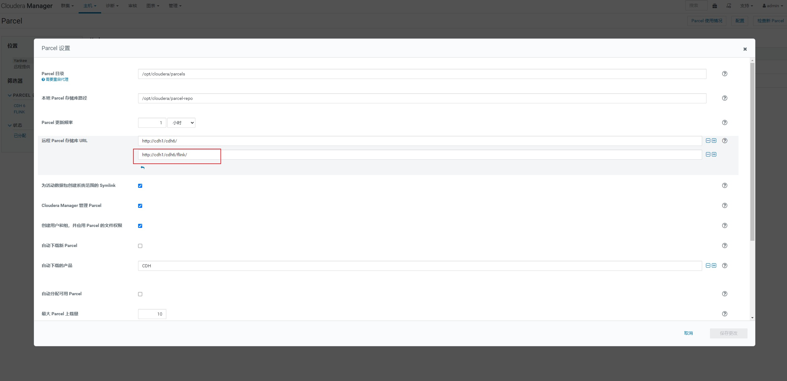
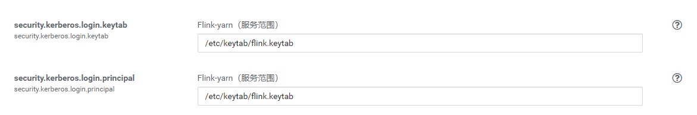
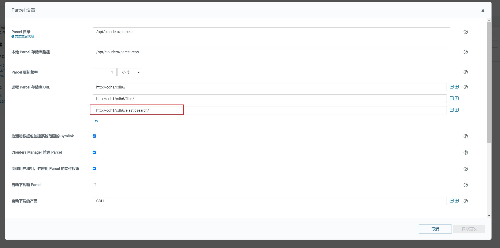
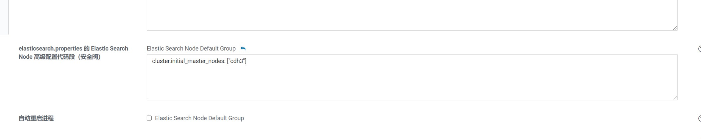
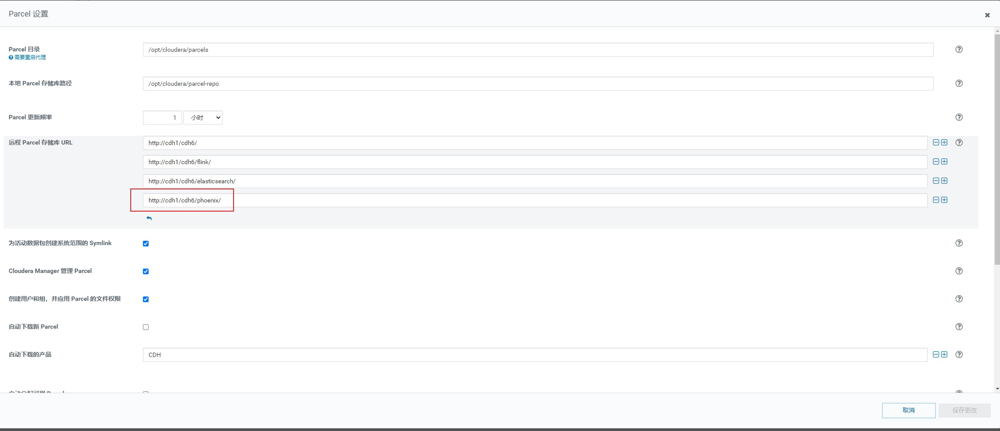
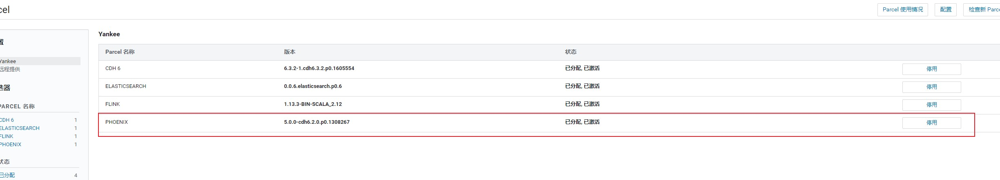
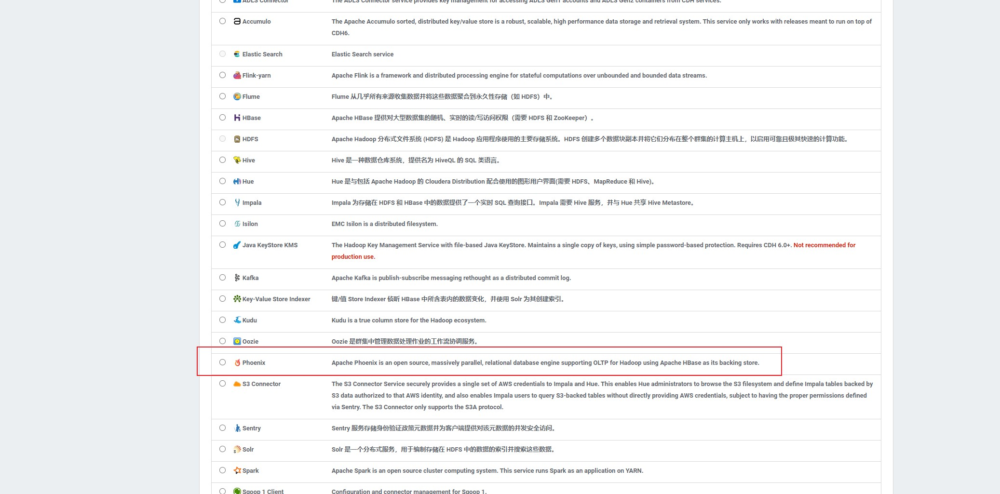

#### CDH6.3.2集群部署

在阿里云上部署CDH6.3.2集群，本人使用四台机器，自己部署是可以选择自行规划节点角色。

##### 1. 基础配置

###### 1. 角色规划

| 节点 | 节点主要角色 | 备注 |
| :--: | :----------: | :--: |
| cdh1 |              |      |
| cdh2 |              |      |
| cdh3 |              |      |
| cdh4 |              |      |

###### 2. 修改hostname（所有节点）

```shell
hostnamectl set-hostname cdh1
hostnamectl set-hostname cdh2
hostnamectl set-hostname cdh3
hostnamectl set-hostname cdh4
```

###### 3. 关闭防火墙（所有节点）

```shell
systemctl stop firewalld
systemctl disable firewalld
systemctl status firewalld
```

###### 4. 配置免密登录（所有节点）

```shell
# 生成ssh-key
ssh-keygen -t rsa
# 互相拷贝密钥
ssh-copy-id cdh1
ssh-copy-id cdh2
ssh-copy-id cdh3
ssh-copy-id cdh4
```

###### 5. 安装ntp服务并设置

所有节点安装ntp服务：

```shell
yum install -y ntp
```

cdh1节点配置：

````shell
# 编辑/etc/ntp.conf，注释掉其他的server，添加阿里云时间同步服务器
server ntp.aliyun.com
````

其他节点配置：

```shell
# 编辑/etc/ntp.conf，注释掉其他的server，添加cdh1主节点时间同步服务器
server cdh1
```

配置ntp服务自启：

```shell
systemctl start ntpd
systemctl enable ntpd
systemctl status ntpd
```

###### 6. 配置CM源

cdh1节点安装httpd并配置启动，登录阿里云开放80端口访问：

```shell
yum -y install httpd
```

启动httpd服务，并登录阿里云控制台开放80端口访问：

```shell
 systemctl start httpd
 systemctl status httpd
```

进入/var/www/html目录下：

```shell
cd /var/www/html
mkdir cm6
mkdir cdh6
```

拷贝cdh的安装包和cm的包拷贝到此目录：

```shell
cp /opt/software/CDH6.3.2/cm6.3.1/RPMS/x86_64/* /var/www/html/cm6
cp /opt/software/CDH6.3.2/allkeys.asc /var/www/html/cm6
cp /opt/software/CDH6.3.2/CDH-6.3.2-1.cdh6.3.2.p0.1605554-el7.parcel /var/www/html/cdh6
cp /opt/software/CDH6.3.2/manifest.json /var/www/html/cdh6
# flink包
cp -r /opt/software/CDH6.3.2/flink/ /var/www/html/cdh6/
```

安装createrepo：

```shell
yum install -y createrepo
```

创建镜像：

```shell
cd /var/www/html/cm6 && createrepo ./
```

修改cloudera-manager.repo文件，并分发到其他节点：

```shell
[cloudera-manager]
name=Cloudera Manager 6.3.1
baseurl=http://cdh1/cm6/
gpgcheck=0
type=rpm-md
```

复制cloudera-manager.repo文件到/etc/yum.repos.d/目录下：

```shell
cp cloudera-manager.repo /etc/yum.repos.d/
```

查看yum配置源是否生效：

```shell
yum clean all
yum repolist
```

##### 2. 安装

###### 1. 安装依赖（所有节点）

```shell
yum install -y bind-utils libxslt cyrus-sasl-plain cyrus-sasl-gssapi portmap fuse-libs /lib/lsb/init-functions httpd mod_ssl openssl-devel python-psycopg2 Mysql-python fuse
```

###### 2. 安装MySQL

```shell
# 获取yum源
cd /opt/software/mysql-5.7
yum install mysql57-community-release-el7-11.noarch.rpm

# 安装mysql
yum install -y mysql-community-server

# 启动mysql
systemctl start mysqld
systemctl enable mysqld
systemctl status mysqld

# 查看mysql默认密码
cat /var/log/mysqld.log | grep password

# 登录并修改密码
alter user 'root'@'localhost' identified by 'Root@123';
```

###### 3. 安装jdk并配置环境变量（所有节点）

```shell
# 安装jdk
yum install -y oracle-j2sdk1.8.x86_64

# 配置环境变量
# vi /etc/profile
JAVA_HOME=/usr/java/jdk1.8.0_181-cloudera
PATH=$PATH:$JAVA_HOME/bin
export JAVA_HOME PATH
```

###### 4. 安装cloudera-manager和agent（cdh1）

```shell
# 安装cloudera-manager和agent
yum install -y cloudera-manager-agent cloudera-manager-daemons cloudera-manager-server cloudera-manager-server-db-2 postgresq-server
```

###### 5. 安装cloudera-agent（其他节点）

```shell
yum install -y cloudera-manager-daemons cloudera-manager-agent
```

修改/etc/cloudera-scm-agent/config.ini配置

```shell
server=cdh1
```

###### 6. 修改/etc/rc.local配置

```shell
echo never > /sys/kernel/mm/transparent_hugepage/defrag
echo never > /sys/kernel/mm/transparent_hugepage/enabled
```

Tips：修改完成后需要重启

###### 7. 启动cloudera-manager（cdh1）

```shell
systemctl start cloudera-scm-server
systemctl status cloudera-scm-server
```

###### 8. 访问cloudera-manager并访问

```shell
端口：7180 用户名：admin 密码：admin
```

##### 3. 集成Flink

###### 1. 配置parcel源



###### 2. 分发及激活Flink-parcel

分发完之后需要激活，激活如果报错哈希校验不通过，可以修改/etc/httpd/conf/httpd.conf配置文件，然后重启httpd服务：

```shell
AddType application/x-gzip .gz .tgz .parcel #此处添加.parcel
```

将FLINK_ON_YARN-1.13.3.jar放在cm server节点的/opt/cloudera/csd目录下。

###### 3. 重启agent及cm server

```shell
systemctl restart cloudera-scm-server
systemctl restart cloudera-scm-agent
```

###### 4. 添加服务即可

添加服务到cdh集群中，如果没有使用kerberos认证，需要删除对应的配置：



###### 5. 复制jar包到flink的lib下（所有节点）

```shell
# flink-shaded-hadoop-3-uber-3.1.1.7.2.9.0-173-9.0.jar 和 common-cli-1.4.jar
# 复制jar包到/opt/cloudera/parcels/FLINK/lib/flink/lib目录下
cp /opt/software/CDH6.3.2/flink-shaded-hadoop-3-uber-3.1.1.7.2.9.0-173-9.0.jar /opt/cloudera/parcels/FLINK/lib/flink/lib
cp /opt/software/CDH6.3.2/common-cli-1.4.jar /opt/cloudera/parcels/FLINK/lib/flink/lib
```

##### 4. 集成ElasticSearch

###### 1. 配置parcel源



###### 2. 分发及激活ElasticSearch-parcel

分发完之后需要激活，激活如果报错哈希校验不通过，可以修改/etc/httpd/conf/httpd.conf配置文件，然后重启httpd服务：

```shell
AddType application/x-gzip .gz .tgz .parcel #此处添加.parcel
```

将ELASTICSEARCH-1.0.jar放在cm server节点的/opt/cloudera/csd目录下。

###### 3. 重启agent及cm server

```shell
systemctl restart cloudera-scm-server
systemctl restart cloudera-scm-agent
```

###### 4. 添加服务即可

###### 5. 报错处理

- 报错权限问题

  ```shell
  Exception in thread "main" org.elasticsearch.bootstrap.BootstrapException: org.elasticsearch.cli.UserException: unable to create temporary keystore
  ```

  再安装ElasticSearch的节点：

  ```shell
  chmod 777 /opt/cloudera/parcels/ELASTICSEARCH-0.0.6.elasticsearch.p0.6/config/
  ```

- 使用错误

  使用`_cat/nodes?pretty`报错：

  ```shell
  master_not_discovered_exception
  ```

  修改ElasticSearch的配置，增加初始化主节点配置：

  ```
  cluster.initial_master_nodes: ["cdh3"]
  ```

  

##### 5. 集成Phoenix

###### 1. 配置parcel源



###### 2. 分发及激活phoenix-parcel



将PHOENIX-1.0.jar放在cm server节点的/opt/cloudera/csd目录下。

###### 3. 重启agent及cm server

```shell
systemctl restart cloudera-scm-server
systemctl restart cloudera-scm-agent
```

###### 4. 添加服务即可


