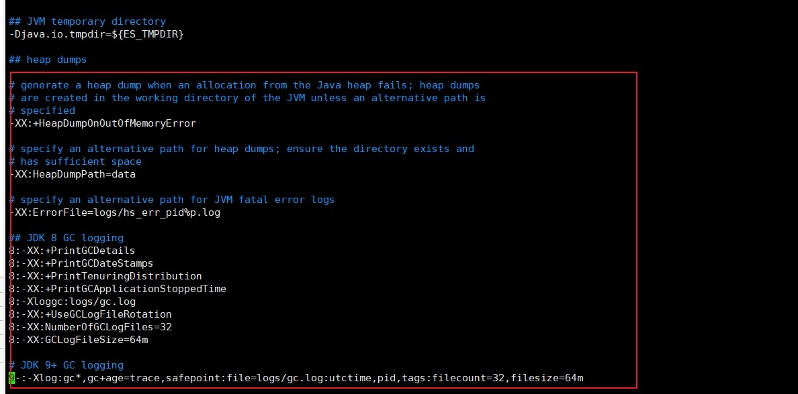
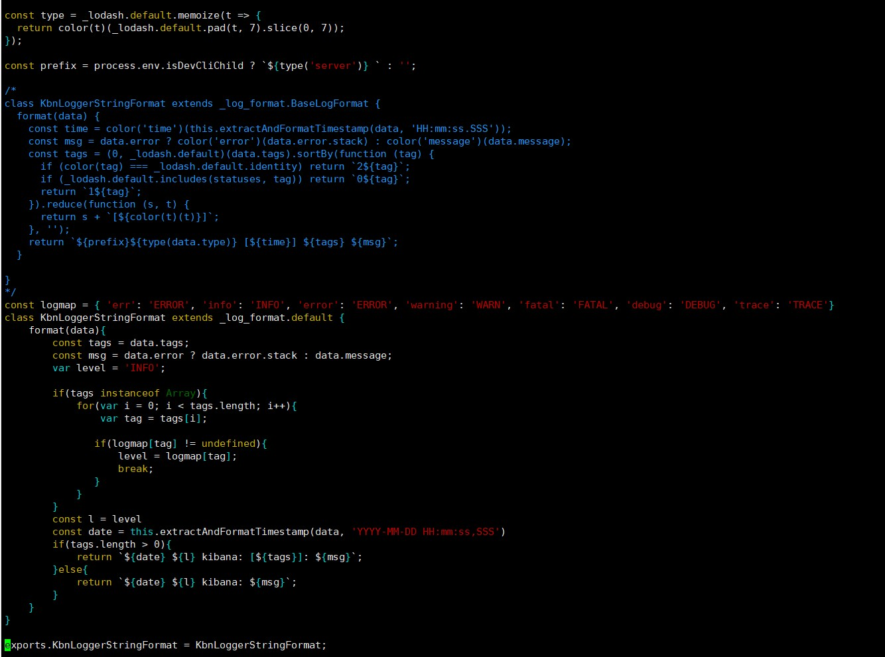

#### 自制CDH6.3版本ELK安装包

```shell
tar -zvxf elasticsearch-7.15.2-linux-x86_64.tar.gz
tar -zvxf kibana-7.15.2-linux-x86_64.tar.gz
tar -zvxf logstash-7.15.2-linux-x86_64.tar.gz

mv elasticsearch-7.15.2 elasticsearch
mv kibana-7.15.2-linux-x86_64 kibana
mv logstash-7.15.2 logstash
```


```shell
chmod -R 755 elasticsearch/jdk/
chmod 777 elasticsearch/plugins/
chmod 644 elasticsearch/config/*
chmod -R 777 kibana/optimize/
chmod 777 elasticsearch/bin/
chmod 777 kibana/bin/
chmod 777 logstash/bin/
```


修改elasticsearch-7.15.2/config/jvm.options文件内容，注释掉红色框内的所有配置：




```shell
tar -zvcf ELK-7.15.2-el7.parcel ELK-7.15.2/
```


```shell
git clone https://github.com/cloudera/cm_ext.git

# 在parcel所在目录
python cm_ext/make_manifest/make_manifest.py ./
```


修改kibana/node_modules/@kbn/legacy-logging/target_node/log_format_string.js文件内容，注释掉后添加以下内容：




```js
const logmap = { 'err': 'ERROR', 'info': 'INFO', 'error': 'ERROR', 'warning': 'WARN', 'fatal': 'FATAL', 'debug': 'DEBUG', 'trace': 'TRACE'}
class KbnLoggerStringFormat extends _log_format.default {
    format(data){
        const tags = data.tags;
        const msg = data.error ? data.error.stack : data.message;
        var level = 'INFO';

        if(tags instanceof Array){
            for(var i = 0; i < tags.length; i++){
                var tag = tags[i];

               if(logmap[tag] != undefined){
                   level = logmap[tag];
                   break;
               }
            }
        }
        const l = level
        const date = this.extractAndFormatTimestamp(data, 'YYYY-MM-DD HH:mm:ss,SSS')
        if(tags.length > 0){
            return `${date} ${l} kibana: [${tags}]: ${msg}`;
        }else{
            return `${date} ${l} kibana: ${msg}`;
        }
    }
}
```


```shell
jar -cvf ELK_7.15.2.jar *
```

