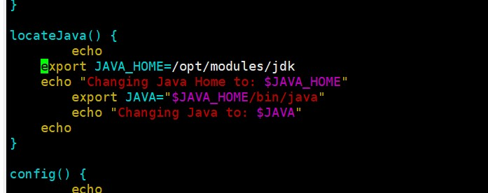

#### 自制CDH6.3版本ElasticSearch安装包

##### 1. 下载cm_ext

Cloudera提供的cm_ext工具，对生成的csd和parcel进行检验

```
mkdir -p ~/github/cloudera
cd ~/github/cloudera

# clone cm_ext
git clone https://github.com/cloudera/cm_ext.git

# 打包
cd cm_ext
mvn package -Dmaven.test.skip=true
```

Tips：build_parcel.sh和 build_csd.sh脚本文件里面执行jar包路径默认是~/github/cloudera/

##### 2. 下载elasticsearch-parcel工具

```shell
git clone https://github.com/ibagomel/elasticsearch-parcel.git
```

##### 3. 下载ElasticSearch安装包

```
wget https://artifacts.elastic.co/downloads/elasticsearch/elasticsearch-7.15.2-linux-x86_64.tar.gz
```

##### 4. 安装jdk11（所有节点）

```shell
# 解压jdk11压缩包并建立软链接，不需要配置环境变量
ln -s jdk-11.0.10 jdk
```

##### 5. 修改parcel配置文件

elasticsearch-parcel配置文件：elasticsearch-parcel/parcel-src/meta/parcel.json

```json
{
  "schema_version":     1,
  "name":               "ELASTICSEARCH",
  "version":            "<VERSION-FULL>",
  "setActiveSymlink":   true,

  "depends": "CDH (>= 5.0), CDH (<< 7.0)",
  "provides": ["elasticsearch"],
  "scripts": {
    "defines": "es_env.sh"
  },

  "packages": [{
    "name": "elasticsearch",
    "version": "<VERSION-FULL>"
  }],

  "components": [{
    "name":    "elasticsearch",
    "version": "<VERSION-SHORT>",
    "pkg_version": "<VERSION-SHORT>"
  }],

  "users": {
    "elasticsearch": {
      "longname"    : "Elastic Search",
      "home"        : "/var/lib/elasticsearch",
      "shell"       : "/bin/bash",
      "extra_groups": []
    }
  },

  "groups": ["elasticsearch"]
}
```

修改elasticsearch-parcel/csd-src/descriptor/service.sdl文件内容


修改elasticsearch-parcel/csd-src/scripts/control.shj脚本中的JAVA_HOME地址（jdk11的地址）：



##### 6. 打包parcel

```shell
# 生成parcel
POINT_VERSION=6 VALIDATOR_DIR=~/github/cloudera/cm_ext OS_VER=el7 PARCEL_NAME=ElasticSearch ./build-parcel.sh ~/github/cloudera/elasticsearch/elasticsearch-7.15.2-linux-x86_64.tar.gz

# 生成csd
VALIDATOR_DIR=~/github/cloudera/cm_ext CSD_NAME=ElasticSearch ./build-csd.sh
```

##### 7. 打包parcel镜像

复制ealsticsearch-parcel目录下的build-parcel和build-csd目录的内容就是我们最后的parcel和jar包。

