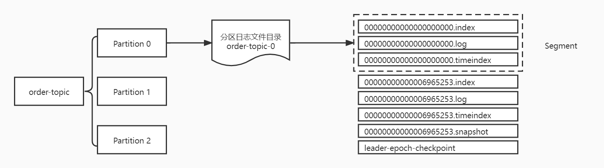

kafka的消息是以topic为单位进行归类的，各个topic之间互相独立，互不影响。每个主题可以分成一个或者多个分区。每个分区各自存在一个记录消息数据的日志文件。



图中，order-topic主题共有3个分区，每个分区存在一个以`topic-partition`命名的目录，目录下的文件结构如下表：

| 文件类别                | 作用                                                 |
| ----------------------- | ---------------------------------------------------- |
| .index                  | 消息的物理地址的偏移量索引文件                       |
| .timeindex              | 映射时间戳和相对offset的时间戳索引文件               |
| .log                    | 日志文件（消息存储文件）                             |
| .snapshot               | 对幂等型或者事务型producer所生成的快照文件           |
| leader-epoch-checkpoint | 保存了每一任leader开始写入消息时的offset, 会定时更新 |

Kafka日志追加是顺序写入的，日志文件存在多种后缀，重点需要关注`.index`，`.timeindex`和`.log`三种类型。每个Segment都有一个基准偏移量，用来表示当前Segment中的第一条消息的offset。偏移量是一个64位的长整型数值，固定是20位数字，长度未达到，用0进行填补，索引文件和日志文件都由该作为文件命名规则。查看各个文件的命令：

| 文件类别   | 命令                                                         |
| ---------- | ------------------------------------------------------------ |
| .index     | kafka-dump-log.sh --files ./00000000000000000000.index       |
| .timeindex | kafka-dump-log.sh --files ./00000000000000000000.timeindex   |
| .log       | bin/kafka-run-class.sh kafka.tools.DumpLogSegments --files ./00000000000000000000.log |

#### 1. Index

kafka的index采用的是稀疏索引，索引文件大小默认为10M。由参数`log.index.size.max.bytes`控制，而index文件和timeindex文件是一一对应的，index中的索引条数，由参数`log.segment.bytes`和`log.index.interval.bytes`共同决定。`log.segment.bytes`的大小默认为1G，`log.index.interval.bytes`表示索引间隔，默认大小为4K。

##### 1. index文件

index文件中的内容如下：

```
offset: 35 position: 4961
offset: 261 position: 24300
offset: 352 position: 40646
offset: 458 position: 54670
```

如果要查找offset为270的消息，首先会通过二分找到对应的segment，然后去对应的index文件通过二分找到不大于270的最大索引项，也就是[offset: 261 position: 24300]，之后进行顺序扫描。先通过二分法找到offset为261的那条，从log文件中的物理偏移量为24300的位置开始顺序查找偏移量为270的消息。

##### 2. timeindex文件

timeindex文件中的内容如下：

```
timestamp: 1636617435892 offset: 35
timestamp: 1636617435952 offset: 261
timestamp: 1636617435981 offset: 352
timestamp: 1636617435988 offset: 458
```

如果要查找timstamp为1636617435955开始的消息，首先将时间戳和每个log文件中最大的时间戳largestTimeStamp进行逐一对比，直到找到不小于1636617435955所对应的segment。log文件的largestTimeStamp的计算是先查询该log文件所对应的时间戳文件，找到最后一条索引项，若最后一条索引项的时间戳字段大于0，则取该值，否则去取log的修改时间。找到log文件后，使用二分法定位，找到不大于1636617435955的最大索引项，也就是[timestamp: 1636617435952 offset: 261]，拿着偏移量是261的offset值去偏移量索引文件找到不大于261的最大索引项，也就是[offset: 261 position: 24300]，之后从偏移量为24300的位置开始顺序查找，找到timestamp不小于1636617435955的消息。

#### 2. Log

log文件中存储的是真正的数据，通过命令可以看到如下信息：

```
baseOffset: 0 lastOffset: 31 count: 32 baseSequence: -1 lastSequence: -1 producerId: -1 producerEpoch: -1 partitionLeaderEpoch: 0 isTransactional: false isControl: false position: 0 CreateTime: 1636617435886 size: 4961 magic: 2 compresscodec: NONE crc: 3491097385 isvalid: true
baseOffset: 32 lastOffset: 35 count: 4 baseSequence: -1 lastSequence: -1 producerId: -1 producerEpoch: -1 partitionLeaderEpoch: 0 isTransactional: false isControl: false position: 4961 CreateTime: 1636617435892 size: 674 magic: 2 compresscodec: NONE crc: 1015769393 isvalid: true
baseOffset: 36 lastOffset: 37 count: 2 baseSequence: -1 lastSequence: -1 producerId: -1 producerEpoch: -1 partitionLeaderEpoch: 0 isTransactional: false isControl: false position: 5635 CreateTime: 1636617435892 size: 367 magic: 2 compresscodec: NONE crc: 587346678 isvalid: true
baseOffset: 38 lastOffset: 41 count: 4 baseSequence: -1 lastSequence: -1 producerId: -1 producerEpoch: -1 partitionLeaderEpoch: 0 isTransactional: false isControl: false position: 6002 CreateTime: 1636617435894 size: 676 magic: 2 compresscodec: NONE crc: 2973063088 isvalid: true
```

从以上内容可以看到的的消息是：baseOffset从0开始，到offset为31结束的消息段中存储了32条消息，时间戳是1636617435886，大小为4961K，压缩类型为NONE。

kafka提供了两种清理策略：日志删除和日志压缩，可以通过参数`log.cleaner.policy`进行配置，参数可选[compact, delete]。

日志删除：按照一定的策略，将不满足的数据进行删除。日志删除的配置如下：

| 配置                            | 默认值     | 说明                                             |
| ------------------------------- | ---------- | ------------------------------------------------ |
| log.retention.check.interval.ms | 300000毫秒 | 日志清理器检查日志是否符合删除条件的频率（毫秒） |
| log.retention.bytes             | -1         | 保留日志文件的最大值                             |
| log.segment.bytes               | 1073741824 | 单个日志文件的最大大小（KB）                     |
| log.retention.hours             | 168小时    | 日志保留的时间（小时）                           |
| log.retention.minutes           |            | 日志保留的时间（分钟）                           |
| log.retention.ms                |            | 日志保留的时间（毫秒）                           |
| file.delete.delay.ms            | 60000毫秒  | 从磁盘中删除的延迟时间（毫秒）                   |

日志压缩：针对每个消息的key进行整合，对于有相同key的不同的value值，只保留最后一个版本。也支持对单个的topic进行配置清理策略，参数`cleaner.policy`，压缩策略通过`compression.type`进行指定，可选值为['none', 'gzip', 'snappy', 'lz4', 'zstd']。

#### 3. leader-epoch-checkpoint

leader-epoch-checkpoint文件的内容如下：

```
0			# 版本号 
2			# 下面的记录数
0 0			# [epoch, offset] 
4 7179704	# [epoch, offset]
# epoch表示leader的版本号，从0开始，leader变更过1次epoch就会+1
# offset表示对应该epoch版本的leader写入第一条消息的offset
```
