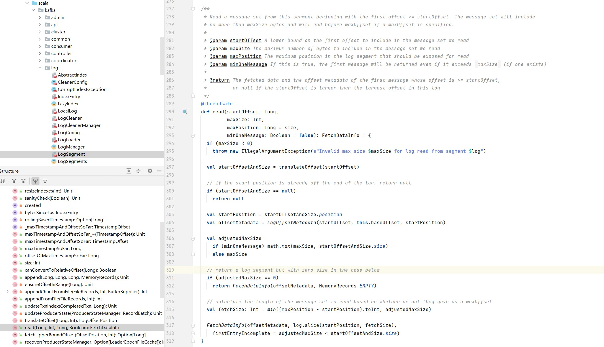
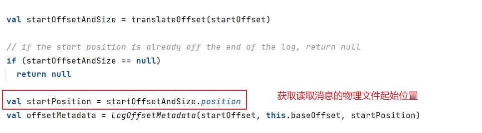
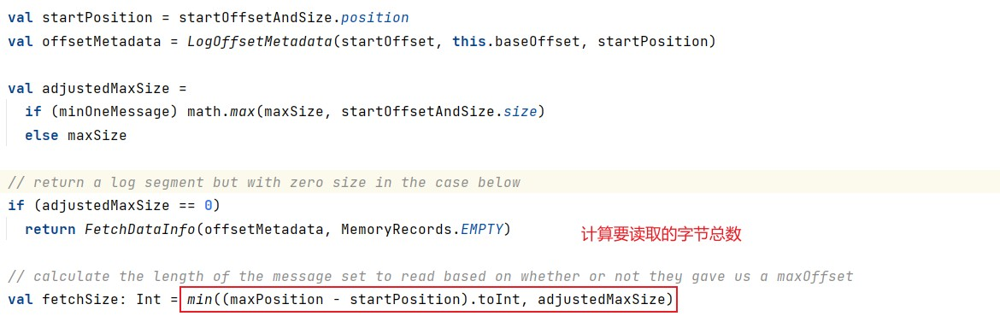
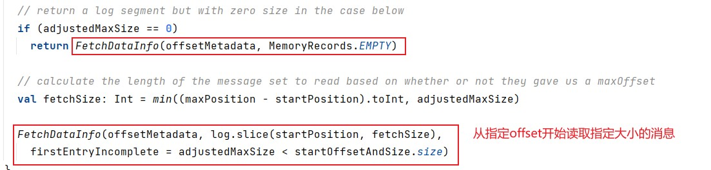
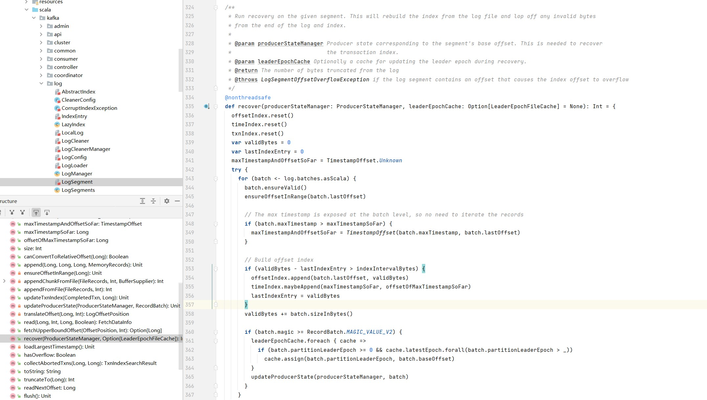
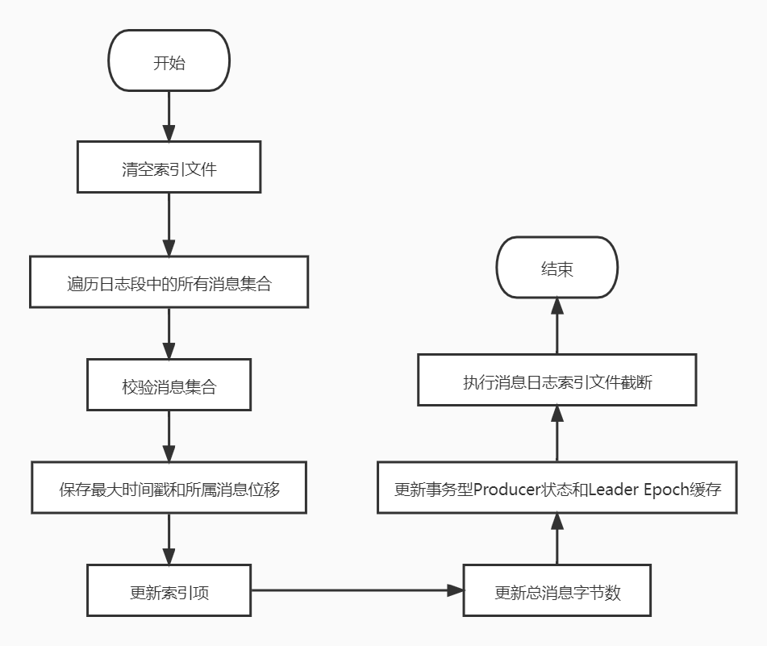
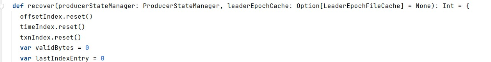
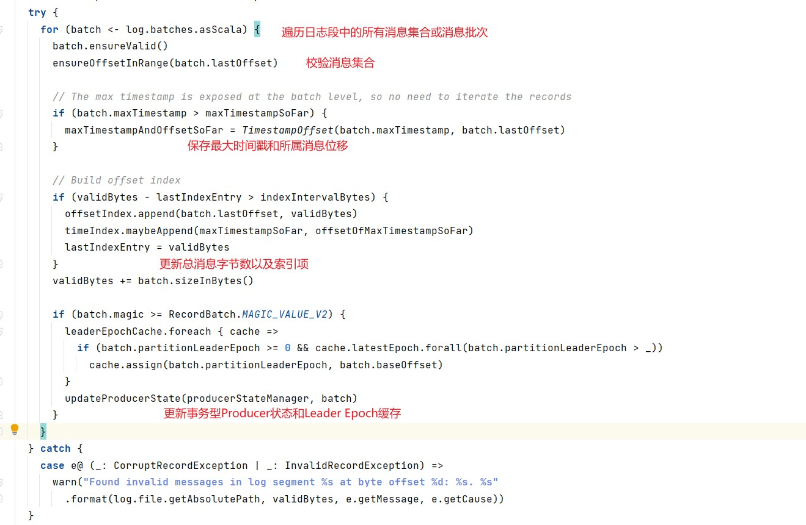
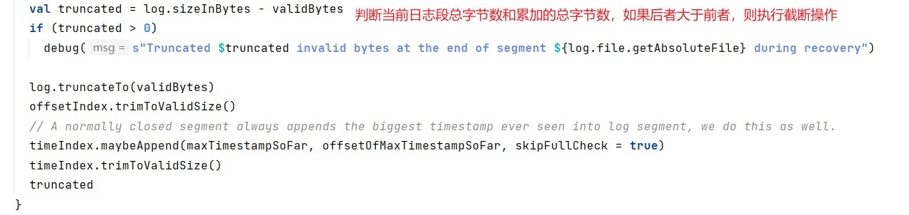

#### 源码阅读-LogSegment

日志段代码解析地址位于core工程下，具体的位置是core/src/main/scala/kafka/log/LogSegment.scala，实际上，所有日志结构部分的源码都在core的kafka.log下。


该文件中定义了以下三个scala对象：


- LogSegment class：伴生类
- LogSegment object：单例对象，保存一些静态变量或静态方法
- LogFlushStats object：LogFlushStats是作统计用的，主要负责为日志落盘时进行计时。

##### 1. LogSegment类定义


从类上的注释可以看到每个日志段由两个核心组件构成：日志和索引。这里的索引指广义的索引文件。另外，这段注释给出了一个重要的参数起始位置值（Base Offset），该位移值是此日志段中最小的位移值，同时，该值却又比前面任何日志段中的消息的位移值都大。

```
log：消息的日志文件
lazyOffsetIndex：偏移量索引文件，使用延迟初始化，降低了初始化时间的成本
lazyTimeIndex：时间戳索引文件，使用延迟初始化，降低了初始化时间的成本
txnIndex：事务索引文件
baseOffset：每个日志文件的其实偏移量baseOffset，磁盘中存储文件的命名采用的就是baseOffset
indexIntervalBytes：索引文件中记录条数的间隔大小，默认大小为4K。与参数log.index.interval.bytes对应
rollJitterMs：日志段对象新增倒计时的“扰动值”，也就是说，在未来的某个时刻可能同时创建多个日志段对象，会增加物理磁盘的I/O压力。有了该值，每个新增日志段在创建时会彼此岔开一段时间，减少磁盘I/O负载
time：计时统计的实例
```

##### 2. append

append方法接受四个输入参数，分别表示待写入消息批次中的消息的最大位移值、最大时间戳、最大时间戳对应的位移以及真正要写入的消息集合。

```scala
/**
 * Append the given messages starting with the given offset. Add
 * an entry to the index if needed.
 *
 * It is assumed this method is being called from within a lock.
 *
 * @param largestOffset The last offset in the message set
 * @param largestTimestamp The largest timestamp in the message set.
 * @param shallowOffsetOfMaxTimestamp The offset of the message that has the largest timestamp in the messages to append.
 * @param records The log entries to append.
 * @return the physical position in the file of the appended records
 * @throws LogSegmentOffsetOverflowException if the largest offset causes index offset overflow
 */
@nonthreadsafe
def append(largestOffset: Long,
           largestTimestamp: Long,
           shallowOffsetOfMaxTimestamp: Long,
           records: MemoryRecords): Unit = {
  if (records.sizeInBytes > 0) {
    trace(s"Inserting ${records.sizeInBytes} bytes at end offset $largestOffset at position ${log.sizeInBytes} " +
          s"with largest timestamp $largestTimestamp at shallow offset $shallowOffsetOfMaxTimestamp")
    val physicalPosition = log.sizeInBytes()
    if (physicalPosition == 0)
      rollingBasedTimestamp = Some(largestTimestamp)

    ensureOffsetInRange(largestOffset)

    // append the messages
    val appendedBytes = log.append(records)
    trace(s"Appended $appendedBytes to ${log.file} at end offset $largestOffset")
    // Update the in memory max timestamp and corresponding offset.
    if (largestTimestamp > maxTimestampSoFar) {
      maxTimestampAndOffsetSoFar = TimestampOffset(largestTimestamp, shallowOffsetOfMaxTimestamp)
    }
    // append an entry to the index (if needed)
    if (bytesSinceLastIndexEntry > indexIntervalBytes) {
      offsetIndex.append(largestOffset, physicalPosition)
      timeIndex.maybeAppend(maxTimestampSoFar, offsetOfMaxTimestampSoFar)
      bytesSinceLastIndexEntry = 0
    }
    bytesSinceLastIndexEntry += records.sizeInBytes
  }
}
```


append方法的执行流程图如下：


步骤：

- 调用log.sizeInBytes方法判断该日志段是否为空，如果是空，kafka需要记录要写入消息集合的最大时间戳，并将其作为后面新增日志段倒计时的依据。

  

- 判断log文件的物理偏移量是否为0。

  

- 校验消息偏移量offset合法，判断标准是看它与日志段的起始位移的差值是否在整数范围内，即largestOffset-baseOffset的值是不是介于[0，Int.MAXVALUE]之间。在极个别的情况下，可能会越界，一旦遇到问题，需要升级kafka版本，这是已知的bug。

  

  

- 写入消息，append方法会调用FileRecords的append方法执行真正的写入。

  

- 更新当前最大时间戳和所属消息偏移量，每个日志段都要保存当前最大的时间戳信息和所属消息的最大位移信息。Broker端提供的定期删除日志的功能就是借助于当前的最大时间戳作为判断依据，而最大时间戳对应的消息的位移值则用于时间戳索引项。

  

- 当写入字节数大于4K，新增索引。调用索引对象的append方法新增索引，同时清空已写入字节数，以备下次重新累积计算。

  

- 更新已写入最大字节数

  

##### 3. 更新index和timeindex方法

offsetIndex的append方法：


timeIndex的append方法：


##### 4. read

read方法，是进行读取日志段的具体操作。read方法接受四个输入参数，分别是要读取的第一条消息的位移、要读取的最大字节数、能读到的最大文件位置以及是否允许在消息体过大时至少返回第一条消息。第四个参数minOneMessage为true时，即使出现了消息体字节数超过了maxSize的情况，read方法仍然能返回至少一条消息。引入这个消息主要是为了确保不出现消费者饿死的情况。

```scala
/**
 * Read a message set from this segment beginning with the first offset >= startOffset. The message set will include
 * no more than maxSize bytes and will end before maxOffset if a maxOffset is specified.
 *
 * @param startOffset A lower bound on the first offset to include in the message set we read
 * @param maxSize The maximum number of bytes to include in the message set we read
 * @param maxPosition The maximum position in the log segment that should be exposed for read
 * @param minOneMessage If this is true, the first message will be returned even if it exceeds `maxSize` (if one exists)
 *
 * @return The fetched data and the offset metadata of the first message whose offset is >= startOffset,
 *         or null if the startOffset is larger than the largest offset in this log
 */
@threadsafe
def read(startOffset: Long,
         maxSize: Int,
         maxPosition: Long = size,
         minOneMessage: Boolean = false): FetchDataInfo = {
  if (maxSize < 0)
    throw new IllegalArgumentException(s"Invalid max size $maxSize for log read from segment $log")

  val startOffsetAndSize = translateOffset(startOffset)

  // if the start position is already off the end of the log, return null
  if (startOffsetAndSize == null)
    return null

  val startPosition = startOffsetAndSize.position
  val offsetMetadata = LogOffsetMetadata(startOffset, this.baseOffset, startPosition)

  val adjustedMaxSize =
    if (minOneMessage) math.max(maxSize, startOffsetAndSize.size)
    else maxSize

  // return a log segment but with zero size in the case below
  if (adjustedMaxSize == 0)
    return FetchDataInfo(offsetMetadata, MemoryRecords.EMPTY)

  // calculate the length of the message set to read based on whether or not they gave us a maxOffset
  val fetchSize: Int = min((maxPosition - startPosition).toInt, adjustedMaxSize)

  FetchDataInfo(offsetMetadata, log.slice(startPosition, fetchSize),
    firstEntryIncomplete = adjustedMaxSize < startOffsetAndSize.size)
}
```



read方法的执行流程图如下：


步骤：

- 判断要读取的最大字节数是否大于0。

- 查询索引确定读取物理文件位置，调用translateOffset方法定位要读取的起始文件位置（startPosition）。输入参数startOffset仅仅是位移值，kafka需要根据索引信息找到对应的物理文件的位置才能开始读取消息。

  

- 计算要读取的字节总数，确定了起始位置，日志段需要根据这部分信息以及maxSize和maxPosition参数共同计算要读取的字节总数。

  

- 读取消息，调用FileRecords的slice方法，从指定位置读取指定大小的消息集合。

  

##### 5. recover

revover方法，用于恢复日志段。Broker在启动时会从磁盘上加载所有的日志段信息到内存中，并创建相应的LogSegment对象实例。

```scala
/**
 * Run recovery on the given segment. This will rebuild the index from the log file and lop off any invalid bytes
 * from the end of the log and index.
 *
 * @param producerStateManager Producer state corresponding to the segment's base offset. This is needed to recover
 *                             the transaction index.
 * @param leaderEpochCache Optionally a cache for updating the leader epoch during recovery.
 * @return The number of bytes truncated from the log
 * @throws LogSegmentOffsetOverflowException if the log segment contains an offset that causes the index offset to overflow
 */
@nonthreadsafe
def recover(producerStateManager: ProducerStateManager, leaderEpochCache: Option[LeaderEpochFileCache] = None): Int = {
  offsetIndex.reset()
  timeIndex.reset()
  txnIndex.reset()
  var validBytes = 0
  var lastIndexEntry = 0
  maxTimestampAndOffsetSoFar = TimestampOffset.Unknown
  try {
    for (batch <- log.batches.asScala) {
      batch.ensureValid()
      ensureOffsetInRange(batch.lastOffset)

      // The max timestamp is exposed at the batch level, so no need to iterate the records
      if (batch.maxTimestamp > maxTimestampSoFar) {
        maxTimestampAndOffsetSoFar = TimestampOffset(batch.maxTimestamp, batch.lastOffset)
      }

      // Build offset index
      if (validBytes - lastIndexEntry > indexIntervalBytes) {
        offsetIndex.append(batch.lastOffset, validBytes)
        timeIndex.maybeAppend(maxTimestampSoFar, offsetOfMaxTimestampSoFar)
        lastIndexEntry = validBytes
      }
      validBytes += batch.sizeInBytes()

      if (batch.magic >= RecordBatch.MAGIC_VALUE_V2) {
        leaderEpochCache.foreach { cache =>
          if (batch.partitionLeaderEpoch >= 0 && cache.latestEpoch.forall(batch.partitionLeaderEpoch > _))
            cache.assign(batch.partitionLeaderEpoch, batch.baseOffset)
        }
        updateProducerState(producerStateManager, batch)
      }
    }
  } catch {
    case e@ (_: CorruptRecordException | _: InvalidRecordException) =>
      warn("Found invalid messages in log segment %s at byte offset %d: %s. %s"
        .format(log.file.getAbsolutePath, validBytes, e.getMessage, e.getCause))
  }
  val truncated = log.sizeInBytes - validBytes
  if (truncated > 0)
    debug(s"Truncated $truncated invalid bytes at the end of segment ${log.file.getAbsoluteFile} during recovery")

  log.truncateTo(validBytes)
  offsetIndex.trimToValidSize()
  // A normally closed segment always appends the biggest timestamp ever seen into log segment, we do this as well.
  timeIndex.maybeAppend(maxTimestampSoFar, offsetOfMaxTimestampSoFar, skipFullCheck = true)
  timeIndex.trimToValidSize()
  truncated
}
```



recover方法的执行流程图如下：



步骤：

- recover开始先清空索引文件，依次调用索引对象的reset方法清空所有的索引文件。

  

- 遍历日志段中的所有消息集合或消息批次（RecordBatch）。

- 校验消息集合或消息批次，①集合中的消息要符合kafka定义的二进制格式；②该集合中的最后一条消息的位移值不能越界，即它与日志段起始位置的差值必须是一个正整数值。

- 更新遍历过程中观测到的最大时间戳以及所属消息的位移值。

- 同时，不断累加当前已读取的消息字节数，并更新索引项。

- 更新事务性型Producer状态和Leader Epoch缓存。

  

- 遍历执行完成后，kafka会将日志段当前总字节数和刚刚累加的已读取字节数进行比较，如果发现已读取字节比当前总字节数大，说明日志段写入了一些非法消息，需要截断，将日志段大小调整回合法的数值。同时，kafka还需要相应的调整索引文件的大小。

  

