#### Kafka源码阅读-LogSegment

日志段代码解析地址位于core工程下的/scala/log/LogSegment.scala。

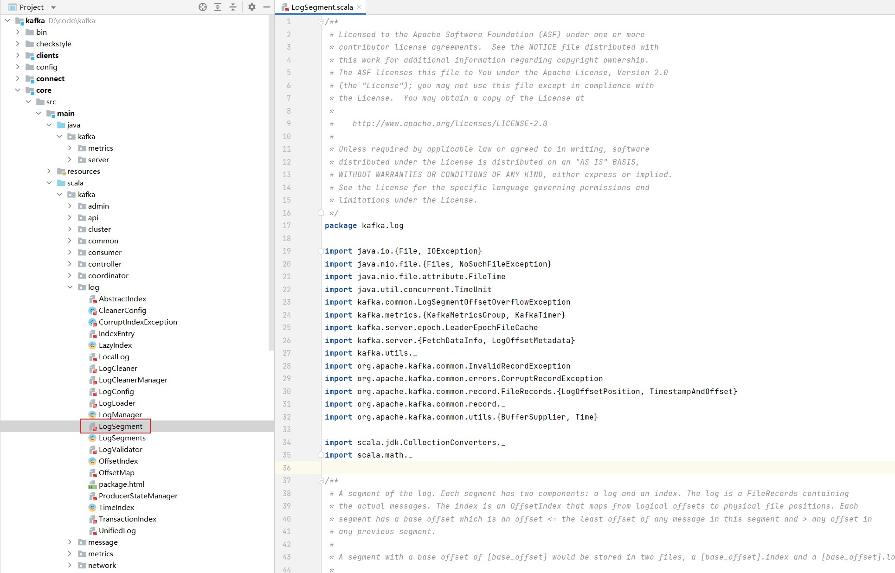

该文件中定义了以下三个scala对象：

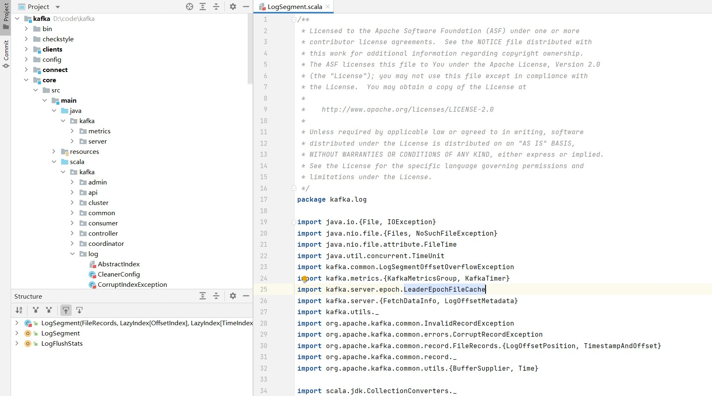

##### 1. LogSegment类定义


```
log：消息的日志文件
lazyOffsetIndex：偏移量索引文件
lazyTimeIndex：时间戳索引文件
txnIndex：事务索引文件
baseOffset：每个日志文件的其实偏移量baseOffset，磁盘中存储文件的命名采用的就是baseOffset
indexIntervalBytes：索引文件中记录条数的间隔大小，默认大小为4K。与参数log.index.interval.bytes对应
rollJitterMs：The maximum random jitter subtracted from the scheduled segment roll time
time：计时统计的实例
```

##### 2. append执行流程

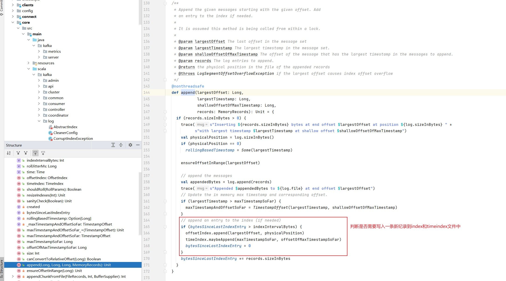

执行流程图如下：

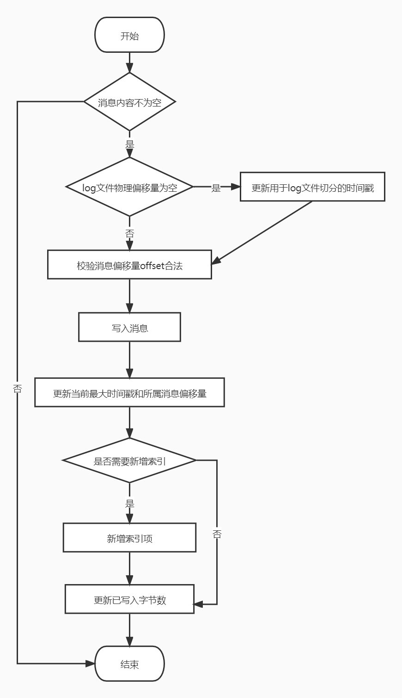

步骤：

- 判断消息内容是否为空

  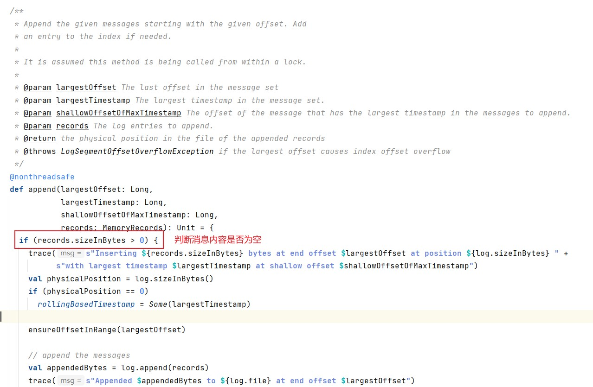

- 判断log文件的物理偏移量是否为0

  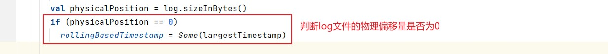

- 校验消息偏移量offset合法

  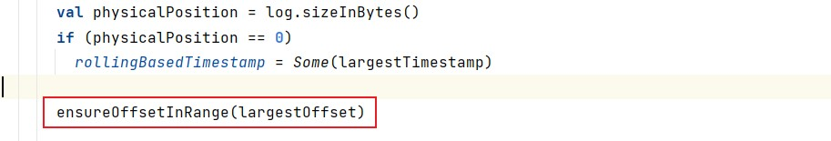

  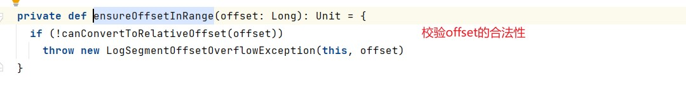

- 写入消息

  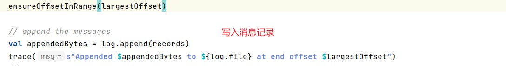

- 更新当前最大时间戳和所属消息偏移量

  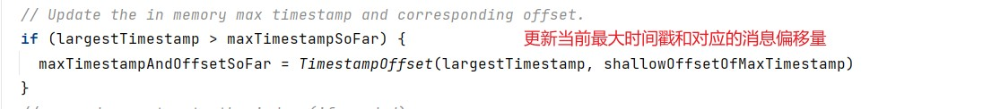

- 当写入字节数大于4K，新增索引

  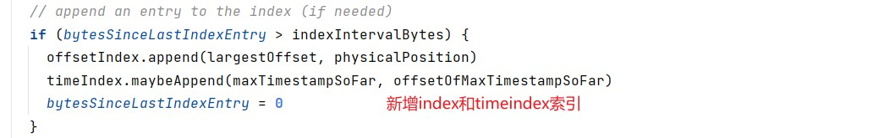

- 更新已写入字节数

  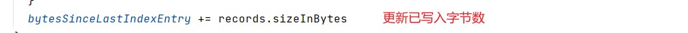

##### 3. 更新index和timeindex方法

offsetIndex的append方法：

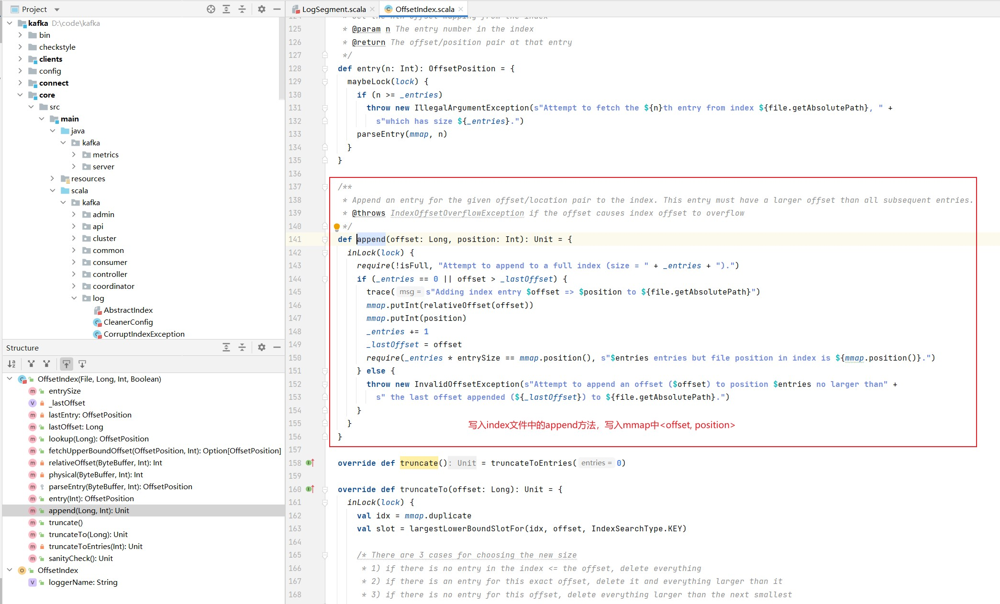

timeIndex的append方法：

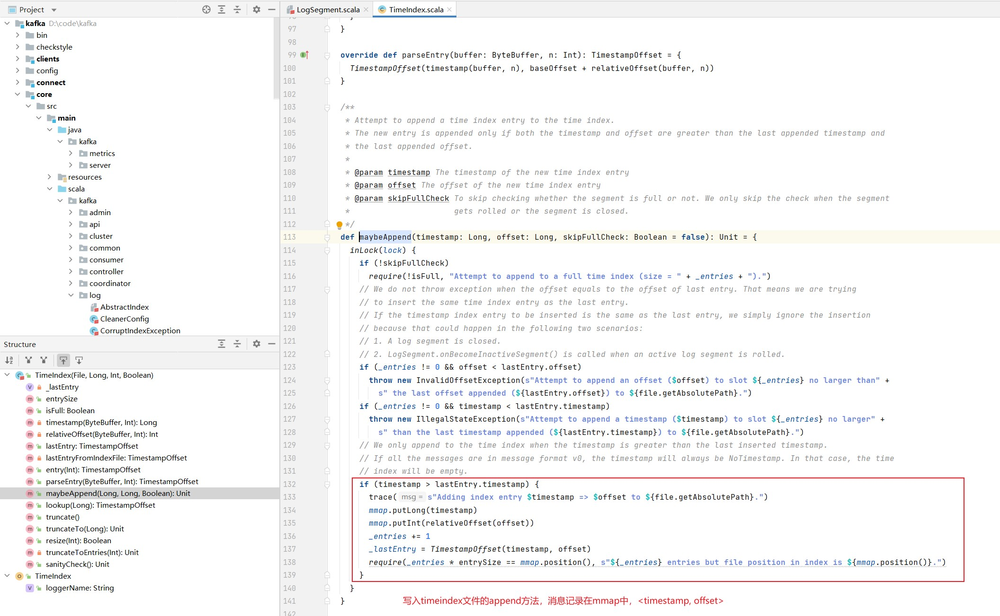

