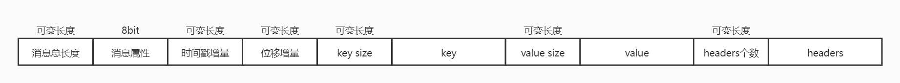
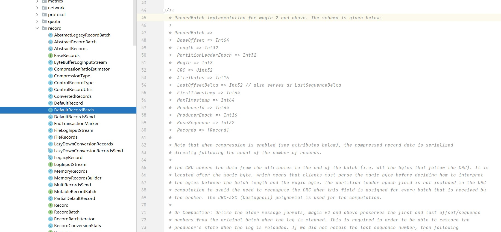
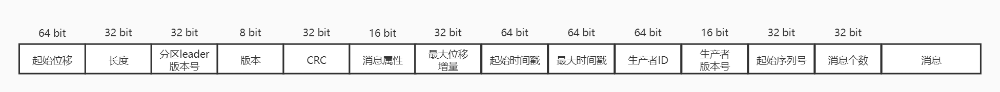

#### 源码阅读-Record

Kafka消息格式相关的代码位于clients工程下的`/java/org/apache/kafka/common/record`包下。


类之间的关系图如下所示：


##### 1. DefaultRecord（默认消息）

类中的消息格式定义（org.apache.kafka.common.record.DefaultRecord）：


|    字段     |         说明         |
| :---------: | :------------------: |
| sizeInBytes |    消息总长度字段    |
| attributes  |     消息属性字段     |
|   offset    |       位移增量       |
|  timestamp  |      时间戳增量      |
|  sequence   | 用于支持消息的幂等性 |
|     key     |        key值         |
|    value    |       value值        |
|   headers   |     消息头部属性     |

kafka将record组装成buffer进行输出（org.apache.kafka.common.record.DefaultRecord#writeTo）：

```scala
/**
 * Write the record to `out` and return its size.
 */
public static int writeTo(DataOutputStream out,
                          int offsetDelta,
                          long timestampDelta,
                          ByteBuffer key,
                          ByteBuffer value,
                          Header[] headers) throws IOException {
    // 消息总数
    int sizeInBytes = sizeOfBodyInBytes(offsetDelta, timestampDelta, key, value, headers);
    ByteUtils.writeVarint(sizeInBytes, out);

    // 属性
    byte attributes = 0; // there are no used record attributes at the moment
    out.write(attributes);

    // 时间增量
    ByteUtils.writeVarlong(timestampDelta, out);
    // 位移增量
    ByteUtils.writeVarint(offsetDelta, out);

    // key
    if (key == null) {
        ByteUtils.writeVarint(-1, out);
    } else {
        // key size
        int keySize = key.remaining();
        ByteUtils.writeVarint(keySize, out);
        Utils.writeTo(out, key, keySize);
    }

    // value
    if (value == null) {
        ByteUtils.writeVarint(-1, out);
    } else {
        // value size
        int valueSize = value.remaining();
        ByteUtils.writeVarint(valueSize, out);
        Utils.writeTo(out, value, valueSize);
    }

    // headers
    if (headers == null)
        throw new IllegalArgumentException("Headers cannot be null");

    // headers个数
    ByteUtils.writeVarint(headers.length, out);
 
    for (Header header : headers) {
        // header key
        String headerKey = header.key();
        if (headerKey == null)
            throw new IllegalArgumentException("Invalid null header key found in headers");

        byte[] utf8Bytes = Utils.utf8(headerKey);
        // header key length
        ByteUtils.writeVarint(utf8Bytes.length, out);
        out.write(utf8Bytes);

        // header value
        byte[] headerValue = header.value();
        if (headerValue == null) {
            ByteUtils.writeVarint(-1, out);
        } else {
            // header value length
            ByteUtils.writeVarint(headerValue.length, out);
            out.write(headerValue);
        }
    }

    return ByteUtils.sizeOfVarint(sizeInBytes) + sizeInBytes;
}
```

消息格式可以用如下表示：



##### 2. DefaultRecordBatch（默认消息集合）

类中的消息集合格式的定义（org.apache.kafka.common.record.DefaultRecordBatch）：



消息批次格式可以用如下表示：



