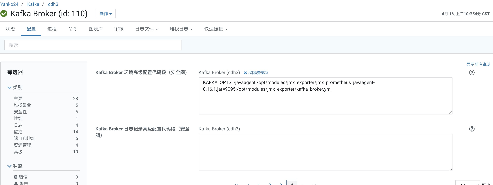

### CDH6.3.2配合使用Grafana进行监控


下面的很多组件都要用到`JMX`进行监控，需要先去下载`jmx_prometheus_javaagent-0.16.1.jar`，版本可以自行选择，下载地址为：`https://mvnrepository.com/artifact/io.prometheus.jmx/jmx_prometheus_javaagent`，下载后放到一个目录即可。


#### 2. 使用Prometheus监控Kafka

通过JMX获取kafka-metrics指标，并通过Grafana进行展示。

将下载好的`jmx_prometheus_javaagent`放到指定的目录下，每个broker节点都需要，比如上传到路径`/opt/modules/jmx_exporter`，之后需要修改kafka启动的配置参数：

打开CDH的kafka节点，针对每个broker进行单独配置，配置`环境高级配置代码段（安全阀）`配置，配置为如下内容：

```
KAFKA_OPTS=-javaagent:/opt/modules/jmx_exporter/jmx_prometheus_javaagent-0.16.1.jar=9095:/opt/modules/jmx_exporter/kafka_broker.yml
```



其中上述配置中用到的`kafka_broker.yml`，参考博主`不识君的荒漠`的[文章](https://blog.csdn.net/x763795151/article/details/119705372)，如有需要可以进行修改。

因为消息积压等一些信息没法通过broker进行获取，可以通过[kafka-exporter](https://github.com/xxd763795151/kafka-exporter)获取对应的metrics指标，在对应的github仓库中有详细的步骤。

##### 2.1 配置Prometheus

在`prometheus.yml`文件中增加如下配置：

```yml
- job_name: 'kafka'
  metrics_path: "/metrics"
  static_configs:
    - targets: ['cdh2:9095', 'cdh3:9095', 'cdh4:9095']
      labels:
        env: "dev"

- job_name: 'kafka-exporter'
  metrics_path: "/prometheus"
  static_configs:
    - targets: ['cdh1:9097']
      labels:
         env: "dev"
```

之后重启prometheus，打开`cdh2:9095/metrics`以及`kafka-exporter-host:9097/prometheus`即可看到对应的metrics。

##### 2.2 配置Grafana

Grafana配置模板参考博主的[文章](https://blog.csdn.net/x763795151/article/details/119705372)，博主也提供了对应的下载地址。

#### 3. 使用Prometheus监控HBase