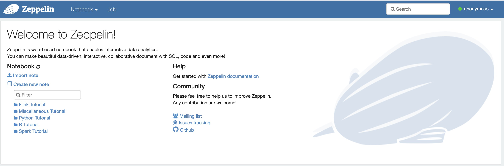
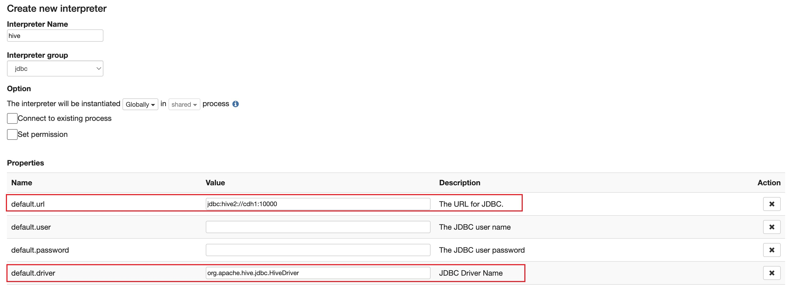
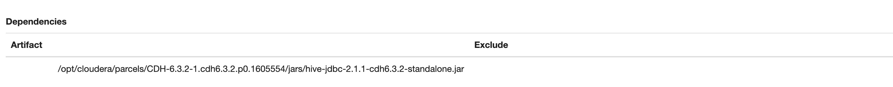
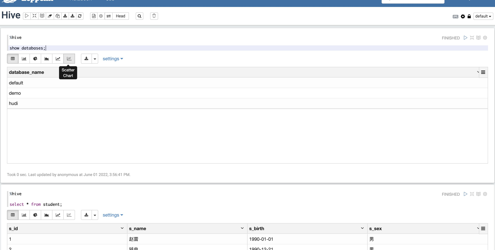
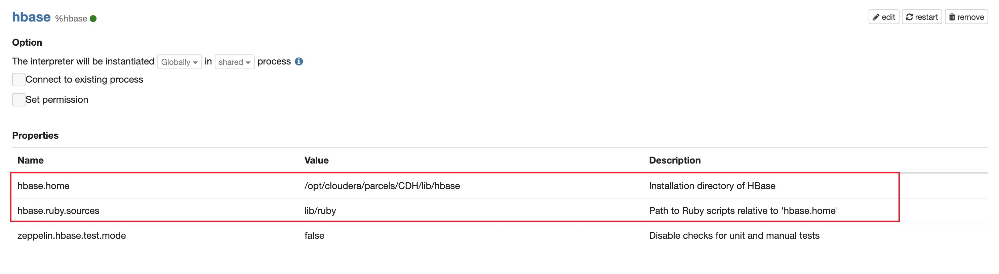
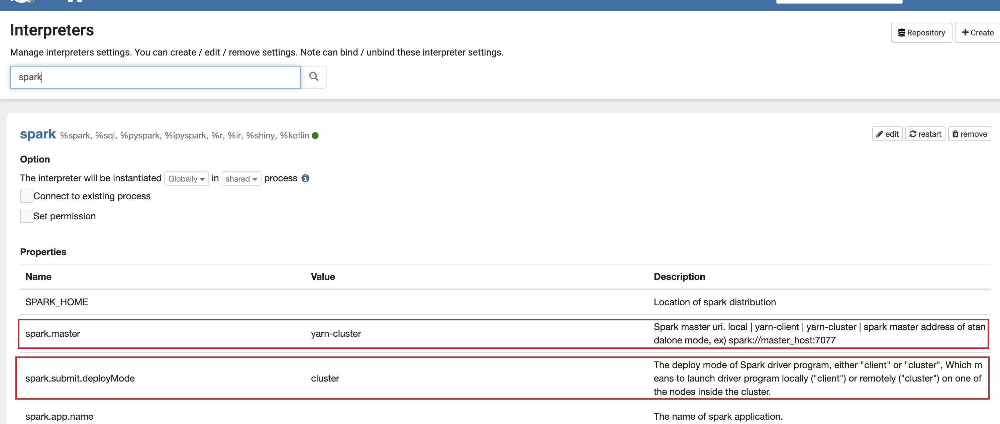
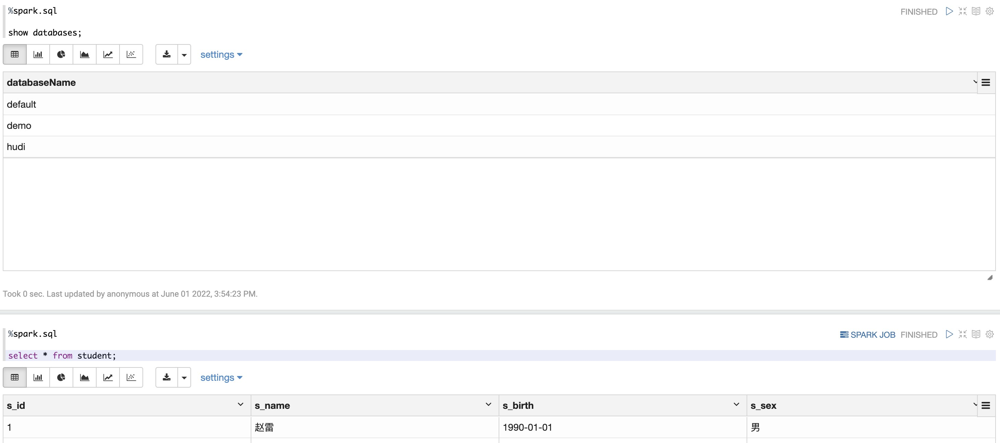
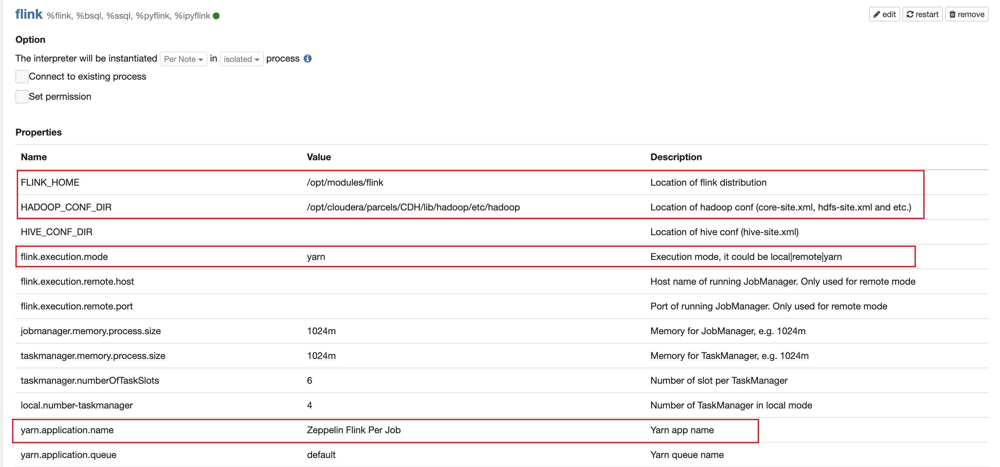
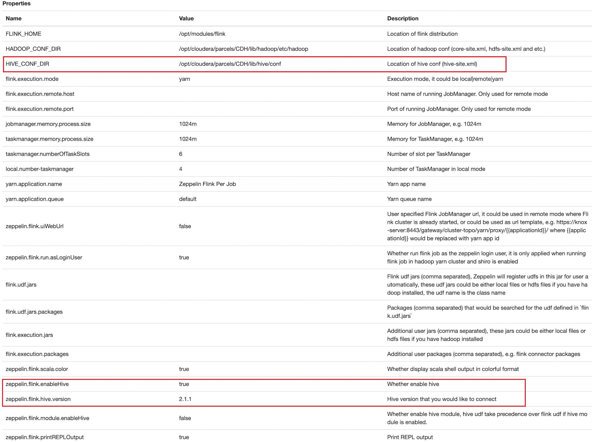
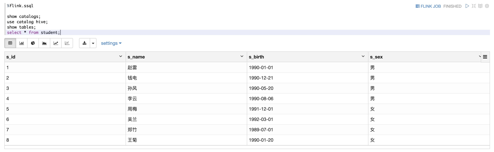

### CDH6.3.2集群集成Zeppelin0.10.0

#### 1. 准备工作

从官网下载Zeppelin的压缩包，[下载地址](https://downloads.apache.org/zeppelin/zeppelin-0.10.0/zeppelin-0.10.0-bin-all.tgz)。

#### 2. Zeppelin安装

##### 2.1 解压zeppelin并创建软链接

```shell
[hadoop@cdh1 ~]$ cd /opt/modules
[hadoop@cdh1 modules]$ tar -zvxf zeppelin-0.10.0-bin-all.tgz
[hadoop@cdh1 modules]$ ln -s zeppelin-0.10.0-bin-all zeppelin
```

##### 2.2 配置环境变量

```shell
export ZEPPELIN_HOME=/opt/modules/zeppelin
export PATH=$PATH:$ZEPPELIN_HOME/bin
```

##### 2.3 配置zeppelin

进入zeppelin的conf目录下，将`zeppelin-env.sh.template`修改为`zeppelin-env.sh`，并添加以下内容：

```shell
export JAVA_HOME=/usr/java/jdk1.8.0_181-cloudera
export ZEPPELIN_ADDR=cdh1
export ZEPPELIN_PORT=9091
```

#### 3. 启动zeppelin

```shell
[hadoop@cdh1 modules]$ cd zeppelin
[hadoop@cdh1 zeppelin]$ bin/zeppelin-daemon.sh start
```

至此zeppelin已经安装完成，可以在浏览器上访问`cdh1:9091`打开zeppelin。



#### 4. 集成Hive

在Interpreters页面点击"+Create"创建一个新的解释器，其中Interpreters Name填写hive，Interpreters Group选择jdbc即可，其中必须改的配置是`default.url`和`default.driver`，分别是`jdbc:hive2://cdh1:10000`和`org.apache.hive.jdbc.HiveDriver`。



设置完成后，需要添加依赖的jar包，添加的jar包如下：

```
/opt/cloudera/parcels/CDH-6.3.2-1.cdh6.3.2.p0.1605554/jars/hive-jdbc-2.1.1-cdh6.3.2-standalone.jar
```





#### 5. 集成HBase

Zeppelin-0.10.0以及集成了HBase，需要在`zeppelin-env.sh`中设置`HBASE_HOME`和 `HBASE_CONF_DIR`环境变量。

```shell
export HBASE_HOME=/opt/cloudera/parcels/CDH/lib/hbase
export HBASE_CONF_DIR=/opt/cloudera/parcels/CDH/lib/hbase/conf
```



设置好环境变量之后，修改Interpreter Name为hbase的`hbase.home`和`hbase.ruby.sources`这两个参数。同时还要引入相关的hbase的jar包依赖。

```
/opt/cloudera/parcels/CDH/lib/hbase/lib/hbase-client-2.1.0-cdh6.3.2.jar
/opt/cloudera/parcels/CDH/lib/hbase/lib/hbase-common-2.1.0-cdh6.3.2.jar
/opt/cloudera/parcels/CDH/lib/hbase/lib/hbase-protocol-2.1.0-cdh6.3.2.jar
/opt/cloudera/parcels/CDH/lib/hbase/lib/commons-lang3-3.7.jar
/opt/cloudera/parcels/CDH/lib/hbase/lib/hbase-shaded-protobuf-2.2.1.jar
/opt/cloudera/parcels/CDH/lib/hbase/lib/hbase-shaded-miscellaneous-2.2.1.jar
/opt/cloudera/parcels/CDH/lib/hbase/lib/hbase-protocol-shaded-2.1.0-cdh6.3.2.jar
```


#### 6. 集成spark

Zeppelin-0.10.0已经集成了Spark，需要在`zeppelin-env.sh`中设置`SPARK_HOME`和`SPARK_CONF_DIR`环境变量。

```shell
export SPARK_HOME=/opt/cloudera/parcels/CDH/lib/spark
export SPARK_CONF_DIR=/opt/cloudera/parcels/CDH/lib/spark/conf
```

设置zeppelin提交的sql以yarn-cluster或者yarn-client模式运行，需要修改Interpreter Name为spark的`spark.master`和`spark.submit.deployMode`这两个参数。





#### 7. 集成Flink

Zeppelin-0.10.0已经集成了Flink，设置Flink on Yarn模式需要`zeppelin-env.sh`中设置`USE_HADOOP`和`HADOOP_CONF_DIR`环境变量。

```shell
export USE_HADOOP=true
export HADOOP_CONF_DIR=/opt/cloudera/parcels/CDH/lib/hadoop/etc/hadoop
```

设置zeppelin提交的sql以类似yarn-per-job模式运行（这种模式其实是每个note对应一个flink-session），需要修改Interpreter Name为flink的Interpreter Binding模式为`isolated per note`，同时也要修改`FLINK_HOME`、`HADOOP_CONF_DIR`、`flink.execution.mode`、`flink.yarn.appName`和`flink.yarn.queue`等参数。



打开Flink Interpreter的Streaming ETL对应的notebook，运行sql之前需要先运行`%flink.conf`中的内容，这个中的参数支持Flink的所有配置参数，具体可以参考[官网](https://nightlies.apache.org/flink/flink-docs-release-1.13/docs/deployment/config/)。


如果需要访问hive数据，以及使用HiveCatalog管理FlinkSQL的元数据，则还需要与Hive集成。修改Flink的Interpreter中的`HIVE_CONF_DIR`、`zeppelin.flink.enableHive`和`zeppelin.flink.hive.version`等参数，同时还需要将hive相关的jar包依赖也复制到`$FLINK_HOME/lib`目录下。



相关的依赖jar包如下所示：

```
flink-connector-hive_2.12-1.13.6.jar
flink-hadoop-compatibility_2.12-1.13.6.jar
hive-exec-2.1.1-cdh6.3.2.jar
libfb303-0.9.3.jar
hadoop-mapreduce-client-core-3.0.0-cdh6.3.2.jar
```

