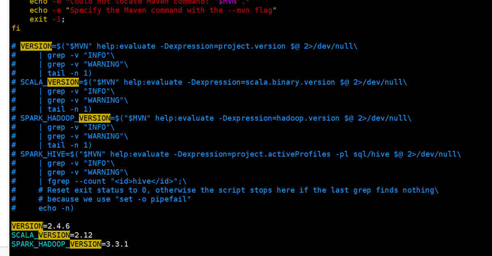

#### Hadoop集群搭建之Hive on Spark

用到的各个组件的版本

|  组件  |  版本   |
| :----: | :-----: |
| hadoop |  3.3.1  |
|  hive  |  3.1.2  |
| spark  |  2.4.6  |
| scala  | 2.12.10 |

##### 1. 准备工作

```shell
# 下载spark的源码
wget https://downloads.apache.org/spark/spark-2.4.6/spark-2.4.6.tgz
```

##### 2. 编译spark源码

```shell
# 解压源码到目录下
tar -zvxf spark-2.4.6.tgz && cd spark-2.4.6
```

修改spark源码中的make-distribution.sh文件：



```shell
# 编译源码
./dev/make-distribution.sh --name "hadoop3-without-hive" --tgz "-Pyarn,hadoop-provided,hadoop-3.3,parquet-provided"
```

##### 3. Spark配置

将编译好的包解压到/opt/modules目录，并建立软链接为spark。

```
tar -zvxf spark-2.4.6-bin-hadoop3-without-hive.tgz
mv spark-2.4.6-bin-hadoop3-without-hive spark-2.4.6
ln -s spark-2.4.6 spark
```

- spark-env.sh

  ```
  export JAVA_HOME=/opt/modules/jdk
  export SCALA_HOME=/opt/modules/scala
  export HADOOP_HOME=/opt/modules/hadoop
  export HADOOP_CONF_DIR=/opt/modules/hadoop/etc/hadoop
  export HADOOP_YARN_CONF_DIR=/opt/modules/hadoop/etc/hadoop
  export SPARK_HOME=/opt/modules/spark
  export SPARK_WORKER_MEMORY=512m
  export SPARK_EXECUTOR_MEMORY=512m
  export SPARK_DRIVER_MEMORY=512m
  export SPARK_DIST_CLASSPATH=$(/opt/modules/hadoop/bin/hadoop classpath)
  ```

##### 4. Hive配置

```xml
<configuration>
    <property>
        <!-- 查询数据时 显示出列的名字 -->
        <name>hive.cli.print.header</name>
        <value>true</value>
    </property>
    <property>
        <!-- 在命令行中显示当前所使用的数据库 -->
        <name>hive.cli.print.current.db</name>
        <value>true</value>
    </property>
    <property>
        <!-- 默认数据仓库存储的位置，该位置为HDFS上的路径 -->
        <name>hive.metastore.warehouse.dir</name>
        <value>/user/hive/warehouse</value>
    </property>
    <property>
    	<name>javax.jdo.option.ConnectionURL</name>
      <value>jdbc:mysql://hadoop01:3306/hive?createDatabaseIfNotExist=true</value>
    </property>
    <property>
    	<name>javax.jdo.option.ConnectionDriverName</name>
        <value>com.mysql.jdbc.Driver</value>
    </property>
    <property>
    	<name>javax.jdo.option.ConnectionUserName</name>
        <value>hive</value>
    </property>
    <property>
    	<name>javax.jdo.option.ConnectionPassword</name>
        <value>xiaoer</value>
    </property>
    <property>
        <name>hive.server2.transport.mode</name>
        <value>binary</value>
    </property>
    <property>
        <name>hive.server2.thrift.port</name>
        <value>10000</value>
    </property>
    <property>
        <name>hive.server2.webui.host</name>
        <value>hadoop01</value>
    </property>
    <property>
        <name>hive.server2.webui.port</name>
        <value>10002</value>
    </property>
    <property>
        <!-- 设置引擎为Spark-->
        <name>hive.execution.engine</name>
        <value>spark</value>
    </property>
    <property>
        <name>hive.enable.spark.execution.engine</name>
        <value>true</value>
    </property>
    <property>
        <name>spark.home</name>
        <value>/opt/modules/spark</value>
    </property>
    <property>
        <name>spark.master</name>
        <value>yarn</value>
    </property>
    <property>
        <name>spark.eventLog.enabled</name>
        <value>true</value>
    </property>
    <property>
        <!-- Hive的日志存储目录，HDFS -->
        <name>spark.eventLog.dir</name>
        <value>hdfs://supercluster/spark-hive-jobhistory</value>
    </property>
    <property>
        <name>spark.executor.memory</name>
        <value>512m</value>
    </property>
    <property>
        <name>spark.driver.memory</name>
        <value>512m</value>
    </property>
    <property>
        <name>spark.serializer</name>
        <value>org.apache.spark.serializer.KryoSerializer</value>
    </property>
    <property>
        <!-- HDFS中jar包的存储路径 -->
        <name>spark.yarn.jars</name>
        <value>hdfs://supercluster/spark-jars/*</value>
    </property>
    <property>
        <name>hive.spark.client.server.connect.timeout</name>
        <value>300000</value>
    </property>
</configuration>
```

拷贝mysql的jar包到hive/lib目录下，并初始化hive元数据库：

```shell
cp mysql-connector-jdbc.jar /opt/modules/hive/lib
/opt/modules/hive/bin/schematool --initSchema -dbType
```

##### 5. 整合jar包

将spark和hive的jar包整合：

```
cp /opt/modules/spark/jars/*.jar /opt/modules/hive/lib/
rm /opt/modules/spark/jars/*.jar
cp /opt/modules/hive/lib/*.jar /opt/modules/spark/jars/
```

将配置文件拷贝到saprk/conf目录下：

```shell
cp /opt/modules/hadoop/etc/hadoop/core-site.xml /opt/modules/hadoop/etc/hadoop/hdfs-site.xml /opt/modules/hadoop/etc/hadoop/yarn-site.xml /opt/modules/hive/conf/hive-site.xml /opt/modules/spark/conf
```

将整合后的jar包上传到hdfs目录spark-jars：

```shell
hdfs dfs -mkdir /spark-jars
hdfs dfs -put /opt/modules/spark/jars/*.jar /spark-jars
```

##### 6. 启动服务

```shell
# 启动hadoop集群
start-dfs.sh
start-yarn.sh

# 启动spark集群
cd /opt/modules/spark/sbin && ./start-all.sh
```

