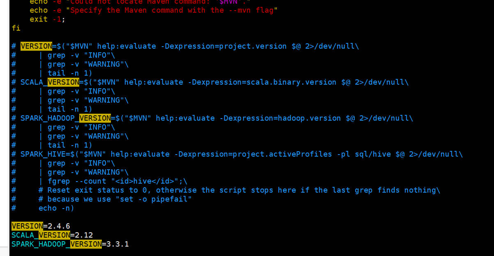

### Hadoop集群搭建完整攻略

#### 1. Hadoop集群之CentOS7系统配置

##### 1.1 准备工作

准备三台已经安装了CentOS7系统的虚拟机，分别是`master`，`slave1`，`slave2`。

三台虚拟机配置如下(以下配置只做参考，如果自己的电脑不允许的情况下，也可以适当的调整)：

| 主机名称 |     机器配置      | 存储容量 |  用户  |
| :------: | :---------------: | :------: | :----: |
|  master  | 4G内存，2核，2CPU |   50G    | hadoop |
|  slave1  | 1G内存，1核，1CPU |   50G    | hadoop |
|  slave2  | 1G内存，1核，1CPU |   50G    | hadoop |

##### 1.2 配置`sudo`权限

三台都需要配置`hadoop`用户的`sudo`权限，否则之后使用`hadoop`用户时可能会出现的权限问题，无法解决。(三台配置方法相同)

```
1. 刚刚重启虚拟机之后，首先使用root账户登录，然后执行visudo命令
2. 进入vi编辑器之后，使用命令[:set nu]可以显示行号
3. 在第100行之后新插入一行内容[hadoop	ALL=(ALL)	ALL]
4. 之后在第111行后插入一行内容[hadoop	ALL=(ALL)	NOPASSWD: ALL]
5. 之后保存并切换到hadoop用户
```


##### 1.3 修改IP地址

查看自己虚拟机的`VMnet8`(也就是NAT模式)的网卡的地址，设置三台虚拟机的网络IP在同一个网段内，并且都是静态IP地址。

| 主机名称 |     IP地址     |
| :------: | :------------: |
|  master  | 192.168.21.210 |
|  slave1  | 192.168.21.211 |
|  slave2  | 192.168.21.212 |

```
1. 使用sudo权限编辑[/etc/sysconfig/network-scripts/ifcfg-ens33]文件，修改如下：
	TYPE=Ethernet
	PROXY_METHOD=none
	BROWSER_ONLY=no
	BOOTPROTO=static[修改]
	DEFROUTE=yes
	IPV4_FAILURE_FATAL=no
	IPV6INIT=yes
	IPV6_AUTOCONF=yes
	IPV6_DEFROUTE=yes
	IPV6_FAILURE_FATAL=no
	IPV6_ADDR_GEN_MODE=stable-privacy
	NAME=ens33
	UUID=4a123d67-9c45-43c9-b7fa-b26c245a5446
	DEVICE=ens33
	ONBOOT=yes[修改]
	GATEWAY=192.168.21.2[新增]
	IPADDR=192.168.21.210[新增]
	NETMASK=255.255.255.0[新增]
	DNS1=8.8.8.8[新增]
	DNS2=114.114.114.114[新增]
2. 保存后重新启动网络服务[sudo systemctl restart network]
3. 使用[ip addr]查看IP地址，是否已经修改成功
4. 使用[ping www.baidu.com]测试外网是否可以访问
```

##### 1.4 添加主机名映射

```
使用sudo权限编辑[/etc/hosts]文件，修改如下：
	192.168.21.210	master
	192.168.21.211	slave1
	192.168.21.212	slave2
```

##### 1.5 配置各个机器之间的免密登录

```
1. 使用[ssh-keygen -t rsa]生成各个机器的私钥和公钥(需要在三台机器上执行)
2. 使用[ssh-copy-id username@hostname]即可将本地的公钥发送到另外一台机器(需要在三台机器上执行)
	ssh-copy-id hadoop@master
	ssh-copy-id hadoop@slave1
	ssh-copy-id hadoop@slave2
3. 之后在三台机器上使用[ssh localhost]，因为第一次使用需要输入(yes/no)，防止后面产生不必要的麻烦
```

##### 1.6 关闭防火墙

```
使用[systemctl stop firewalld]关闭防火墙，使用[systemctl disable firewalld]让防火墙开机不自启
```

##### 1.7 安装JDK

上传JDK的压缩包，上传到[/opt/software]目录下，解压到[/opt/apps]目录下，同时记得修改[/opt]目录的归属。

```
1. 修改[/opt]目录的所属用户组和用户[sudo chown -R hadoop:hadoop /opt]
2. 解压JDK的压缩包[tar -zvxf xxxx.tar.gz -C /opt/apps]
3. 配置环境变量（这里建议修改hadoop用户的用户变量，如果出错还可以使用root账户进行修改）
4. 修改[/home/hadoop/.bash_profile]文件，添加以下内容：
	JAVA_HOME=/opt/apps/jdk1.8.0_162
	PATH=$JAVA_HOME/bin:$PATH
	export JAVA_HOME PATH
5. 执行[source ~/.bash_profile]使环境变量生效
6. 使用[java -version]测试是否生效即可
7. 使用[scp]命令将jdk发送到其他两台服务器
```

#### 2. Hadoop集群搭建之全分布式集群搭建

##### 2.1 准备工作

集群版本规划：

|  组件  |  版本   |
| :----: | :-----: |
| hadoop |  3.3.1  |
|  hive  |  3.1.2  |
| hbase  |  2.4.8  |
| spark  |  2.4.6  |
| scala  | 2.12.10 |

##### 2.2 集群规划

| 主机名称 |     IP地址     |  用户  |            HDFS             |             YARN             |
| :------: | :------------: | :----: | :-------------------------: | :--------------------------: |
| hadoop01 | 192.168.21.211 | hadoop |     NameNode，DataNode      | ResourceManager，NodeManager |
| hadoop02 | 192.168.21.212 | hadoop | DataNode，SecondaryNamenode |         NodeManager          |
| hadoop03 | 192.168.21.213 | hadoop |          DataNode           |         NodeManager          |
| hadoop04 | 192.168.21.214 | hadoop |          DataNode           |         NodeManager          |

##### 2.3 Hadoop安装

###### 2.3.1 安装目录规划

```
统一安装路径：/opt/modules
统一软件存放路径：/opt/software
```

###### 2.3.2 上传压缩包

```
1. 将压缩包上传到[/opt/software]目录下，解压到[/opt/modules]目录下
2. 建立软链接
	ln -s hadoop-3.3.1 hadoop
3. 修改[/home/hadoop/.bash_profile]文件，增加以下内容：
	HADOOP_HOME=/opt/modules/hadoop
	PATH=$HADOOP_HOME/bin:$HADOOP_HOME/sbin:$PATH
	export HADOOP_HOME PATH
4. 使用[source ~/.bash_profile使其生效
```

###### 2.3.3 集群配置

配置文件目录：【/opt/modules/hadoop/etc/hadoop/】

- hadoop-env.sh

  ```
  修改第25行JAVA_HOME的路径为[/opt/modules/jdk]
  ```

- core-site.xml

  ```xml
  <configuration>
      <property>
          <name>hadoop.tmp.dir</name>
          <value>/opt/modules/hadoop/tmp</value>
      </property>
      <property>
          <name>fs.defaultFS</name>
          <value>hdfs://hadoop01:8020</value>
      </property>
  </configuration>
  ```

- hdfs-site.xml

  ```xml
  <configuration>
      <property>
          <name>dfs.replication</name>
          <value>3</value>
      </property>
      <property>
          <name>dfs.blocksize</name>
          <value>134217728</value>
      </property>
      <property>
          <name>dfs.namenode.secondary.http-address</name>
          <value>hadoop02:50090</value>
      </property>
      <property>
          <name>dfs.namenode.name.dir</name>
          <value>/opt/modules/hadoop/tmp/namenode</value>
      </property>
      <property>
        	<name>dfs.datanode.data.dir</name>
        	<value>/opt/modules/hadoop/tmp/datanode</value>
      </property>
  </configuration>
  ```

- mapred-site.xml

  需要将`mapred-site.xml.template`复制一份为`mapred-site.xml`

  ```xml
  <configuration>
      <property>
          <name>mapreduce.framework.name</name>
          <value>yarn</value>
      </property>
      <property>
          <name>mapreduce.jobhistory.address</name>
          <value>hadoop01:10020</value>
      </property>
      <property>
          <name>mapreduce.jobhistory.weapp.address</name>
          <value>hadoop01:19888</value>
      </property>
  </configuration>
  ```

- yarn-site.xml

  ```xml
  <configuration>
      <property>
          <name>yarn.resourcemanager.hostname</name>
      	<value>hadoop01</value>
      </property>
      <property>
          <name>yarn.nodemanager.aux-services</name>
          <value>mapreduce_shuffle</value>
      </property>
      <property>
          <name>yarn.log-aggregation-enable</name>
          <value>true</value>
      </property>
      <property>
  		<name>yarn.log.server.url</name>
      	<value>http://hadoop01:19888/jobhistory/logs</value>
  	</property>
  </configuration>
  ```

- slaves

  ```
  hadoop01
  hadoop02
  hadoop03
  ```


使用[scp -r /opt/modules/hadoop hadoop@hostname:/opt/modules]命令将hadoop发送到三台服务器中

##### 2.4 Hadoop集群测试

###### 2.4.1 集群格式化

使用[hadoop namenode -format]命令对集群进行格式化，格式化后会产生集群ID，块池ID等相关信息。


###### 2.4.2 启动集群

```
官方建议使用[start-dfs.sh]和[start-yarn.sh]分别启动hdfs和yarn集群，当然也可以使用[start-all.sh]启动集群
```

###### 2.4.3 集群测试

```
1. 访问[hadoop01:50070]查看HDFS集群WebUI
2. 访问[hadoop01:8088]查看YARN集群WebUI
```

##### 2.5 Hadoop高可用集群

###### 2.5.1 集群规划

| 主机名称 |     IP地址     |  用户  |              HDFS               |             YARN             |       ZK       |          ZKFC           |
| :------: | :------------: | :----: | :-----------------------------: | :--------------------------: | :------------: | :---------------------: |
| hadoop01 | 192.168.21.211 | hadoop |       NameNode，DataNode        | ResourceManager，NodeManager |                | DFSZKFailoverController |
| hadoop02 | 192.168.21.212 | hadoop | Namenode，DataNode，JournalNode | ResourceManager，NodeManager | QuorumPeerMain | DFSZKFailoverController |
| hadoop03 | 192.168.21.213 | hadoop |      DataNode，JournalNode      |         NodeManager          | QuorumPeerMain |                         |
| hadoop04 | 192.168.21.214 | hadoop |      DataNode，JournalNode      |         NodeManager          | QuorumPeerMain |                         |

###### 2.5.2 Zookeeper安装

由于安装高可用集群需要Zookeeper的支持，所以我们先要安装Zookeeper集群

+ 上传压缩包并配置环境变量

  ```
  ZOOKEEPER_HOME=/opt/modules/zookeeper
  PATH=$ZOOKEEPER_HOME/bin:$PATH
  export ZOOKEEPER_HOME PATH
  ```

+ 修改zookeeper相关配置文件

  + zoo.cfg

    由于[conf]目录下只有[zoo_sample.cfg]，所以需要复制一份重命名为[zoo.cfg]

    ```properties
    # The number of milliseconds of each tick
    tickTime=2000
    # The number of ticks that the initial
    # synchronization phase can take
    initLimit=10
    # The number of ticks that can pass between
    # sending a request and getting an acknowledgement
    syncLimit=5
    # the directory where the snapshot is stored.
    # do not use /tmp for storage, /tmp here is just
    # example sakes.
    dataDir=/opt/modules/zookeeper-3.6.1/data
    # the port at which the clients will connect
    clientPort=2181
    # the maximum number of client connections.
    # increase this if you need to handle more clients
    #maxClientCnxns=60
    #
    # Be sure to read the maintenance section of the
    # administrator guide before turning on autopurge.
    #
    # http://zookeeper.apache.org/doc/current/zookeeperAdmin.html#sc_maintenance
    #
    # The number of snapshots to retain in dataDir
    #autopurge.snapRetainCount=3
    # Purge task interval in hours
    # Set to "0" to disable auto purge feature
    #autopurge.purgeInterval=1
    
    ## Metrics Providers
    #
    # https://prometheus.io Metrics Exporter
    #metricsProvider.className=org.apache.zookeeper.metrics.prometheus.PrometheusMetricsProvider
    #metricsProvider.httpPort=7000
    #metricsProvider.exportJvmInfo=true
    
    server.1=hadoop02:2888:3888
    server.2=hadoop03:2888:3888
    server.3=hadoop04:2888:3888
    ```

  + myid

    新建一个目录[data]，在data中新建一个文件[myid]，写上刚才IP地址所对应的[server.id]中的[id]值。（hadoop02填写1，其余的自行修改）

    ```
    1
    ```

+ 分发到三台服务器，并修改[myid]内容

+ 使用命令[zkServer.sh start]启动三台服务器中的zookeeper，如果出现进程名为[QuorumPeerMain]的进程表示zookeeper启动成功

###### 2.5.3 HA集群配置

配置文件目录：【/opt/modules/hadoop/etc/hadoop/】

- hadoop-env.sh

  ```
  修改第25行JAVA_HOME的路径为[/opt/modules/jdk]
  ```

+ core-site.xml

  ```xml
  <configuration>
      <property>
          <name>hadoop.tmp.dir</name>
          <value>/opt/modules/hadoop/data</value>
      </property>
      <property>
          <name>fs.defaultFS</name>
          <value>hdfs://supercluster</value>
      </property>
      <property>
          <name>ha.zookeeper.quorum</name>
          <value>hadoop02:2181,hadoop03:2181,hadoop04:2181</value>
      </property>
      <property>
          <name>hadoop.proxyuser.hadoop.hosts</name>
          <value>*</value>
      </property>
      <property>
          <name>hadoop.proxyuser.hadoop.groups</name>
          <value>*</value>
      </property>
  </configuration>
  ```

+ hdfs-site.xml

  ```xml
  <configuration>
      <property>
          <name>dfs.replication</name>
          <value>3</value>
      </property>
      <property>
          <name>dfs.blocksize</name>
          <value>134217728</value>
      </property>
      <property>
          <name>dfs.nameservices</name>
          <value>supercluster</value>
      </property>
      <property>
          <name>dfs.ha.namenodes.supercluster</name>
          <value>nn1,nn2</value>
      </property>
      <property>
          <name>dfs.namenode.rpc-address.supercluster.nn1</name>
          <value>hadoop01:8020</value>
      </property>
      <property>
          <name>dfs.namenode.rpc-address.supercluster.nn2</name>
          <value>hadoop02:8020</value>
      </property>
      <property>
          <name>dfs.namenode.http-address.supercluster.nn1</name>
          <value>hadoop01:50070</value>
      </property>
      <property>
          <name>dfs.namenode.http-address.supercluster.nn2</name>
          <value>hadoop02:50070</value>
      </property>
      <property>
          <name>dfs.namenode.shared.edits.dir</name>
          <value>qjournal://hadoop02:8485;hadoop03:8485;hadoop04:8485/supercluster</value>
      </property>
      <property>
          <name>dfs.journalnode.edits.dir</name>
          <value>/opt/modules/hadoop/data/journaldata</value>
      </property>
      <property>
          <name>dfs.namenode.name.dir</name>
          <value>/opt/modules/hadoop/data/namenode</value>
      </property>
      <property>
        	<name>dfs.datanode.data.dir</name>
        	<value>/opt/modules/hadoop/data/datanode</value>
      </property>
      <property>
          <name>dfs.ha.automatic-failover.enabled</name>
          <value>true</value>
      </property>
      <property>
          <name>dfs.client.failover.proxy.provider.supercluster</name>
          <value>org.apache.hadoop.hdfs.server.namenode.ha.ConfiguredFailoverProxyProvider</value>
      </property>
      <property>
          <name>dfs.ha.fencing.methods</name>
          <value>sshfence</value>
      </property>
      <property>
          <name>dfs.ha.fencing.ssh.private-key-files</name>
          <value>/home/hadoop/.ssh/id_rsa</value>
      </property>
      <property>
          <name>dfs.ha.fencing.ssh.connect-timeout</name>
          <value>30000</value>
      </property>
  </configuration>
  ```

+ mapred-site.xml

  ```xml
  <configuration>
      <property>
          <name>mapreduce.framework.name</name>
          <value>yarn</value>
      </property>
      <property>
          <name>mapreduce.jobhistory.address</name>
          <value>hadoop01:10020</value>
      </property>
      <property>
          <name>mapreduce.jobhistory.weapp.address</name>
          <value>hadoop01:19888</value>
      </property>
  </configuration>
  ```

+ yarn-site.xml

  ```xml
  <configuration>
      <property>
          <name>yarn.resourcemanager.ha.enabled</name>
      	<value>true</value>
      </property>
      <property>
          <name>yarn.resourcemanager.cluster-id</name>
          <value>yarncluster</value>
      </property>
      <property>
          <name>yarn.resourcemanager.ha.rm-ids</name>
          <value>rm1,rm2</value>
      </property>
      <property>
          <name>yarn.resourcemanager.hostname.rm1</name>
          <value>hadoop01</value>
      </property>
      <property>
          <name>yarn.resourcemanager.hostname.rm2</name>
          <value>hadoop02</value>
      </property>
      <property>
          <name>yarn.resourcemanager.zk-address</name>
          <value>hadoop02:2181,hadoop03:2181,hadoop04:2181</value>
      </property>
      <property>
          <name>yarn.nodemanager.aux-services</name>
          <value>mapreduce_shuffle</value>
      </property>
      <property>
          <name>yarn.log-aggregation-enable</name>
          <value>true</value>
      </property>
      <property>
  	<name>yarn.log.server.url</name>
      	<value>http://hadoop01:19888/jobhistory/logs</value>
      </property>
      <property>  
      	<name>yarn.resourcemanager.address.rm1</name>  
      	<value>hadoop01:8032</value>  
      </property> 
      <property>
      	<name>yarn.resourcemanager.scheduler.address.rm1</name>  
      	<value>hadoop01:8030</value>  
      </property>
      <property>
      	<name>yarn.resourcemanager.resource-tracker.address.rm1</name>  
      	<value>hadoop01:8031</value>  
      </property>
      <property>
      	<name>yarn.resourcemanager.address.rm2</name>
      	<value>hadoop02:8032</value>
      </property>
      <property>
      	<name>yarn.resourcemanager.scheduler.address.rm2</name>
      	<value>hadoop02:8030</value>
      </property>
      <property>
      	<name>yarn.resourcemanager.resource-tracker.address.rm2</name>
      	<value>hadoop02:8031</value>
      </property>
  </configuration>
  ```

###### 2.5.4 启动HA集群

+ 首先停止原有集群，启动[journalnode]（三台都要启动）

  ```shell
  hdfs --daemon start journalnode
  ```

+ 启动原有节点上的[namenode]

  ```shell
  hdfs --daemon start namenode
  ```

+ 在新的[namenode]上拉取集群镜像文件

  ```shell
  hdfs namenode -bootstrapStandby
  ```

+ 停止原有集群的[namenode]

  ```shell
  hdfs --daemon stop namenode
  ```

+ 格式化ZKFC集群

  ```shell
  hdfs zkfc -formatZK
  ```

+ 启动HA集群

  ```shell
  start-dfs.sh
  start-yarn.sh
  ```


###### 2.5.5 测试HA集群自动容灾

直接[kill]掉为[active]的[namenode]，如果状态为[standby]的[namenode]切换为[active]，说明自动容灾成功

##### 2.6 Yarn历史服务器

【yarn】历史服务器配置属性已包含在上述内容，如果需要启动可以使用：

```shell
mapred --daemon start historyserver
```

#### 3. Hadoop集群搭建之Hive安装

##### 3.1 准备工作

准备好已经安装了Hadoop的集群服务器之后，需要在其中一台中安装MySQL数据库，安装可以参考[CentOS7安装MySQL5.7](https://github.com/yangqi199808/BigData-Home/blob/master/CentOS/1.CentOS7安装MySQL5.7.md)这篇文章。

下载Hive的安装包并上传至其中一台服务器中，[下载地址](https://downloads.apache.org/hive/)

##### 3.2 Hive本地安装

###### 3.2.1 安装目录规划

```
统一安装路径：/opt/modules
统一软件存放路径：/opt/software
```

###### 3.2.2 上传压缩包

```
1. 将压缩包上传到[/opt/software]目录下，解压到[/opt/modules]目录下
2. 修改[/home/hadoop/.bash_profile]文件，增加以下内容：
	HIVE_HOME=/opt/modules/hive
	PATH=$HIVE_HOME/bin:$PATH
	export HIVE_HOME PATH
3. 使用[source ~/.bash_profile]使其生效
```

###### 3.2.3 上传MySQL的JAR包

```
将mysql的jar包上传至/opt/modules/hive/lib目录下(注意和自己的mysql相匹配，如果使用mysql8，记得上传mysql8的jar包)
```

###### 3.2.4 Hive配置

配置文件目录：【/opt/modules/hive/conf/】

- hive-env.sh

  需要将`hive-env.sh.template`复制一份为`hive-env.sh`

  ```
  修改第48行HADOOP_HOME的路径为[/opt/modules/hadoop]
  修改第51行HIVE_CONF_DIR的路径为[/opt/modules/hive/conf]
  修改第54行HIVE_AUX_JARS_PATH的路径为[/opt/modules/hive/lib]
  ```

- hive-site.sh

  需要将`hive-default.xml.template`复制一份为`hive-site.xml`，并删除其配置相关内容，添加如下内容

  ```xml
  <configuration>
      <property>
          <!-- 查询数据时 显示出列的名字 -->
          <name>hive.cli.print.header</name>
          <value>true</value>
      </property>
      <property>
          <!-- 在命令行中显示当前所使用的数据库 -->
          <name>hive.cli.print.current.db</name>
          <value>true</value>
      </property>
      <property>
          <!-- 默认数据仓库存储的位置，该位置为HDFS上的路径 -->
          <name>hive.metastore.warehouse.dir</name>
          <value>/user/hive/warehouse</value>
      </property>
      <property>
      	<name>javax.jdo.option.ConnectionURL</name>
        <value>jdbc:mysql://hadoop01:3306/hive?createDatabaseIfNotExist=true</value>
      </property>
      <property>
      	<name>javax.jdo.option.ConnectionDriverName</name>
          <value>com.mysql.jdbc.Driver</value>
      </property>
      <property>
      	<name>javax.jdo.option.ConnectionUserName</name>
          <value>hive</value>
      </property>
      <property>
      	<name>javax.jdo.option.ConnectionPassword</name>
          <value>xiaoer</value>
      </property>
  </configuration>
  ```

###### 3.2.5 初始化MySQL元数据库

```shell
# 使用命令初始化MySQL元数据库
[hadoop@master ~]$ schematool -dbType mysql -initSchema
```

###### 3.2.6 测试本地安装

``` shell
# 直接使用hive启动，hive会主动维护一个metastore服务
[hadoop@master ~]$ hive
# 之后可以测试一个最简单的命令，如果可以显示default库，说明安装成功
hive> show databases;
```

##### 3.3 Hive远程安装

Hive远程安装是指需要手动维护一个metastore服务或者hiveserver2服务，之后可以在任何一个客户端机器上访问该服务，连接Hive。

###### 3.3.1 HiveServer2服务的配置

- hive-site.xml

  ```xml
  <configuration>
      <property>
          <name>hive.server2.transport.mode</name>
          <value>binary</value>
      </property>
      <property>
          <name>hive.server2.thrift.port</name>
          <value>10000</value>
      </property>
      <property>
          <name>hive.server2.webui.host</name>
          <value>hadoop01</value>
      </property>
      <property>
          <name>hive.server2.webui.port</name>
          <value>10002</value>
      </property>
  </configuration>
  ```

- hive服务

  ```shell
  # 第一种：可以启动hiveserver2服务，如果启动hiveserver2服务，那么客户只能使用beeline工具连接
  # 监听状态不退出
  [hadoop@master ~]$ hiveserver2
  # 后台启动
  [hadoop@master ~]$ hive --service hiveserver2 &
  # 后台启动，日志信息送入黑洞
  [hadoop@master ~]$ hive --service hiveserver2 2>&1 >/dev/null &
  
  # 第二种：可以启动metastore服务
  [hadoop@master ~]$ hive --service metastore 2>&1 >/dev/null &
  ```

###### 3.3.2 hive客户端配置

将下载好的Hive安装包解压到[/opt/modules]目录下，并配置环境变量即可，修改hive-env.sh的相关路径即可。

如果服务端启动的是hiveserver2服务，那么客户端不需要进行过多的配置，可以使用beeline工具连接。

```shell
# 服务端启动hiveserver2服务
[hadoop@master ~]$ hive --service hiveserver2 2>&1 >/dev/null &

# 可以先看看 10000 端口是否监听
[hadoop@master ~]$ netstat -anp | grep 10000
# 客户端beeline连接
[hadoop@master ~]$ beeline
beeline> !connect jdbc:hive2://master:10000
Connecting to jdbc:hive2://slave2:10000/practice
Enter username for jdbc:hive2://slave2:10000/practice: hadoop
Enter password for jdbc:hive2://slave2:10000/practice: ******
Connected to: Apache Hive (version 2.3.7)
Driver: Hive JDBC (version 2.3.7)
Transaction isolation: TRANSACTION_REPEATABLE_READ
0: jdbc:hive2://slave2:10000/practice> 
```

使用beeline连接时需要输入用户名和密码，输入自己系统用户的用户名和密码即可，如果报错如下：

```
Error: Could not open client transport with JDBC Uri: jdbc:hive2://slave2:10000/practice: Failed to open new session: java.lang.RuntimeException: org.apache.hadoop.security.AccessControlException: Permission denied: user=anonymous, access=EXECUTE, inode="/tmp":hadoop:supergroup:drwx------
	at org.apache.hadoop.hdfs.server.namenode.FSPermissionChecker.checkTraverse(FSPermissionChecker.java:266)
	at org.apache.hadoop.hdfs.server.namenode.FSPermissionChecker.checkPermission(FSPermissionChecker.java:206)
	at org.apache.hadoop.hdfs.server.namenode.FSPermissionChecker.checkPermission(FSPermissionChecker.java:190)
	at org.apache.hadoop.hdfs.server.namenode.FSDirectory.checkPermission(FSDirectory.java:1752)
	at org.apache.hadoop.hdfs.server.namenode.FSDirStatAndListingOp.getFileInfo(FSDirStatAndListingOp.java:100)
	at org.apache.hadoop.hdfs.server.namenode.FSNamesystem.getFileInfo(FSNamesystem.java:3834)
	at org.apache.hadoop.hdfs.server.namenode.NameNodeRpcServer.getFileInfo(NameNodeRpcServer.java:1012)
	at org.apache.hadoop.hdfs.protocolPB.ClientNamenodeProtocolServerSideTranslatorPB.getFileInfo(ClientNamenodeProtocolServerSideTranslatorPB.java:855)
	at org.apache.hadoop.hdfs.protocol.proto.ClientNamenodeProtocolProtos$ClientNamenodeProtocol$2.callBlockingMethod(ClientNamenodeProtocolProtos.java)
	at org.apache.hadoop.ipc.ProtobufRpcEngine$Server$ProtoBufRpcInvoker.call(ProtobufRpcEngine.java:616)
	at org.apache.hadoop.ipc.RPC$Server.call(RPC.java:982)
	at org.apache.hadoop.ipc.Server$Handler$1.run(Server.java:2217)
	at org.apache.hadoop.ipc.Server$Handler$1.run(Server.java:2213)
	at java.security.AccessController.doPrivileged(Native Method)
	at javax.security.auth.Subject.doAs(Subject.java:422)
	at org.apache.hadoop.security.UserGroupInformation.doAs(UserGroupInformation.java:1762)
	at org.apache.hadoop.ipc.Server$Handler.run(Server.java:2211) (state=08S01,code=0)
```

由于hadoop用户访问HDFS权限不够被拒绝，可以在`core-site.xml`中增加以下配置(注意需要在三台集群中的`core-site.xml`均配置)，之后便可以使用配置的用户登录：

```xml
<!-- hadoop.proxyuser.${username}.hosts -->
<!-- hadoop.proxyuser.${username}.groups -->
<property>
	<name>hadoop.proxyuser.hadoop.hosts</name>
    <value>*</value>
</property>
<property>
	<name>hadoop.proxyuser.hadoop.groups</name>
    <value>*</value>
</property>
```

如果服务端启动的是metastore服务，需要对客户端进行配置：

- hive-site.xml

  ```xml
  <configuration>
  	<property>
      	<name>hive.metastore.uris</name>
          <value>thrift://master:9083</value>
      </property>
  </configuration>
  ```

可以在客户端直接使用hive连接远程的metastore服务，操作hive数据库。

#### 4. Hadoop集群搭建之Hive on Spark

##### 4.1 准备工作

```shell
# 下载spark的源码
wget https://downloads.apache.org/spark/spark-2.4.6/spark-2.4.6.tgz
```

##### 4.2 编译spark源码

```shell
# 解压源码到目录下
tar -zvxf spark-2.4.6.tgz && cd spark-2.4.6
```

修改spark源码中的make-distribution.sh文件：



```shell
# 编译源码
./dev/make-distribution.sh --name "hadoop3-without-hive" --tgz "-Pyarn,hadoop-provided,hadoop-3.3,parquet-provided"
```

##### 4.3 Spark配置

将编译好的包解压到/opt/modules目录，并建立软链接为spark。

```
tar -zvxf spark-2.4.6-bin-hadoop3-without-hive.tgz
mv spark-2.4.6-bin-hadoop3-without-hive spark-2.4.6
ln -s spark-2.4.6 spark
```

- spark-env.sh

  ```
  export JAVA_HOME=/opt/modules/jdk
  export SCALA_HOME=/opt/modules/scala
  export HADOOP_HOME=/opt/modules/hadoop
  export HADOOP_CONF_DIR=/opt/modules/hadoop/etc/hadoop
  export HADOOP_YARN_CONF_DIR=/opt/modules/hadoop/etc/hadoop
  export SPARK_HOME=/opt/modules/spark
  export SPARK_WORKER_MEMORY=512m
  export SPARK_EXECUTOR_MEMORY=512m
  export SPARK_DRIVER_MEMORY=512m
  export SPARK_DIST_CLASSPATH=$(/opt/modules/hadoop/bin/hadoop classpath)
  ```

##### 4.4 Hive配置

```xml
<configuration>
    <property>
        <!-- 查询数据时 显示出列的名字 -->
        <name>hive.cli.print.header</name>
        <value>true</value>
    </property>
    <property>
        <!-- 在命令行中显示当前所使用的数据库 -->
        <name>hive.cli.print.current.db</name>
        <value>true</value>
    </property>
    <property>
        <!-- 默认数据仓库存储的位置，该位置为HDFS上的路径 -->
        <name>hive.metastore.warehouse.dir</name>
        <value>/user/hive/warehouse</value>
    </property>
    <property>
    	<name>javax.jdo.option.ConnectionURL</name>
      <value>jdbc:mysql://hadoop01:3306/hive?createDatabaseIfNotExist=true</value>
    </property>
    <property>
    	<name>javax.jdo.option.ConnectionDriverName</name>
        <value>com.mysql.jdbc.Driver</value>
    </property>
    <property>
    	<name>javax.jdo.option.ConnectionUserName</name>
        <value>hive</value>
    </property>
    <property>
    	<name>javax.jdo.option.ConnectionPassword</name>
        <value>xiaoer</value>
    </property>
    <property>
        <name>hive.server2.transport.mode</name>
        <value>binary</value>
    </property>
    <property>
        <name>hive.server2.thrift.port</name>
        <value>10000</value>
    </property>
    <property>
        <name>hive.server2.webui.host</name>
        <value>hadoop01</value>
    </property>
    <property>
        <name>hive.server2.webui.port</name>
        <value>10002</value>
    </property>
    <property>
        <!-- 设置引擎为Spark-->
        <name>hive.execution.engine</name>
        <value>spark</value>
    </property>
    <property>
        <name>hive.enable.spark.execution.engine</name>
        <value>true</value>
    </property>
    <property>
        <name>spark.home</name>
        <value>/opt/modules/spark</value>
    </property>
    <property>
        <name>spark.master</name>
        <value>yarn</value>
    </property>
    <property>
        <name>spark.eventLog.enabled</name>
        <value>true</value>
    </property>
    <property>
        <!-- Hive的日志存储目录，HDFS -->
        <name>spark.eventLog.dir</name>
        <value>hdfs://supercluster/spark-hive-jobhistory</value>
    </property>
    <property>
        <name>spark.executor.memory</name>
        <value>512m</value>
    </property>
    <property>
        <name>spark.driver.memory</name>
        <value>512m</value>
    </property>
    <property>
        <name>spark.serializer</name>
        <value>org.apache.spark.serializer.KryoSerializer</value>
    </property>
    <property>
        <!-- HDFS中jar包的存储路径 -->
        <name>spark.yarn.jars</name>
        <value>hdfs://supercluster/spark-jars/*</value>
    </property>
    <property>
        <name>hive.spark.client.server.connect.timeout</name>
        <value>300000</value>
    </property>
</configuration>
```

拷贝mysql的jar包到hive/lib目录下，并初始化hive元数据库：

```shell
cp mysql-connector-jdbc.jar /opt/modules/hive/lib
/opt/modules/hive/bin/schematool --initSchema -dbType
```

##### 4.5 整合jar包

将spark和hive的jar包整合：

```
cp /opt/modules/spark/jars/*.jar /opt/modules/hive/lib/
rm /opt/modules/spark/jars/*.jar
cp /opt/modules/hive/lib/*.jar /opt/modules/spark/jars/
```

将配置文件拷贝到saprk/conf目录下：

```shell
cp /opt/modules/hadoop/etc/hadoop/core-site.xml /opt/modules/hadoop/etc/hadoop/hdfs-site.xml /opt/modules/hadoop/etc/hadoop/yarn-site.xml /opt/modules/hive/conf/hive-site.xml /opt/modules/spark/conf
```

将整合后的jar包上传到hdfs目录spark-jars：

```shell
hdfs dfs -mkdir /spark-jars
hdfs dfs -put /opt/modules/spark/jars/*.jar /spark-jars
```

##### 4.6 启动服务

```shell
# 启动hadoop集群
start-dfs.sh
start-yarn.sh

# 启动spark集群
cd /opt/modules/spark/sbin && ./start-all.sh
```

#### 5. Hadoop集群搭建之HBase安装

##### 5.1 准备工作

准备好已经安装了Hadoop的集群服务器之后，下载HBase的安装包并上传至其中一台服务器中，[下载地址](https://downloads.apache.org/hbase/)。

由于hadoop-3.3.1（HA）和hbase-2.4.8安装存在部分问题，编译hbase源码安装，需要下载hbase-2.4.8-src.tar.gz

##### 5.2 HBase独立模式安装

###### 5.2.1 安装目录规划

```
统一安装路径：/opt/modules
统一软件存放路径：/opt/software
```

###### 5.2.2 上传压缩包

```
1. 将压缩包上传到[/opt/software]目录下，解压到[/opt/modules]目录下
2. 修改[/home/hadoop/.bash_profile]文件，增加以下内容：
	HBASE_HOME=/opt/modules/hbase
	PATH=$HBASE_HOME/bin:$PATH
	export HBASE_HOME PATH
3. 使用[source ~/.bash_profile]使其生效
```

###### 5.2.3 HBase配置

配置文件目录：【/opt/modules/hbase/conf/】

- hbase-env.sh

  ```
  JAVA_HOME的路径为[/opt/modules/jdk]
  HBASE_MANAGES_ZK=true
  ```

- hbase-site.xml

  ```xml
  <configuration>
      <property>
          <name>hbase.rootdir</name>
          <value>file:///opt/modules/hbase/data</value>
      </property>
      <property>
          <name>hbase.zookeeper.property.dataDir</name>
          <value>/opt/modules/hbase/zookeeper</value>
      </property>
  </configuration>
  ```

###### 5.2.4 启动HBase守护进程

```shell
# 启动HBase
start-hbase.sh
```

###### 5.2.5 测试本地安装

``` shell
# 连接HBase
hbase shell
```

##### 5.3 HBase源码编译

```shell
wget https://downloads.apache.org/hbase/2.4.8/hbase-2.4.8-src.tar.gz

# 解压后进入hbase-2.4.8目录
tar -zvxf hbase-2.4.8-src.tar.gz
cd hbase-2.4.8

# 提前安装好maven，编译源码
mvn clean package -DskipTest assembly:single -Dhadoop.profile=3.0 -Dhadoop-three.version-3.3.1

# 编译成功后，在hbase-assembly/target目录下可以看到hbase-2.4.8-bin.tar.gz
```

##### 5.4 HBase伪分布式安装

HBase配置：配置文件目录：【/opt/modules/hbase/conf/】，需要将hadoop的hdfs-site.xml和core-site.xml复制到hbase的conf目录。

- hbase-env.sh

  ```
  JAVA_HOME的路径为[/opt/modules/jdk]
  HBASE_MANAGES_ZK=false
  ```

- hbase-site.xml

  ```xml
  <configuration>
      <property>
           <name>hbase.rootdir</name>
           <value>hdfs://supercluster/hbase</value>
      </property>
      <property>
              <name>hbase.zookeeper.quorum</name>
              <value>hadoop02:2181,hadoop03:2181,hadoop04:2181</value>
      </property>
      <property>
           <name>hbase.cluster.distributed</name>
           <value>true</value>
      </property>
      <property>
          <name>hbase.unsafe.stream.capability.enforce</name>
          <value>true</value>
      </property>
  </configuration>
  ```

- 启动HBase服务

  ```shell
  # 首先启动zookeeper服务
  zkServer.sh start
  
  # 启动HMaster进程(可以同时启动backup-master
  # 2 3 5 是偏移量，启动在不同的端口
  local-master-backup.sh start 2 3 5
  # 停止HMaster
  local-master-backup.sh stop 2 3 5
  
  # 启动RegionServer
  local-regionservers.sh start 2 3 5
  # 停止RegionServer
  local-regionservers.sh stop 2 3 5
  ```

##### 5.5 HBase全分布式安装

###### 5.5.1 HBase进程规划

| 主机名称 |     IP地址     |  用户  |             HBase             |   Zookeeper    |
| :------: | :------------: | :----: | :---------------------------: | :------------: |
| hadoop01 | 192.168.21.210 | hadoop |    HMaster，HRegionServer     |                |
| hadoop02 | 192.168.21.211 | hadoop | Backer HMaster，HRegionServer | QuorumPeerMain |
| hadoop03 | 192.168.21.212 | hadoop |         HRegionServer         | QuorumPeerMain |
| hadoop04 | 192.168.21.214 | hadoop |         HRegionServer         | QuorumPeerMain |

###### 5.5.2 HBase配置

配置文件目录：【/opt/modules/hbase/conf/】，需要将hadoop的hdfs-site.xml和core-site.xml复制到hbase的conf目录。

- hbase-env.sh

  ```
  JAVA_HOME的路径为[/opt/modules/jdk]
  HBASE_MANAGES_ZK=false
  ```

- hbase-site.xml

  ```xml
  <configuration>
      <property>
  	<name>hbase.rootdir</name>
  	<value>hdfs://supercluster/hbase</value>
      </property>
      <property>
  	<name>hbase.zookeeper.quorum</name>
  	<value>hadoop02:2181,hadoop03:2181,hadoop04:2181</value>
      </property>
      <property>
          <name>hbase.cluster.distributed</name>
          <value>true</value>
      </property>
      <property>
          <name>hbase.unsafe.stream.capability.enforce</name>
          <value>true</value>
      </property>
  </configuration>
  ```

- 配置regionserver的节点信息

  ```shell
  vi /opt/modules/hbase/conf/regionservers
  # 添加如下内容
  hadoop02
  hadoop03
  hadoop04
  ```

- 配置backup-hmaster，需要创建backup-masters文件

  ```shell
  echo "hadoop02" >> /opt/modules/hbase/conf/backup-masters
  ```

- 将HBase安装包发送至其他节点，并配置环境变量

  ```shell
  scp /opt/modules/hbase/ hostname:/opt/modules/
  ```

###### 5.5.3 启动集群并测试

```shell
start-hbase.sh
```

###### 5.5.4 查看WebUI页面

```
http://ip:16010
```

##### 5.6 其它问题

###### 5.6.1 Hadoop是HA的情况

```
将Hadoop目录下的hdfs-site.xml和core-site.xml复制到HBase目录的conf目录下，重新启动
```

