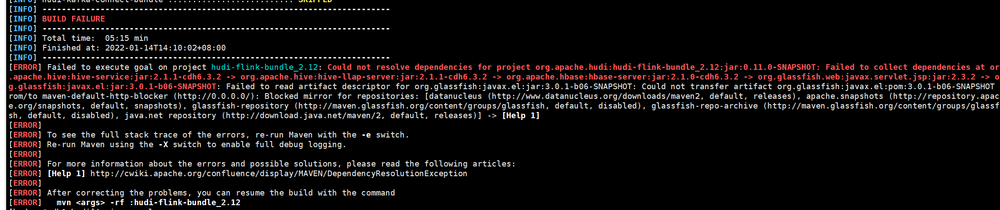
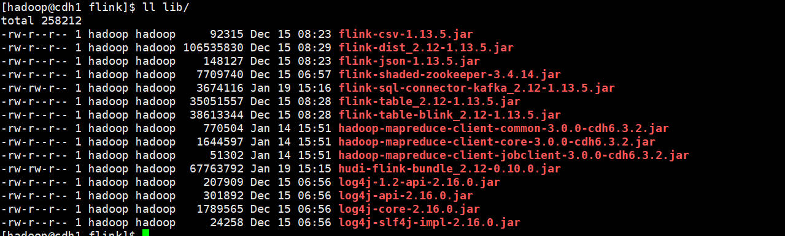
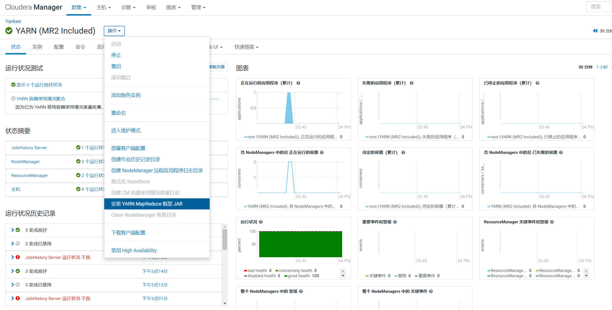
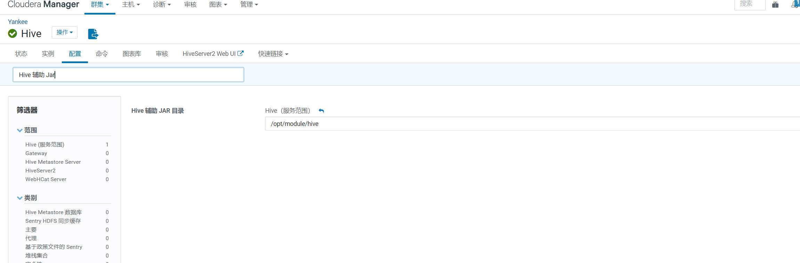
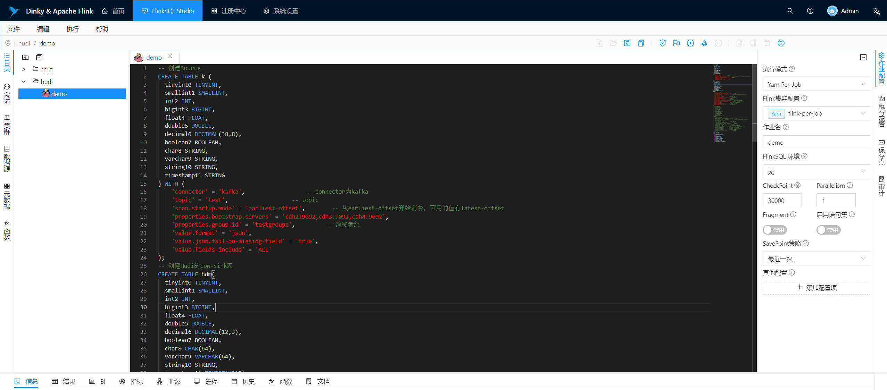

#### 整合Apache Hudi + CDH + Flink + Dlinky

##### 1. 各组件版本

| 组件   | 版本   |
| ------ | ------ |
| Hudi   | 0.10.0 |
| CDH    | 6.3.2  |
| Flink  | 1.13.5 |
| Hadoop | 3.0.0  |
| Hive   | 2.1.1  |
| Kafka  | 2.2.1  |
| Dlinky | 0.5.0  |

##### 2. Hudi代码编译

```shell
git clone https://github.com/apache/hudi.git

# 强制切换到0.10.0的分支
git checkout -f release-0.10.0
```

根据自己所用的hive版本修改packging/hudi-flink-bundle的pom.xml文件：

```xml
<profile>
  <!-- 使用hive1修改 -->
  <id>flink-bundle-shade-hive1</id>
  <properties>
    <hive.version>1.1.0</hive.version>
    <thrift.version>0.9.2</thrift.version>
    <flink.bundle.hive.scope>compile</flink.bundle.hive.scope>
  </properties>
</profile>
<profile>
  <!-- 使用hive2修改 -->
  <id>flink-bundle-shade-hive2</id>
  <properties>
    <hive.version>2.1.1-cdh6.3.2</hive.version>
    <flink.bundle.hive.scope>compile</flink.bundle.hive.scope>
  </properties>
  <dependencies>
    <dependency>
      <groupId>${hive.groupid}</groupId>
      <artifactId>hive-service-rpc</artifactId>
      <version>${hive.version}</version>
      <scope>${flink.bundle.hive.scope}</scope>
    </dependency>
  </dependencies>
</profile>
<profile>
  <!-- 使用hive3修改 -->
  <id>flink-bundle-shade-hive3</id>
  <properties>
    <hive.version>3.1.2</hive.version>
    <flink.bundle.hive.scope>compile</flink.bundle.hive.scope>
  </properties>
  <dependencies>
    <dependency>
      <groupId>${hive.groupid}</groupId>
      <artifactId>hive-service-rpc</artifactId>
      <version>${hive.version}</version>
      <scope>${flink.bundle.hive.scope}</scope>
    </dependency>
  </dependencies>
</profile>
```

编译Hudi：

```shell
# 如果是hive1，需要使用profile -Pflink-bundle-shade-hive1
# 如果是hive3，需要使用profile -Pflink-bundle-shade-hive3
mvn clean install -DskipTests -DskipITs -Dcheckstyle.skip=true -Drat.skip=true -Dscala-2.12 -Dhadoop.version-3.0.0 -Pflink-bundle-shade-hive2
```

将packaging/hudi-flink-bundle/target/hudi-flink-bundle_2.12-0.10.0.jar放到flink1.13.5的lib目录即可。

Tips：

如果编译Hudi报错以下内容：



是因为网络问题，缺少javax.el:jar:3.0.1-b06-SNAPSHOT的包，可以重新下载或者直接点击下方地址下载即可。

```
链接：https://pan.baidu.com/s/1IaeLX1fo0V3s02X2ATYxNA?pwd=yyds 
提取码：yyds
```

##### 3. 配置Flink ON Yarn

修改flink-conf.yaml配置文件：

```yaml
#==============================================================================
# Common
#==============================================================================

# The external address of the host on which the JobManager runs and can be
# reached by the TaskManagers and any clients which want to connect. This setting
# is only used in Standalone mode and may be overwritten on the JobManager side
# by specifying the --host <hostname> parameter of the bin/jobmanager.sh executable.
# In high availability mode, if you use the bin/start-cluster.sh script and setup
# the conf/masters file, this will be taken care of automatically. Yarn/Mesos
# automatically configure the host name based on the hostname of the node where the
# JobManager runs.

jobmanager.rpc.address: cdh1

# The RPC port where the JobManager is reachable.

jobmanager.rpc.port: 6123


# The total process memory size for the JobManager.
#
# Note this accounts for all memory usage within the JobManager process, including JVM metaspace and other overhead.

jobmanager.memory.process.size: 1600m


# The total process memory size for the TaskManager.
#
# Note this accounts for all memory usage within the TaskManager process, including JVM metaspace and other overhead.

taskmanager.memory.process.size: 1728m

# To exclude JVM metaspace and overhead, please, use total Flink memory size instead of 'taskmanager.memory.process.size'.
# It is not recommended to set both 'taskmanager.memory.process.size' and Flink memory.
#
# taskmanager.memory.flink.size: 1280m

# The number of task slots that each TaskManager offers. Each slot runs one parallel pipeline.

# 此值最大为4，如果要修改为大于4的，需要同步修改yarn的配置yarn.nodemanager.resource.cpu-vcores配置
taskmanager.numberOfTaskSlots: 4

# The parallelism used for programs that did not specify and other parallelism.

parallelism.default: 1

# The default file system scheme and authority.
# 
# By default file paths without scheme are interpreted relative to the local
# root file system 'file:///'. Use this to override the default and interpret
# relative paths relative to a different file system,
# for example 'hdfs://mynamenode:12345'
#
# fs.default-scheme

#==============================================================================
# High Availability
#==============================================================================

# The high-availability mode. Possible options are 'NONE' or 'zookeeper'.
#
high-availability: zookeeper

# The path where metadata for master recovery is persisted. While ZooKeeper stores
# the small ground truth for checkpoint and leader election, this location stores
# the larger objects, like persisted dataflow graphs.
# 
# Must be a durable file system that is accessible from all nodes
# (like HDFS, S3, Ceph, nfs, ...) 
#
high-availability.storageDir: hdfs://supercluster/flink/ha/

# The list of ZooKeeper quorum peers that coordinate the high-availability
# setup. This must be a list of the form:
# "host1:clientPort,host2:clientPort,..." (default clientPort: 2181)
#
high-availability.zookeeper.quorum: cdh2:2181,cdh3:2181,cdh4:2181

high-availability.zookeeper.path.root: /flink


# ACL options are based on https://zookeeper.apache.org/doc/r3.1.2/zookeeperProgrammers.html#sc_BuiltinACLSchemes
# It can be either "creator" (ZOO_CREATE_ALL_ACL) or "open" (ZOO_OPEN_ACL_UNSAFE)
# The default value is "open" and it can be changed to "creator" if ZK security is enabled
#
# high-availability.zookeeper.client.acl: open

#==============================================================================
# Fault tolerance and checkpointing
#==============================================================================

# The backend that will be used to store operator state checkpoints if
# checkpointing is enabled.
#
# Supported backends are 'jobmanager', 'filesystem', 'rocksdb', or the
# <class-name-of-factory>.
#
state.backend: filesystem

# Directory for checkpoints filesystem, when using any of the default bundled
# state backends.
#
state.checkpoints.dir: hdfs://supercluster/flink/checkpoints

# Default target directory for savepoints, optional.
#
state.savepoints.dir: hdfs://supercluster/flink/savepoints

# Flag to enable/disable incremental checkpoints for backends that
# support incremental checkpoints (like the RocksDB state backend). 
#
# state.backend.incremental: false

# The failover strategy, i.e., how the job computation recovers from task failures.
# Only restart tasks that may have been affected by the task failure, which typically includes
# downstream tasks and potentially upstream tasks if their produced data is no longer available for consumption.

jobmanager.execution.failover-strategy: region

#==============================================================================
# Rest & web frontend
#==============================================================================

# The port to which the REST client connects to. If rest.bind-port has
# not been specified, then the server will bind to this port as well.
#
rest.port: 8081

# The address to which the REST client will connect to
#
rest.address: 0.0.0.0

# Port range for the REST and web server to bind to.
#
#rest.bind-port: 8080-8090

# The address that the REST & web server binds to
#
#rest.bind-address: 0.0.0.0

# Flag to specify whether job submission is enabled from the web-based
# runtime monitor. Uncomment to disable.

web.submit.enable: false

#==============================================================================
# HistoryServer
#==============================================================================

# The HistoryServer is started and stopped via bin/historyserver.sh (start|stop)

# Directory to upload completed jobs to. Add this directory to the list of
# monitored directories of the HistoryServer as well (see below).
jobmanager.archive.fs.dir: hdfs://supercluster/flink/completed-jobs/

# The address under which the web-based HistoryServer listens.
historyserver.web.address: 0.0.0.0

# The port under which the web-based HistoryServer listens.
historyserver.web.port: 8082

# Comma separated list of directories to monitor for completed jobs.
historyserver.archive.fs.dir: hdfs://supercluster/flink/completed-jobs/

# Interval in milliseconds for refreshing the monitored directories.
historyserver.archive.fs.refresh-interval: 10000
```

配置Flink所需的环境变量：

```shell
# Java环境变量
export JAVA_HOME=/usr/java/jdk1.8.0_181-cloudera
export MAVEN_HOME=/opt/module/maven
# Flink环境变量
export HADOOP_CONF_DIR=/etc/hadoop/conf
export HADOOP_CLASSPATH=`hadoop classpath`
export HBASE_CONF_DIR=/etc/hbase/conf
export FLINK_HOME=/opt/module/flink
export HIVE_HOME=/opt/cloudera/parcels/CDH/lib/hive
export HIVE_CONF_DIR=/etc/hive/conf

export PATH=$JAVA_HOME/bin:$MAVEN_HOME/bin:$FLINK_HOME/bin:$HIVE_HOME/bin:$PATH
```

将flink-sql-connector和hudi-flink-bundle的包放到flink/lib目录下：



由于是同步到hive的数据，所以需要把以下三个包也放入flink/lib目录下：

```shell
cp /opt/cloudera/parcels/CDH/jars/hadoop-mapreduce-client-common-3.0.0-cdh6.3.2.jar /opt/module/flink/lib/
cp /opt/cloudera/parcels/CDH/jars/hadoop-mapreduce-client-core-3.0.0-cdh6.3.2.jar /opt/module/flink/lib/
cp /opt/cloudera/parcels/CDH/jars/hadoop-mapreduce-client-jobclient-3.0.0-cdh6.3.2.jar /opt/module/flink/lib/
```

##### 4. 部署hudi同步到hive的环境

将packaging/hudi-hadoop-mr-bundle/target/hudi-hadoop-mr-bundle-0.10.0-SNAPSHOT.jar复制到CDH的jars目录（所有节点）：

```shell
sudo cp hudi/packaging/hudi-hadoop-mr-bundle/target/hudi-hadoop-mr-bundle-0.10.0.jar /opt/cloudera/parcels/CDH/jars/
```

进入hive/lib建立软链接：

```shell
# 进入hive/lib目录
cd /opt/cloudera/parcels/CDH/lib/hive/lib/

# 建立软链接
ln -ls ../../../jars/hudi-hadoop-mr-bundle-0.10.0.jar hudi-hadoop-mr-bundle-0.10.0.jar
```

##### 5. 安装Yarn MapReduce框架JAR

进入Cloudera Manager操作，安装Yarn MapReduce框架JAR：



设置Hive辅助JAR目录：



修改完成后，根据Cloudera Manager提示进行重启。

##### 6. 配置Dlinky

在Dlinky目录下新建plugins，将flink的lib全部放到plugins目录，并重启Dlinky。

Tips：

报错如下，需要将flink-shade-hadoop放到plugins目录下，并重启Dlinky。


配置好Dlinky的集群Flink On Yarn（per-job）模式，就可以开始FlinkSql的书写了。

写好FlinkSql后，作业配置需要选择执行模式，并设置checkpoint时间，默认为ms。



##### 7. 测试

kafka相关操作：

```shell
# 创建topic
kafka-topics --zookeeper cdh2:2181,cdh3:2181,cdh4:2181/kafka --create --replication-factor 2 --partitions 3 --topic test

# 删除topic
kafka-topics --zookeeper cdh2:2181,cdh3:2181,cdh4:2181/kafka --delete --topic test

# 查看kafka-topic列表
kafka-topics --zookeeper cdh2:2181,cdh3:2181,cdh4:2181/kafka --list

# 消费数据
kafka-console-consumer --bootstrap-server cdh2:9092,cdh3:9092,cdh4:9092 --topic test

# 生产数据
kafka-console-producer --broker-list cdh2:9092,cdh3:9092,cdh4:9092 --topic test
```

Hudi To Hive的Demo语句：

```sql
-- 创建Source
CREATE TABLE k (
  tinyint0 TINYINT,
  smallint1 SMALLINT,
  int2 INT,
  bigint3 BIGINT,
  float4 FLOAT,
  double5 DOUBLE,
  decimal6 DECIMAL(38,8),
  boolean7 BOOLEAN,
  char8 STRING,
  varchar9 STRING,
  string10 STRING,
  timestamp11 STRING
) WITH (
    'connector' = 'kafka',									-- connector为kafka
    'topic' = 'test',										-- topic
    'scan.startup.mode' = 'earliest-offset',				-- 从earliest-offset开始消费，可用的值有latest-offset
    'properties.bootstrap.servers' = 'cdh2:9092,cdh3:9092,cdh4:9092',
    'properties.group.id' = 'testgroup1',					-- 消费者组
    'value.format' = 'json',
    'value.json.fail-on-missing-field' = 'true',
    'value.fields-include' = 'ALL'
);
-- 创建Hudi的cow-sink表
CREATE TABLE hdm(
  tinyint0 TINYINT,
  smallint1 SMALLINT,
  int2 INT,
  bigint3 BIGINT,
  float4 FLOAT,
  double5 DOUBLE,
  decimal6 DECIMAL(12,3),
  boolean7 BOOLEAN,
  char8 CHAR(64),
  varchar9 VARCHAR(64),
  string10 STRING,
  timestamp11 TIMESTAMP(3)
) PARTITIONED BY (tinyint0) 
WITH (
  'connector' = 'hudi',
  'path' = 'hdfs://supercluster/hudi/hdm',
  'hoodie.datasource.write.recordkey.field' = 'char8',		-- 主键
  'write.precombine.field' = 'timestamp11',					-- 相同的键值时，取此字段最大值，默认ts字段
  'write.tasks' = '1',
  'compaction.tasks' = '1',
  'write.rate.limit' = '2000',								-- 限制每秒多少条
  'compaction.async.enabled' = 'true',						-- 在线压缩
  'compaction.trigger.strategy' = 'num_commits',			-- 按次数压缩
  'compaction.delta_commits' = '5',							-- 默认为5
  'hive_sync.enable' = 'true',								-- 启用hive同步
  'hive_sync.mode' = 'hms',									-- 启用hive hms同步，默认jdbc
  'hive_sync.metastore.uris' = 'thrift://cdh1:9083',		-- required, metastore的端口
  'hive_sync.jdbc_url' = 'jdbc:hive2://cdh1:10000',			-- required, hiveServer地址
  'hive_sync.table' = 'hdm',								-- required, hive 新建的表名
  'hive_sync.db' = 'hudi',									-- required, hive 新建的数据库名
  'hive_sync.username' = 'hive',							-- required, HMS 用户名
  'hive_sync.password' = '',								-- required, HMS 密码
  'hive_sync.skip_ro_suffix' = 'true'						-- 去除ro后缀
);
-- 创建Hudi的mor-sink表
CREATE TABLE hdm(
  tinyint0 TINYINT,
  smallint1 SMALLINT,
  int2 INT,
  bigint3 BIGINT,
  float4 FLOAT,
  double5 DOUBLE,
  decimal6 DECIMAL(12,3),
  boolean7 BOOLEAN,
  char8 CHAR(64),
  varchar9 VARCHAR(64),
  string10 STRING,
  timestamp11 TIMESTAMP(3)
) PARTITIONED BY (tinyint0) 
WITH (
  'connector' = 'hudi',
  'path' = 'hdfs://supercluster/hudi/hdm',
  'hoodie.datasource.write.recordkey.field' = 'char8',		-- 主键
  'write.precombine.field' = 'timestamp11',					-- 相同的键值时，取此字段最大值，默认ts字段
  'write.tasks' = '1',
  'compaction.tasks' = '1',
  'write.rate.limit' = '2000',								-- 限制每秒多少条
  'table.type' = 'MERGE_ON_READ',							-- 默认COPY_ON_WRITE
  'compaction.async.enabled' = 'true',						-- 在线压缩
  'compaction.trigger.strategy' = 'num_commits',			-- 按次数压缩
  'compaction.delta_commits' = '5',							-- 默认为5
  'hive_sync.enable' = 'true',								-- 启用hive同步
  'hive_sync.mode' = 'hms',									-- 启用hive hms同步，默认jdbc
  'hive_sync.metastore.uris' = 'thrift://cdh1:9083',		-- required, metastore的端口
  'hive_sync.jdbc_url' = 'jdbc:hive2://cdh1:10000',			-- required, hiveServer地址
  'hive_sync.table' = 'hdm',								-- required, hive 新建的表名
  'hive_sync.db' = 'hudi',									-- required, hive 新建的数据库名
  'hive_sync.username' = 'hive',							-- required, HMS 用户名
  'hive_sync.password' = '',								-- required, HMS 密码
  'hive_sync.skip_ro_suffix' = 'true'						-- 去除ro后缀
);
-- 插入source
insert into hdm 
select
  cast(tinyint0 as TINYINT),
  cast(smallint1 as SMALLINT),
  cast(int2 as INT),
  cast(bigint3 as BIGINT),
  cast(float4 as FLOAT),
  cast(double5 as DOUBLE),
  cast(decimal6 as DECIMAL(38,18)),
  cast(boolean7 as BOOLEAN),
  cast(char8 as CHAR(64)),
  cast(varchar9 as VARCHAR(64)),
  cast(string10 as STRING),
  cast(timestamp11 as TIMESTAMP(3)) 
 from  k;
```

消息测试：

```
{"tinyint0": 6, "smallint1": 223, "int2": 42999, "bigint3": 429450, "float4": 95.47324181659323, "double5": 340.5755392968011,"decimal6": 111.1111, "boolean7": true,  "char8": "aaaaaa", "varchar9": "buy0", "string10": "buy1", "timestamp11": "2021-09-13 03:08:50.810"}
{"tinyint0": 6, "smallint1": 223, "int2": 42999, "bigint3": 429450, "float4": 95.47324181659323, "double5": 340.5755392968011,"decimal6": 111.1111, "boolean7": true,  "char8": "bbbbbb", "varchar9": "buy0", "string10": "buy1", "timestamp11": "2021-09-13 03:08:50.810"}
{"tinyint0": 6, "smallint1": 223, "int2": 42999, "bigint3": 429450, "float4": 95.47324181659323, "double5": 340.5755392968011,"decimal6": 111.1111, "boolean7": true,  "char8": "cccccc", "varchar9": "buy0", "string10": "buy1", "timestamp11": "2021-09-13 03:08:50.810"}
{"tinyint0": 6, "smallint1": 223, "int2": 42999, "bigint3": 429450, "float4": 95.47324181659323, "double5": 340.5755392968011,"decimal6": 111.1111, "boolean7": true,  "char8": "dddddd", "varchar9": "buy0", "string10": "buy1", "timestamp11": "2021-09-13 03:08:50.810"}
{"tinyint0": 6, "smallint1": 223, "int2": 42999, "bigint3": 429450, "float4": 95.47324181659323, "double5": 340.5755392968011,"decimal6": 111.1111, "boolean7": true,  "char8": "eeeeee", "varchar9": "buy0", "string10": "buy1", "timestamp11": "2021-09-13 03:08:50.810"}
{"tinyint0": 6, "smallint1": 223, "int2": 42999, "bigint3": 429450, "float4": 95.47324181659323, "double5": 340.5755392968011,"decimal6": 111.1111, "boolean7": true,  "char8": "ffffff", "varchar9": "buy0", "string10": "buy1", "timestamp11": "2021-09-13 03:08:50.810"}
```

